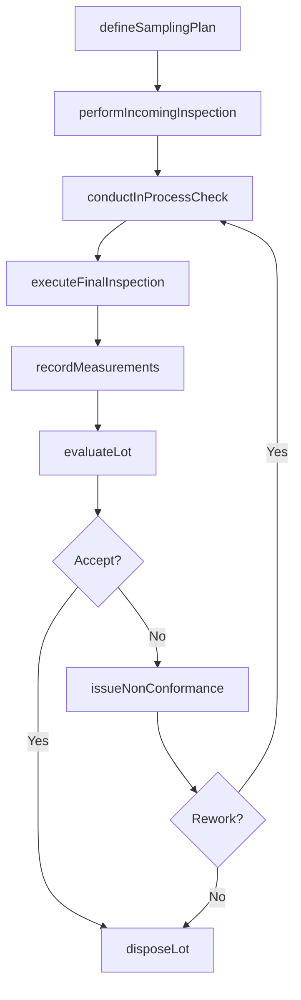
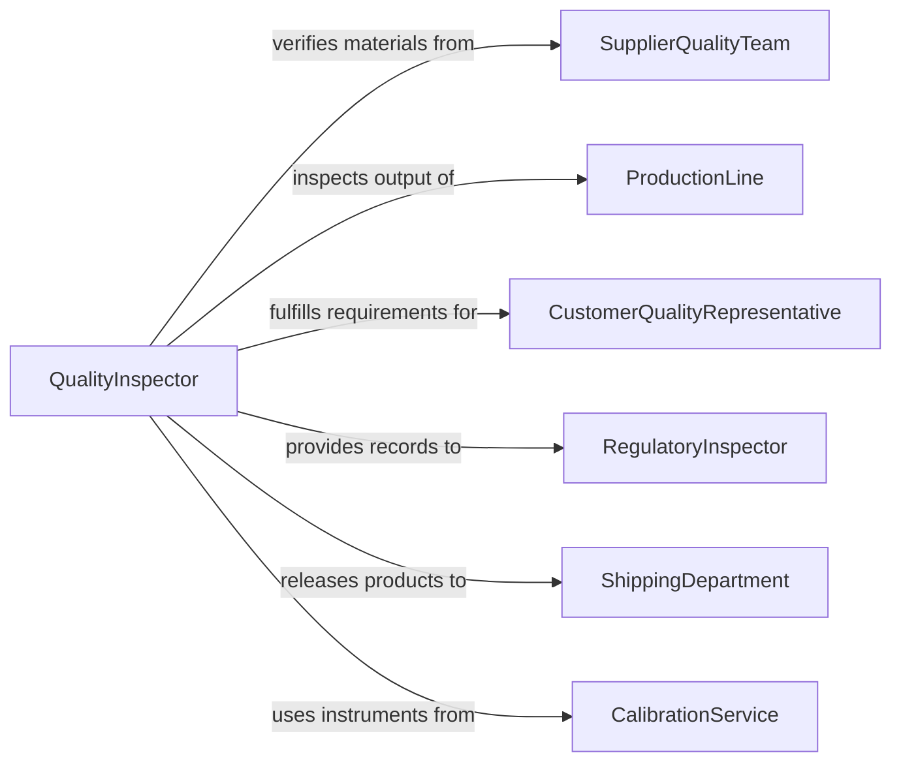

# Test Quality of Materials or Finished Products

> Business-as-Code definition for testing the quality of materials or finished products. Models the quality testing workflow of defining acceptance criteria, performing incoming material and final product inspections, applying sampling plans, and managing lot disposition based on test outcomes.

## Overview

Testing the quality of materials or finished products involves performing systematic inspections and measurements to verify that incoming raw materials, work-in-process, and completed goods meet documented quality standards before acceptance or shipment. This definition covers sampling plan selection, dimensional measurement, visual inspection, functional verification, destructive and non-destructive testing, and lot accept/reject decisions. It supports manufacturing quality control, supply chain quality management, and regulatory compliance across aerospace, automotive, consumer goods, and food production industries.

## Actors

| Actor | Description |
|-------|-------------|
| SupplierQualityTeam | Provides material certifications and responds to quality non-conformances |
| ProductionLine | Produces goods requiring in-process and final quality verification |
| CustomerQualityRepresentative | Specifies acceptance criteria and may conduct source inspections |
| RegulatoryInspector | Audits quality testing records for compliance with industry regulations |
| ShippingDepartment | Requires quality release before dispatching finished products |
| CalibrationService | Maintains and certifies the accuracy of measurement instruments |

## Roles

| Role | Description |
|------|-------------|
| QualityInspector | Performs inspections, measurements, and quality tests on materials and products |
| QualityEngineer | Designs sampling plans, analyzes quality data, and manages corrective actions |
| ReceivingInspector | Evaluates incoming materials against purchase specifications |
| FinalInspector | Verifies finished products meet all quality requirements before shipment |

## Entities

| Entity | Description |
|--------|-------------|
| SamplingPlan | A statistical scheme defining sample size and accept/reject criteria for a lot |
| InspectionRecord | A documented result of quality checks performed on a sample or lot |
| NonConformanceReport | A formal record of a material or product failing to meet quality requirements |
| MaterialCertification | A supplier document declaring material properties and compliance status |
| MeasurementData | Quantitative readings from dimensional, physical, or chemical quality tests |
| LotDisposition | A quality decision to accept, reject, rework, or use-as-is for a tested lot |
| QualityStandard | A documented specification defining acceptable quality levels and test methods |
| InspectionGauge | A calibrated tool or fixture used to verify dimensional or functional characteristics |

## Actions

| Action | Description |
|--------|-------------|
| defineSamplingPlan | Select or create a statistical sampling scheme for the inspection |
| performIncomingInspection | Test raw materials against purchase specifications upon receipt |
| conductInProcessCheck | Verify work-in-process quality at defined production stages |
| executeFinalInspection | Perform comprehensive quality testing on finished products before release |
| recordMeasurements | Document quantitative test results and observations |
| evaluateLot | Apply sampling plan acceptance criteria to determine lot disposition |
| issueNonConformance | Create a formal non-conformance report for failing materials or products |
| disposeLot | Assign a final quality decision to a tested lot |

## Events

| Event | Description |
|-------|-------------|
| samplingPlanDefined | A statistical sampling scheme has been established for the inspection |
| incomingInspectionCompleted | Raw material quality testing has been performed |
| inProcessCheckPassed | Work-in-process quality has been verified at a production stage |
| finalInspectionCompleted | Finished product quality testing has been performed |
| measurementsRecorded | Quantitative test results have been documented |
| lotEvaluated | Acceptance criteria have been applied to determine lot disposition |
| nonConformanceIssued | A quality failure has been formally documented |
| lotDisposed | A final quality decision has been assigned to a tested lot |

## Searches

| Search | Description |
|--------|-------------|
| findInspections | List inspection records by product, material, date, or outcome |
| getNonConformances | Retrieve non-conformance reports by type, severity, or supplier |
| getLotDispositions | Query lot disposition decisions by product, decision type, or date |
| getQualityMetrics | Calculate inspection pass rates, defect rates, and supplier scores |
| getMeasurementData | Access quantitative test data by product, characteristic, or date range |

## Workflow



## Actor Relationships



## Usage

### Calling Actions

```typescript
import { testQualityMaterialsFinishedProducts } from '@headlessly/test-quality-materials-finished-products'

const qualityTest = testQualityMaterialsFinishedProducts()

// Define sampling plan for incoming steel plate
const plan = await qualityTest.defineSamplingPlan({
  product: 'steel-plate-SA516-70',
  inspectionLevel: 'II',
  aql: 1.0,
  lotSize: 200,
  standard: 'ANSI-ASQ-Z1.4'
})

// Perform incoming inspection
const incoming = await qualityTest.performIncomingInspection({
  planId: plan.id,
  lotId: 'PO-2026-0891-LOT-01',
  supplier: 'Nucor-Steel',
  tests: [
    { characteristic: 'thickness', method: 'ultrasonic', spec: { min: 24.5, max: 25.5 } },
    { characteristic: 'surface-finish', method: 'visual', spec: { defects: 0 } },
    { characteristic: 'hardness', method: 'brinell', spec: { min: 121, max: 187 } }
  ]
})

// Record measurements and evaluate
await qualityTest.recordMeasurements({
  inspectionId: incoming.id,
  measurements: [
    { specimen: 1, thickness: 25.1, hardness: 145 },
    { specimen: 2, thickness: 24.8, hardness: 152 },
    { specimen: 3, thickness: 25.3, hardness: 139 }
  ]
})

const evaluation = await qualityTest.evaluateLot({
  inspectionId: incoming.id,
  planId: plan.id
})
```

### Event-Driven Automation

```typescript
// Quarantine lot and notify supplier when non-conformance is issued
qualityTest.nonConformanceIssued(async ({ lotId, supplier, defects }) => {
  await inventory.quarantine({ lotId, reason: 'Quality non-conformance' })
  await notify({
    to: supplier,
    message: `NCR issued for ${lotId}: ${defects.map(d => d.description).join('; ')}`
  })
  await supplier.requestCorrectiveAction({
    lotId,
    defects,
    responseDeadline: '10-business-days'
  })
})

// Auto-release accepted lots to production
qualityTest.lotDisposed(async ({ lotId, disposition }) => {
  if (disposition === 'accept') {
    await inventory.releaseToProduction({ lotId })
  }
})
```
