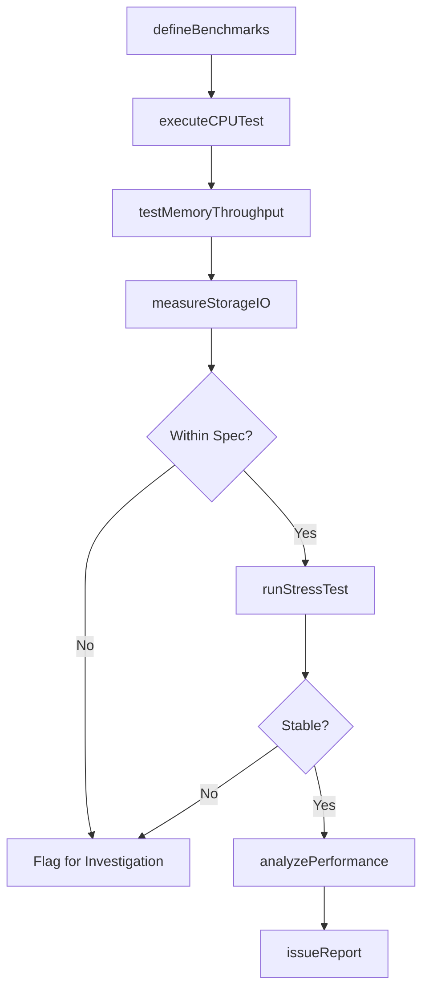
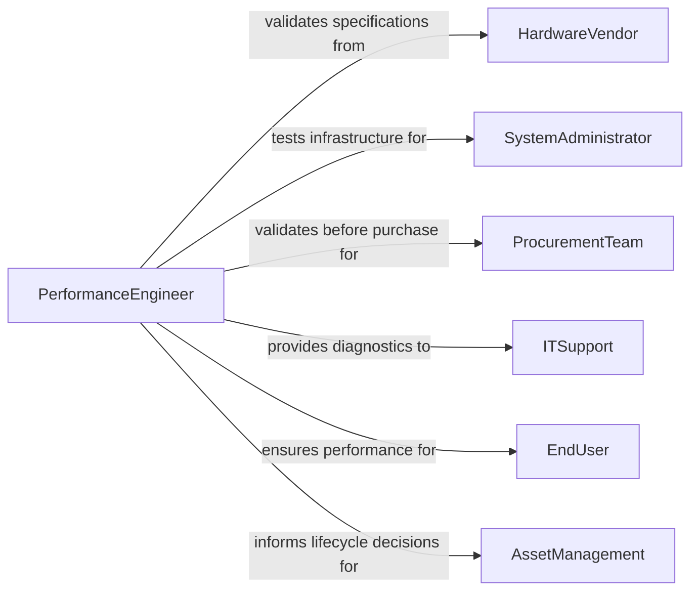

# Test Computer Hardware Performance

> Business-as-Code definition for testing computer hardware performance to validate specifications and identify degradation. Models the complete hardware testing process from benchmark execution through performance analysis and certification.

## Overview

Computer hardware performance testing validates processing speed, memory capacity, storage throughput, and system stability against manufacturer specifications and operational requirements. This definition provides actions for benchmark execution, stress testing, and performance tracking with events for automated degradation alerts and lifecycle management.

## Actors

| Actor | Description |
|-------|-------------|
| HardwareVendor | Manufactures equipment with performance specifications |
| SystemAdministrator | Maintains infrastructure requiring performance validation |
| EndUser | Relies on hardware performance for productivity |
| ProcurementTeam | Validates vendor claims before purchase decisions |
| ITSupport | Troubleshoots performance issues and degradation |
| AssetManagement | Tracks hardware lifecycle and replacement needs |

## Roles

| Role | Description |
|------|-------------|
| PerformanceEngineer | Executes benchmark testing and analysis |
| QualityAssurance | Validates conformance to specifications |
| SystemsTechnician | Performs hardware diagnostics and stress tests |
| CapacityPlanner | Analyzes performance trends for infrastructure planning |

## Entities

| Entity | Description |
|--------|-------------|
| HardwareAsset | A computer, server, or network device under test |
| BenchmarkTest | Standardized performance measurement protocol |
| PerformanceMetrics | CPU, memory, storage, and network measurements |
| StressTest | Extended load test to identify stability issues |
| BaselineRecord | Initial performance measurement for comparison |
| DegradationAlert | Notification of performance decline beyond threshold |

## Actions

| Action | Description |
|--------|-------------|
| defineBenchmarks | Establish test protocols and acceptance criteria |
| executeCPUTest | Measure processor performance and thermal behavior |
| testMemoryThroughput | Validate RAM speed and error correction |
| measureStorageIO | Assess disk read/write performance and latency |
| runStressTest | Execute extended load test for stability verification |
| analyzePerformance | Compare results against baseline and specifications |
| issueReport | Document findings and certification status |

## Events

| Event | Description |
|-------|-------------|
| benchmarksDefined | Test protocols have been established |
| cpuTestExecuted | Processor performance has been measured |
| memoryThroughputTested | RAM performance has been validated |
| storageIOMeasured | Disk performance has been assessed |
| stressTestRun | Stability test has been completed |
| performanceAnalyzed | Results have been compared to specifications |
| reportIssued | Documentation has been published |

## Searches

| Search | Description |
|--------|-------------|
| findTests | List performance tests by asset, date, or status |
| getPerformanceMetrics | Retrieve benchmark results for specific hardware |
| getDegradationAlerts | Find assets with declining performance |
| getBaselineRecords | Review initial performance measurements |

## Workflow



## Actor Relationships



## Usage

### Calling Actions

```typescript
import { testComputerHardwarePerformance } from '@headlessly/test-computer-hardware-performance'

const testing = testComputerHardwarePerformance()

// Define benchmark suite for workstation
const benchmarks = await testing.defineBenchmarks({
  assetId: 'WKS-2026-3847',
  model: 'Dell Precision 7865 Tower',
  testSuite: 'Workstation Validation',
  acceptanceCriteria: {
    cpuMultiCore: '>25000 PassMark score',
    memoryCopySpeed: '>50 GB/s',
    nvmeSSDRead: '>5000 MB/s',
    systemStability: '24-hour stress test without errors'
  }
})

// Execute CPU performance test
await testing.executeCPUTest({
  assetId: 'WKS-2026-3847',
  benchmark: 'PassMark CPU Mark',
  results: {
    singleThreadScore: 3850,
    multiThreadScore: 27400,
    integerMath: 'High',
    floatingPoint: 'High',
    encryption: 'High',
    compression: 'High',
    thermalThrottle: false,
    maxTemperature: '72°C'
  }
})

// Test memory throughput
await testing.testMemoryThroughput({
  assetId: 'WKS-2026-3847',
  benchmark: 'AIDA64 Memory Benchmark',
  results: {
    readSpeed: '54.2 GB/s',
    writeSpeed: '52.8 GB/s',
    copySpeed: '51.3 GB/s',
    latency: '68.2 ns',
    eccErrors: 0,
    installedCapacity: '128 GB DDR5-4800'
  }
})

// Measure storage I/O performance
await testing.measureStorageIO({
  assetId: 'WKS-2026-3847',
  benchmark: 'CrystalDiskMark',
  results: {
    sequentialRead: '7100 MB/s',
    sequentialWrite: '6800 MB/s',
    randomRead4K: '950000 IOPS',
    randomWrite4K: '880000 IOPS',
    driveModel: 'Samsung 990 Pro 2TB',
    interface: 'PCIe 4.0 x4'
  }
})

// Run 24-hour stress test
await testing.runStressTest({
  assetId: 'WKS-2026-3847',
  duration: '24 hours',
  loadProfile: '100% CPU + 90% Memory',
  results: {
    cpuErrors: 0,
    memoryErrors: 0,
    systemCrashes: 0,
    thermalThrottle: false,
    avgCPUTemp: '68°C',
    maxCPUTemp: '74°C',
    stability: 'Pass'
  }
})

// Analyze overall performance
await testing.analyzePerformance({
  assetId: 'WKS-2026-3847',
  analysis: {
    cpuPerformance: 'Exceeds specification by 9%',
    memoryPerformance: 'Exceeds specification by 2%',
    storagePerformance: 'Exceeds specification by 42%',
    stability: 'Passed 24-hour stress test',
    overallRating: 'Certified for CAD/Engineering workloads'
  }
})
```

### Event-Driven Automation

```typescript
// Alert on performance degradation
testing.performanceAnalyzed(async ({ assetId, analysis, baseline }) => {
  if (analysis.performanceVsBaseline < 0.85) {
    await notify({
      to: 'it-support@company.com',
      subject: `Performance degradation - Asset ${assetId}`,
      body: `Performance declined ${(1 - analysis.performanceVsBaseline) * 100}% from baseline`
    })
  }
})

// Schedule periodic retesting
testing.reportIssued(async ({ assetId, certificationDate }) => {
  await scheduleTask({
    taskType: 'Performance Retest',
    assetId,
    scheduledDate: addMonths(certificationDate, 6),
    assignee: 'performance-team'
  })
})
```
