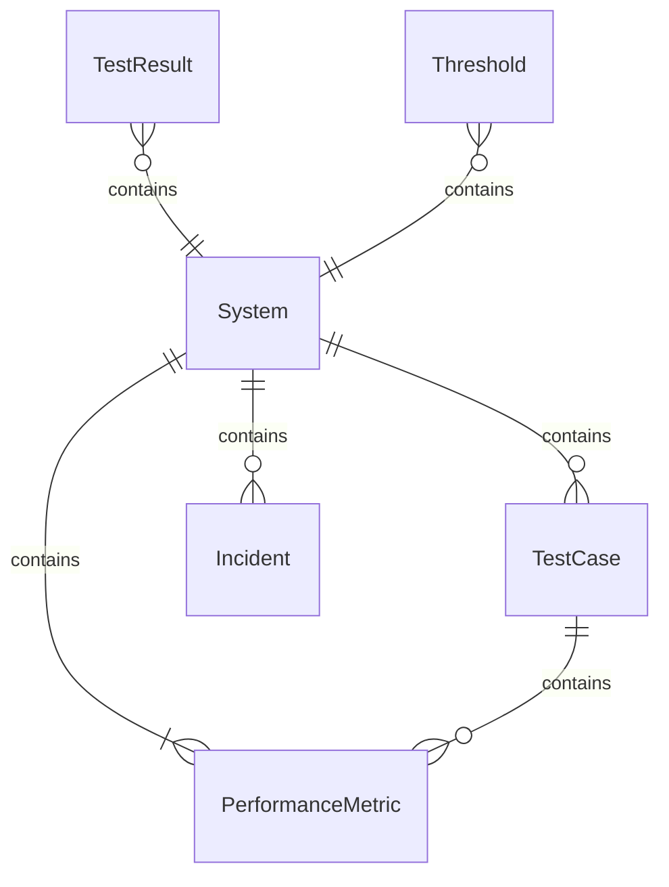
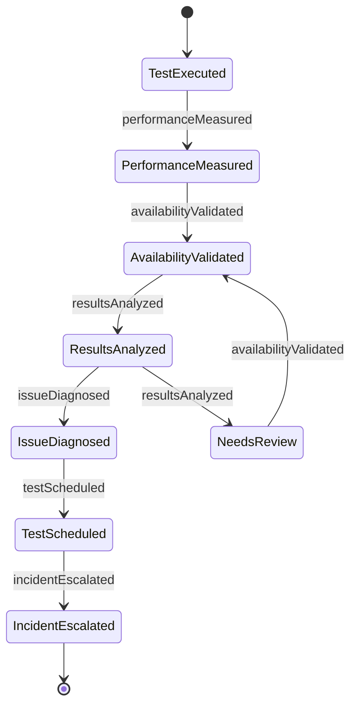
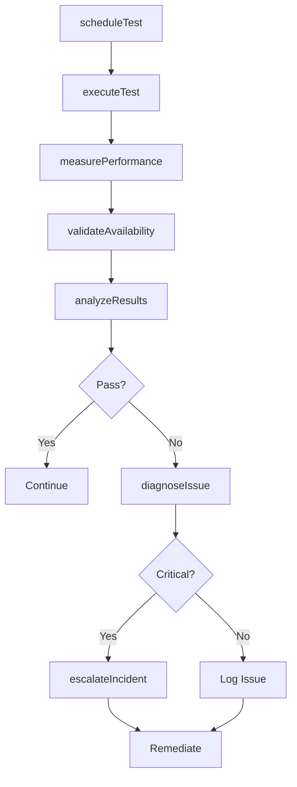
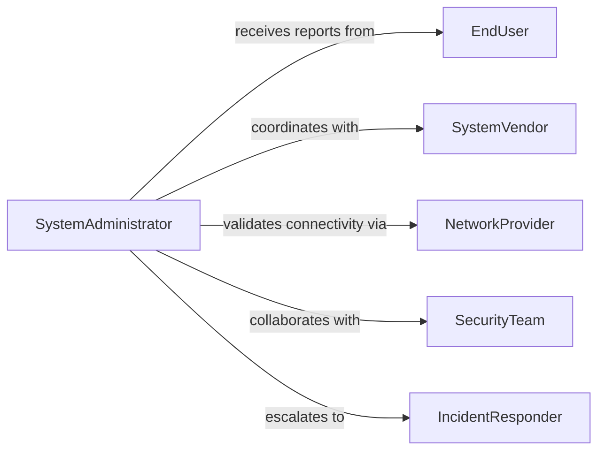

# Test Computer System Operations Ensure

> Business-as-Code definition for computer system operations testing. Verifies system stability, performance, and availability through comprehensive operational validation.

## Overview

Computer system operations testing validates that information systems function correctly under normal and peak load conditions. This definition provides actions for executing system tests, monitoring operational metrics, and automating responses to performance degradation or system failures.

## Actors

| Actor | Description |
|-------|-------------|
| EndUser | Accesses systems and reports operational issues |
| SystemVendor | Provides system documentation and support |
| NetworkProvider | Maintains connectivity infrastructure |
| SecurityTeam | Monitors system access and compliance |
| HelpDesk | Receives and triages user-reported issues |
| ExecutiveManagement | Reviews system availability metrics |

## Roles

| Role | Description |
|------|-------------|
| SystemAdministrator | Executes operational tests and maintains systems |
| PerformanceAnalyst | Analyzes system metrics and identifies bottlenecks |
| QualityAssurance | Validates test results against requirements |
| IncidentResponder | Addresses operational failures and outages |

## Entities

| Entity | Description |
|--------|-------------|
| System | A computer system or application under test |
| TestCase | A specific operational scenario to validate |
| TestResult | Outcome of a test execution with metrics |
| PerformanceMetric | Measurement of system operational characteristics |
| Incident | A system failure or degradation event |
| Threshold | Acceptable limits for performance metrics |

## Actions

| Action | Description |
|--------|-------------|
| executeTest | Run a test case against a system |
| measurePerformance | Collect operational metrics from a running system |
| validateAvailability | Verify system is accessible and responsive |
| analyzeResults | Review test outcomes and compare to thresholds |
| diagnoseIssue | Investigate root cause of test failures |
| scheduleTest | Plan automated test execution |
| escalateIncident | Notify stakeholders of critical failures |

## Events

| Event | Description |
|-------|-------------|
| testExecuted | A test case has been run against the system |
| performanceMeasured | Operational metrics have been collected |
| availabilityValidated | System responsiveness has been verified |
| resultsAnalyzed | Test outcomes have been evaluated |
| issueDiagnosed | Root cause of a failure has been identified |
| testScheduled | Automated test execution has been planned |
| incidentEscalated | Critical failure has been reported to stakeholders |

## Searches

| Search | Description |
|--------|-------------|
| findTests | Retrieve test cases by system, type, or status |
| getResults | Query test results by timeframe or outcome |
| getMetrics | Fetch performance metrics for a system or period |
| getIncidents | Find operational incidents by severity or status |

## Entity Relationships



## State Diagram



## Workflow



## Actor Relationships



## Usage

### Calling Actions

```typescript
import { testComputerSystemOperationsEnsure } from '@headlessly/test-computer-system-operations-ensure'

const testing = testComputerSystemOperationsEnsure()

// Schedule automated operational test
await testing.scheduleTest({
  systemId: 'erp-prod-01',
  testCase: 'peak-load-simulation',
  schedule: { cron: '0 2 * * *' }
})

// Execute real-time system test
const result = await testing.executeTest({
  systemId: 'crm-prod-02',
  testCase: 'user-authentication-flow',
  parameters: { concurrentUsers: 500 }
})

// Measure and validate performance
const metrics = await testing.measurePerformance({
  systemId: 'erp-prod-01',
  duration: 300,
  metrics: ['responseTime', 'throughput', 'errorRate']
})

await testing.validateAvailability({
  systemId: 'erp-prod-01',
  thresholds: { responseTime: 200, uptime: 99.9 }
})
```

### Event-Driven Automation

```typescript
// Auto-escalate critical failures
testing.resultsAnalyzed(async ({ systemId, result, thresholds }) => {
  if (result.errorRate > thresholds.errorRate) {
    await testing.escalateIncident({
      systemId,
      severity: 'critical',
      message: `Error rate ${result.errorRate}% exceeds threshold ${thresholds.errorRate}%`
    })
  }
})

// Log performance degradation
testing.performanceMeasured(async ({ systemId, metrics }) => {
  if (metrics.responseTime > 1000) {
    await testing.diagnoseIssue({
      systemId,
      symptom: 'high-latency',
      metrics
    })
  }
})
```
