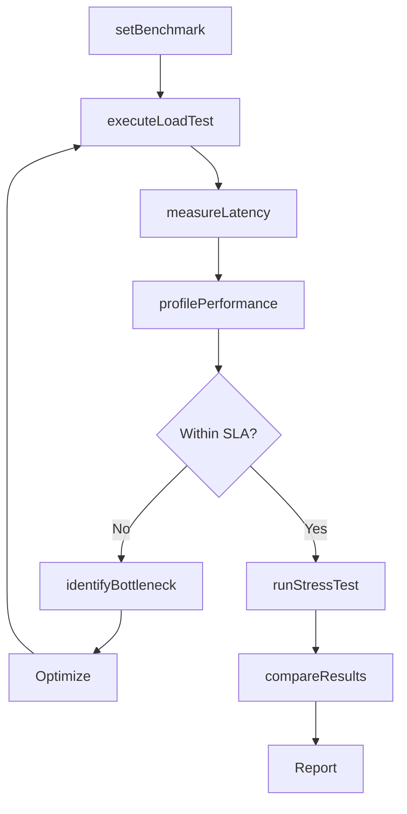
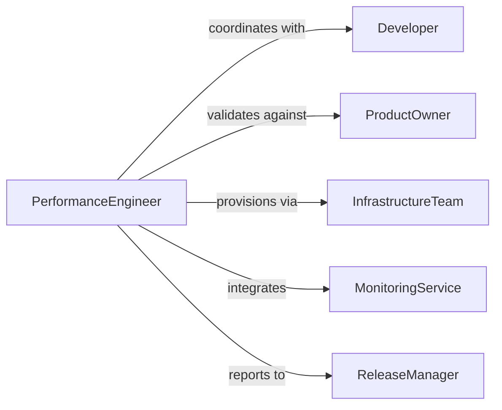

# Test Software Performance

> Business-as-Code definition for software performance testing. Validates application speed, scalability, and resource consumption under various load conditions.

## Overview

Software performance testing measures how applications respond under different workloads, identifying bottlenecks and capacity limits. This definition exposes actions for load testing, stress testing, and performance profiling, along with events for automated alerting and remediation workflows.

## Actors

| Actor | Description |
|-------|-------------|
| Developer | Implements performance improvements |
| ProductOwner | Sets performance requirements and SLAs |
| EndUser | Experiences application performance in production |
| InfrastructureTeam | Provisions compute and network resources |
| Monitoring Service | Collects real-time performance telemetry |
| StakeholderGroup | Reviews performance against business objectives |

## Roles

| Role | Description |
|------|-------------|
| PerformanceEngineer | Designs and executes performance test scenarios |
| TestAutomationSpecialist | Builds automated performance test suites |
| PerformanceAnalyst | Interprets results and recommends optimizations |
| ReleaseManager | Gates releases based on performance criteria |

## Entities

| Entity | Description |
|--------|-------------|
| Application | Software system under performance test |
| LoadTest | Simulated user load to measure throughput |
| StressTest | Test that pushes system beyond normal capacity |
| PerformanceProfile | Detailed resource consumption analysis |
| Bottleneck | Performance constraint limiting throughput |
| Benchmark | Baseline performance metric for comparison |

## Actions

| Action | Description |
|--------|-------------|
| executeLoadTest | Simulate concurrent user load on application |
| runStressTest | Test application behavior beyond capacity limits |
| profilePerformance | Analyze CPU, memory, and I/O utilization |
| measureLatency | Record response times for key transactions |
| identifyBottleneck | Locate performance constraints in system |
| setBenchmark | Establish baseline performance metrics |
| compareResults | Evaluate performance changes across versions |

## Events

| Event | Description |
|-------|-------------|
| loadTestExecuted | Load test has completed with results |
| stressTestRun | Stress test has been performed |
| performanceProfiled | Resource utilization analysis is complete |
| latencyMeasured | Response time data has been collected |
| bottleneckIdentified | Performance constraint has been detected |
| benchmarkSet | Baseline performance metrics established |
| resultsCompared | Performance comparison across versions completed |

## Searches

| Search | Description |
|--------|-------------|
| findTests | Query performance tests by application or type |
| getResults | Retrieve test results by date or outcome |
| getProfiles | Fetch resource utilization data for application |
| getBenchmarks | Get baseline metrics for comparison |

## Workflow



## Actor Relationships



## Usage

### Calling Actions

```typescript
import { testSoftwarePerformance } from '@headlessly/test-software-performance'

const performance = testSoftwarePerformance()

// Set baseline benchmark
await performance.setBenchmark({
  applicationId: 'checkout-service',
  metrics: {
    p95Latency: 150,
    throughput: 1000,
    errorRate: 0.1
  }
})

// Execute load test
const loadTest = await performance.executeLoadTest({
  applicationId: 'checkout-service',
  duration: 600,
  virtualUsers: 500,
  rampUp: 60
})

// Profile performance under load
const profile = await performance.profilePerformance({
  applicationId: 'checkout-service',
  duration: 300,
  metrics: ['cpu', 'memory', 'diskIO', 'networkIO']
})

// Identify bottlenecks
const bottlenecks = await performance.identifyBottleneck({
  profileId: profile.id,
  thresholds: { cpu: 80, memory: 85 }
})
```

### Event-Driven Automation

```typescript
// Alert on SLA violation
performance.latencyMeasured(async ({ applicationId, p95Latency, benchmark }) => {
  if (p95Latency > benchmark.p95Latency * 1.2) {
    await notify({
      to: 'performance-team',
      message: `${applicationId} p95 latency ${p95Latency}ms exceeds SLA`
    })
  }
})

// Auto-scale on stress test failure
performance.stressTestRun(async ({ applicationId, result }) => {
  if (result.maxCapacity < result.targetCapacity) {
    await scaleInfrastructure({
      applicationId,
      targetCapacity: result.targetCapacity
    })
  }
})
```
