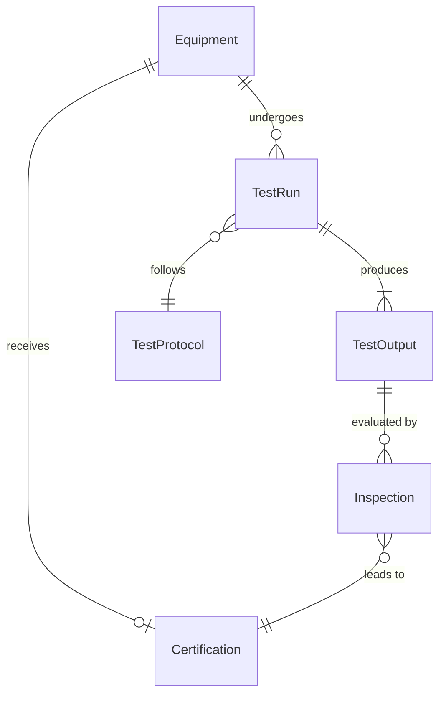
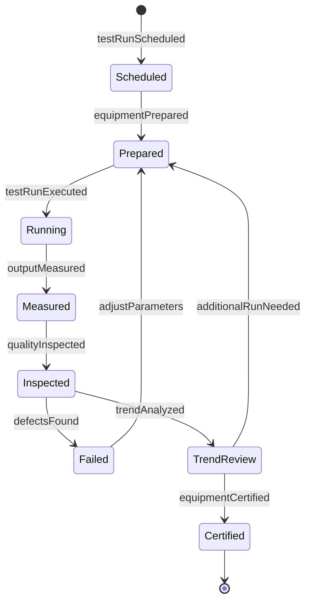
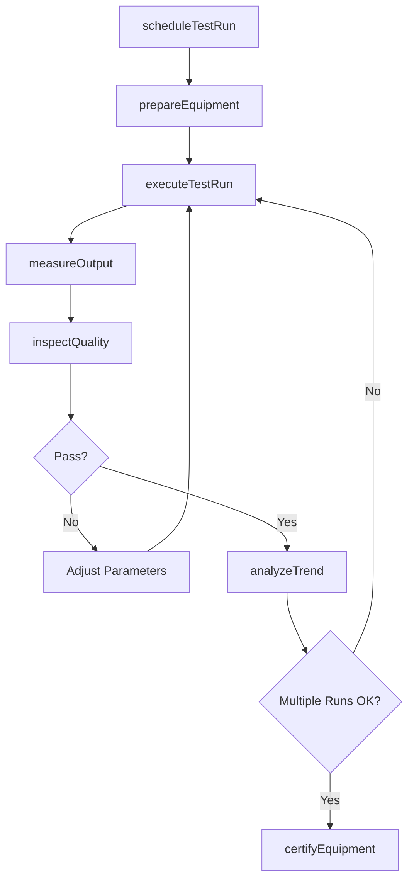
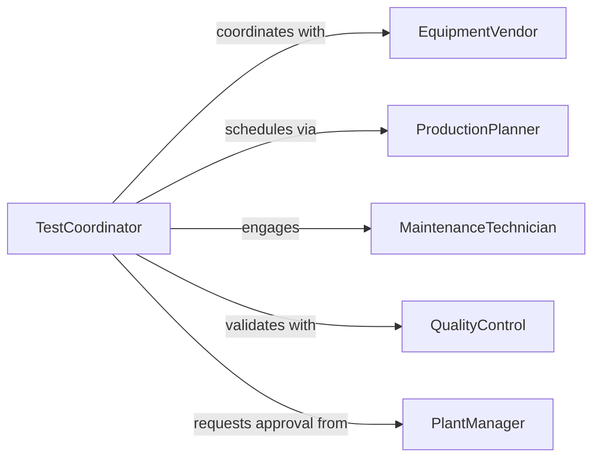

# Conduct Test Runs Production Equipment

> Business-as-Code definition for production equipment test runs. Validates machinery performance, output quality, and operational readiness before full production deployment.

## Overview

Production equipment test runs verify that manufacturing machinery operates correctly, meets output specifications, and produces quality parts before entering full production. This definition provides actions for executing test runs, inspecting output, and certifying equipment readiness.

## Actors

| Actor | Description |
|-------|-------------|
| EquipmentVendor | Provides machinery and technical documentation |
| QualityControl | Inspects test run output for defects |
| ProductionPlanner | Schedules test runs and production cutover |
| MaintenanceTechnician | Prepares equipment for testing |
| SafetyOfficer | Validates safe operating procedures |
| PlantManager | Approves equipment for production use |

## Roles

| Role | Description |
|------|-------------|
| EquipmentOperator | Executes test runs and monitors operation |
| ProcessEngineer | Defines test parameters and acceptance criteria |
| QualityInspector | Measures output against specifications |
| TestCoordinator | Plans and oversees test run execution |

## Entities

| Entity | Description |
|--------|-------------|
| Equipment | Production machinery undergoing testing |
| TestRun | An execution of equipment under test conditions |
| TestOutput | Parts or products produced during test |
| TestProtocol | Procedure and parameters for test execution |
| Inspection | Quality check of test run output |
| Certification | Approval that equipment is ready for production |

## Actions

| Action | Description |
|--------|-------------|
| scheduleTestRun | Plan equipment test execution window |
| prepareEquipment | Ready machinery for test operation |
| executeTestRun | Run equipment under specified test conditions |
| measureOutput | Collect performance data during test |
| inspectQuality | Evaluate test output against specifications |
| analyzeTrend | Compare results across multiple test runs |
| certifyEquipment | Approve equipment for production deployment |

## Events

| Event | Description |
|-------|-------------|
| testRunScheduled | Test execution window has been planned |
| equipmentPrepared | Machinery is ready for test operation |
| testRunExecuted | Equipment test has been completed |
| outputMeasured | Performance data has been collected |
| qualityInspected | Test output has been evaluated |
| trendAnalyzed | Multi-run performance comparison completed |
| equipmentCertified | Equipment approved for production use |

## Searches

| Search | Description |
|--------|-------------|
| findTestRuns | Query test runs by equipment or date |
| getOutput | Retrieve performance data from test runs |
| getInspections | Fetch quality inspection results |
| getCertifications | Get equipment approval records |

## Entity Relationships



## State Diagram



## Workflow



## Actor Relationships



## Usage

### Calling Actions

```typescript
import { conductTestRunsProductionEquipment } from '@headlessly/conduct-test-runs-production-equipment'

const testing = conductTestRunsProductionEquipment()

// Schedule equipment test run
await testing.scheduleTestRun({
  equipmentId: 'cnc-mill-04',
  protocol: 'standard-acceptance-test',
  scheduledDate: '2026-02-10T08:00:00Z',
  duration: 240
})

// Execute test run
const testRun = await testing.executeTestRun({
  equipmentId: 'cnc-mill-04',
  protocolId: 'standard-acceptance-test',
  parameters: {
    cycleCount: 100,
    speed: 3500,
    feedRate: 800
  }
})

// Measure output and inspect quality
const output = await testing.measureOutput({
  testRunId: testRun.id,
  metrics: ['cycleTime', 'throughput', 'partDimensions']
})

const inspection = await testing.inspectQuality({
  testRunId: testRun.id,
  sampleSize: 20,
  tolerances: { dimension: 0.01, surfaceFinish: 1.6 }
})
```

### Event-Driven Automation

```typescript
// Auto-certify after successful test series
testing.trendAnalyzed(async ({ equipmentId, testRuns, trend }) => {
  if (testRuns.length >= 3 && trend.defectRate < 0.5) {
    await testing.certifyEquipment({
      equipmentId,
      certifiedBy: 'system',
      validUntil: '2026-12-31'
    })
  }
})

// Alert on quality failure
testing.qualityInspected(async ({ equipmentId, inspection }) => {
  if (inspection.defectRate > 5) {
    await notify({
      to: 'production-engineering',
      message: `Equipment ${equipmentId} test run failed quality inspection`
    })
  }
})
```
