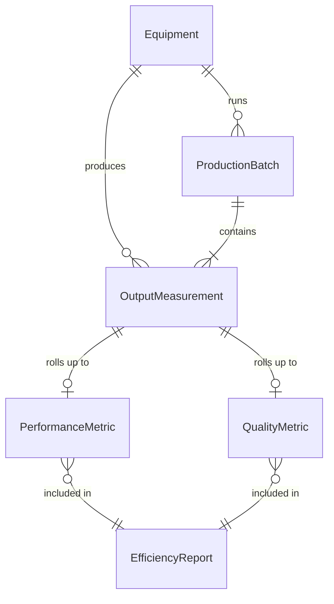
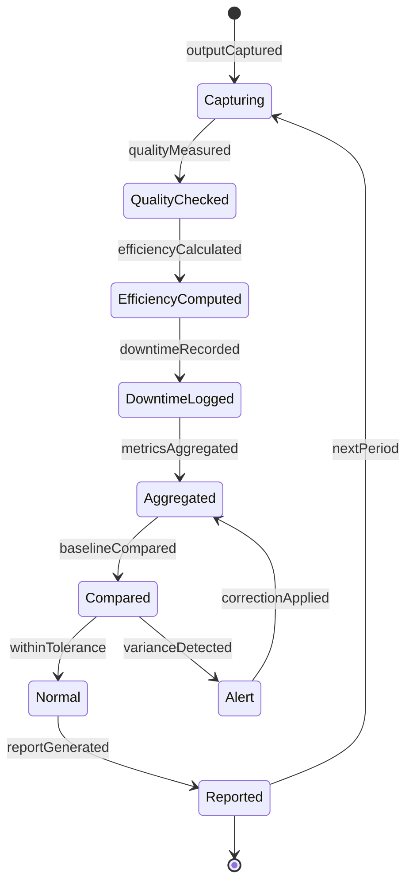
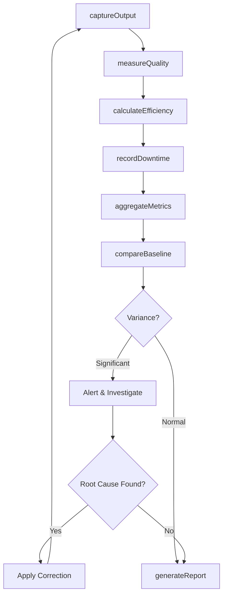
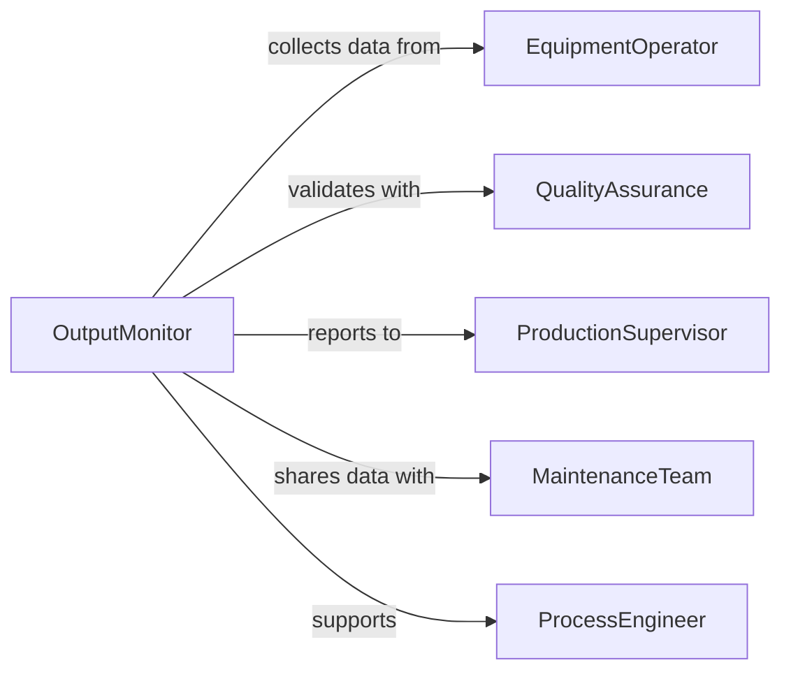

# Measure Equipment Outputs

> Business-as-Code definition for equipment output measurement. Captures production metrics, performance data, and quality indicators from operational machinery.

## Overview

Equipment output measurement collects quantitative and qualitative data from operating machinery to assess performance, track efficiency, and ensure quality standards. This definition provides actions for data collection, analysis, and reporting of equipment output metrics.

## Actors

| Actor | Description |
|-------|-------------|
| EquipmentOperator | Operates machinery and observes performance |
| QualityAssurance | Validates output meets specifications |
| ProductionSupervisor | Reviews output data for efficiency targets |
| MaintenanceTeam | Uses output data to plan preventive maintenance |
| ProcessEngineer | Analyzes output trends for optimization |
| CustomerService | Receives output data to track order fulfillment |

## Roles

| Role | Description |
|------|-------------|
| OutputMonitor | Tracks equipment performance metrics |
| DataAnalyst | Interprets output data and identifies trends |
| PerformanceAuditor | Validates measurement accuracy and completeness |
| ReportingSpecialist | Compiles output data for stakeholder review |

## Entities

| Entity | Description |
|--------|-------------|
| Equipment | Machinery producing measurable output |
| OutputMeasurement | Data captured from equipment operation |
| PerformanceMetric | Calculated indicator of equipment effectiveness |
| ProductionBatch | Group of units produced in a time period |
| QualityMetric | Measurement of output conformance to specifications |
| EfficiencyReport | Summary of equipment output vs. capacity |

## Actions

| Action | Description |
|--------|-------------|
| captureOutput | Record production quantity from equipment |
| measureQuality | Assess output conformance to specifications |
| calculateEfficiency | Compute actual vs. theoretical output rate |
| recordDowntime | Log non-productive equipment time |
| aggregateMetrics | Summarize output data over a time period |
| compareBaseline | Evaluate output against historical performance |
| generateReport | Create output summary for stakeholders |

## Events

| Event | Description |
|-------|-------------|
| outputCaptured | Production quantity has been recorded |
| qualityMeasured | Output conformance assessment is complete |
| efficiencyCalculated | Output rate has been computed |
| downtimeRecorded | Non-productive time has been logged |
| metricsAggregated | Output data has been summarized |
| baselineCompared | Historical comparison has been performed |
| reportGenerated | Output summary has been created |

## Searches

| Search | Description |
|--------|-------------|
| findMeasurements | Query output data by equipment or timeframe |
| getMetrics | Retrieve performance indicators for analysis |
| getDowntime | Fetch non-productive time records |
| getReports | Access output summaries by period or department |

## Entity Relationships



## State Diagram



## Workflow



## Actor Relationships



## Usage

### Calling Actions

```typescript
import { measureEquipmentOutputs } from '@headlessly/measure-equipment-outputs'

const measurement = measureEquipmentOutputs()

// Capture production output
await measurement.captureOutput({
  equipmentId: 'injection-mold-03',
  timestamp: '2026-02-05T14:30:00Z',
  quantity: 1250,
  unit: 'parts',
  batchId: 'batch-2026-02-05-003'
})

// Measure output quality
const quality = await measurement.measureQuality({
  equipmentId: 'injection-mold-03',
  batchId: 'batch-2026-02-05-003',
  sampleSize: 50,
  defects: 2
})

// Calculate efficiency
const efficiency = await measurement.calculateEfficiency({
  equipmentId: 'injection-mold-03',
  timeframe: { start: '2026-02-05T08:00:00Z', end: '2026-02-05T16:00:00Z' },
  theoreticalCapacity: 1500
})

// Generate daily output report
const report = await measurement.generateReport({
  equipmentIds: ['injection-mold-03', 'injection-mold-04'],
  period: 'daily',
  date: '2026-02-05'
})
```

### Event-Driven Automation

```typescript
// Alert on low efficiency
measurement.efficiencyCalculated(async ({ equipmentId, efficiency, target }) => {
  if (efficiency < target * 0.85) {
    await notify({
      to: 'production-team',
      message: `Equipment ${equipmentId} efficiency ${efficiency}% below target`
    })
  }
})

// Schedule maintenance on quality decline
measurement.qualityMeasured(async ({ equipmentId, defectRate, trend }) => {
  if (defectRate > 5 && trend === 'increasing') {
    await scheduleMaintenance({
      equipmentId,
      priority: 'high',
      reason: 'quality-degradation'
    })
  }
})
```
