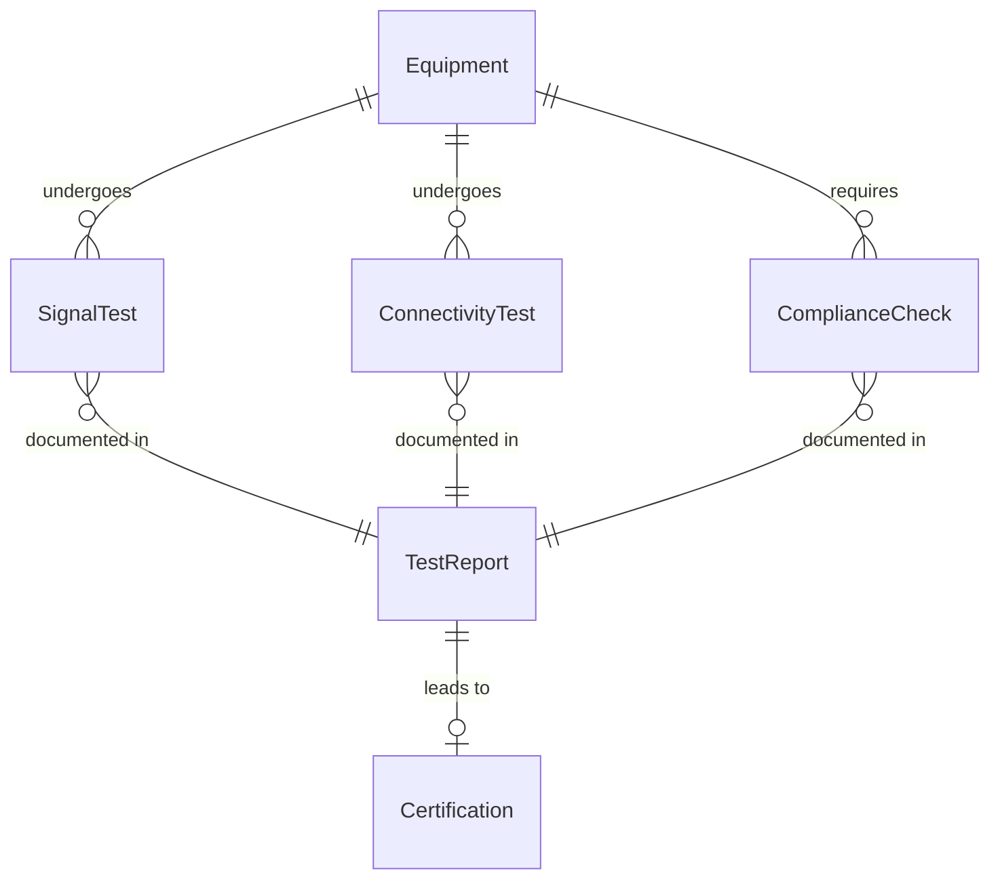
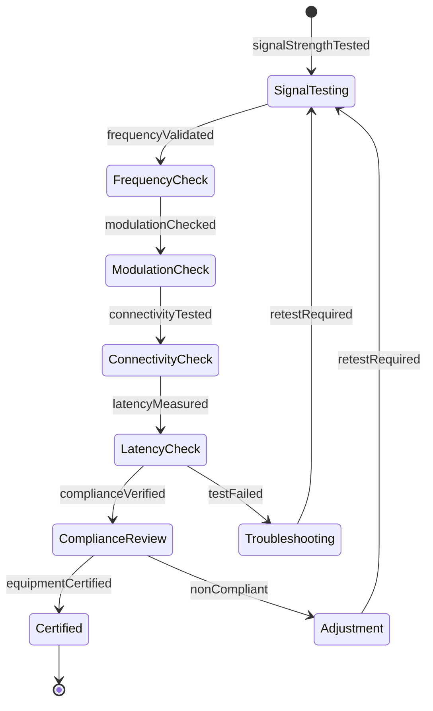
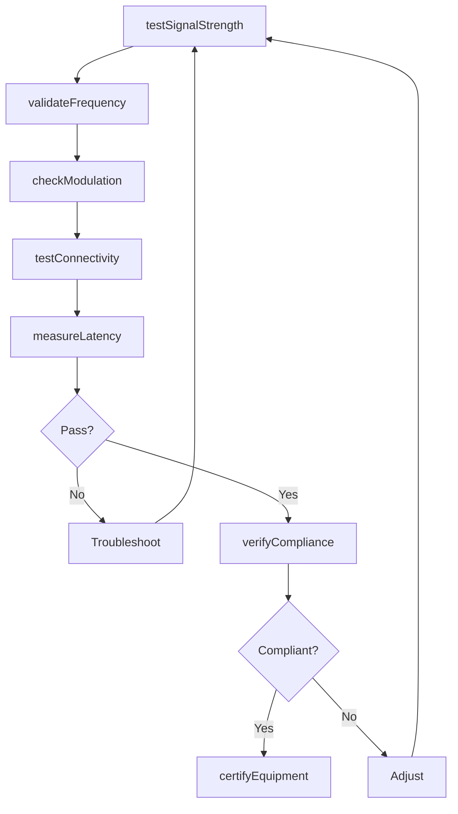
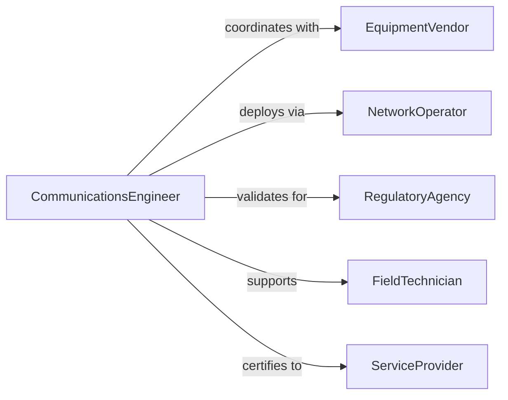

# Test Communications Equipment Ensure Proper

> Business-as-Code definition for communications equipment testing. Validates radio systems, network devices, and transmission equipment for reliability and signal quality.

## Overview

Communications equipment testing verifies that radio transceivers, network switches, antennas, and other transmission devices operate within specifications. This definition provides actions for signal testing, connectivity validation, and performance certification of communications infrastructure.

## Actors

| Actor | Description |
|-------|-------------|
| EquipmentVendor | Provides communications hardware and specifications |
| NetworkOperator | Manages communications infrastructure |
| EndUser | Relies on communications equipment for operations |
| RegulatoryAgency | Enforces spectrum and emissions compliance |
| FieldTechnician | Installs and maintains communications equipment |
| ServiceProvider | Delivers connectivity services using equipment |

## Roles

| Role | Description |
|------|-------------|
| CommunicationsEngineer | Tests and certifies communications equipment |
| SignalAnalyst | Measures RF characteristics and signal quality |
| NetworkTechnician | Validates data transmission and connectivity |
| ComplianceSpecialist | Ensures equipment meets regulatory requirements |

## Entities

| Entity | Description |
|--------|-------------|
| Equipment | Communications device under test |
| SignalTest | Measurement of RF characteristics |
| ConnectivityTest | Validation of data transmission capability |
| ComplianceCheck | Verification of regulatory conformance |
| TestReport | Documentation of equipment test results |
| Certification | Approval for operational deployment |

## Actions

| Action | Description |
|--------|-------------|
| testSignalStrength | Measure transmit and receive power levels |
| validateFrequency | Verify operating frequency accuracy |
| checkModulation | Assess signal modulation quality |
| testConnectivity | Validate data transmission and reception |
| measureLatency | Record signal propagation delay |
| verifyCompliance | Confirm regulatory standard conformance |
| certifyEquipment | Approve device for operational use |

## Events

| Event | Description |
|-------|-------------|
| signalStrengthTested | Power level measurements completed |
| frequencyValidated | Operating frequency verified |
| modulationChecked | Signal quality assessed |
| connectivityTested | Data transmission validated |
| latencyMeasured | Propagation delay recorded |
| complianceVerified | Regulatory conformance confirmed |
| equipmentCertified | Device approved for deployment |

## Searches

| Search | Description |
|--------|-------------|
| findTests | Query equipment tests by device or date |
| getResults | Retrieve test outcomes and measurements |
| getReports | Fetch equipment test documentation |
| getCertifications | Access equipment approval records |

## Entity Relationships



## State Diagram



## Workflow



## Actor Relationships



## Usage

### Calling Actions

```typescript
import { testCommunicationsEquipmentEnsureProper } from '@headlessly/test-communications-equipment-ensure-proper'

const testing = testCommunicationsEquipmentEnsureProper()

// Test radio signal strength
const signal = await testing.testSignalStrength({
  equipmentId: 'radio-base-station-12',
  frequency: 850,
  testPoints: ['indoor', 'outdoor', 'edge-of-coverage']
})

// Validate operating frequency
await testing.validateFrequency({
  equipmentId: 'radio-base-station-12',
  nominalFrequency: 850.25,
  tolerance: 0.001
})

// Test network connectivity
const connectivity = await testing.testConnectivity({
  equipmentId: 'network-switch-05',
  testDuration: 300,
  trafficPattern: 'full-duplex',
  throughput: 1000
})

// Verify regulatory compliance
const compliance = await testing.verifyCompliance({
  equipmentId: 'radio-base-station-12',
  standards: ['FCC-Part-15', 'ETSI-EN-301-489']
})
```

### Event-Driven Automation

```typescript
// Auto-certify compliant equipment
testing.complianceVerified(async ({ equipmentId, standards, results }) => {
  if (results.every((r) => r.passed)) {
    await testing.certifyEquipment({
      equipmentId,
      standards,
      validUntil: '2027-02-05'
    })
  }
})

// Alert on signal quality degradation
testing.modulationChecked(async ({ equipmentId, signalQuality, threshold }) => {
  if (signalQuality < threshold) {
    await notify({
      to: 'network-operations',
      message: `Equipment ${equipmentId} signal quality below acceptable level`
    })
  }
})
```
