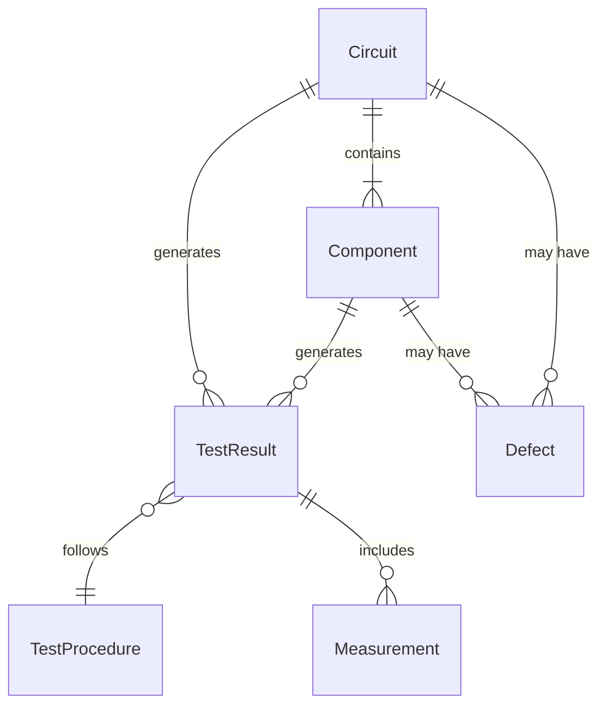
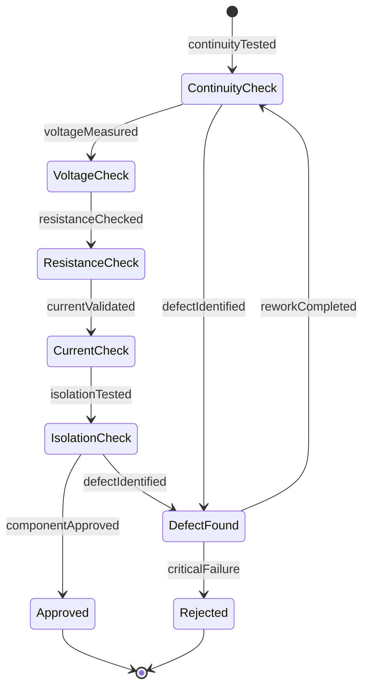
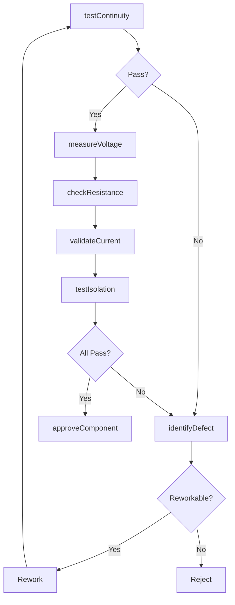
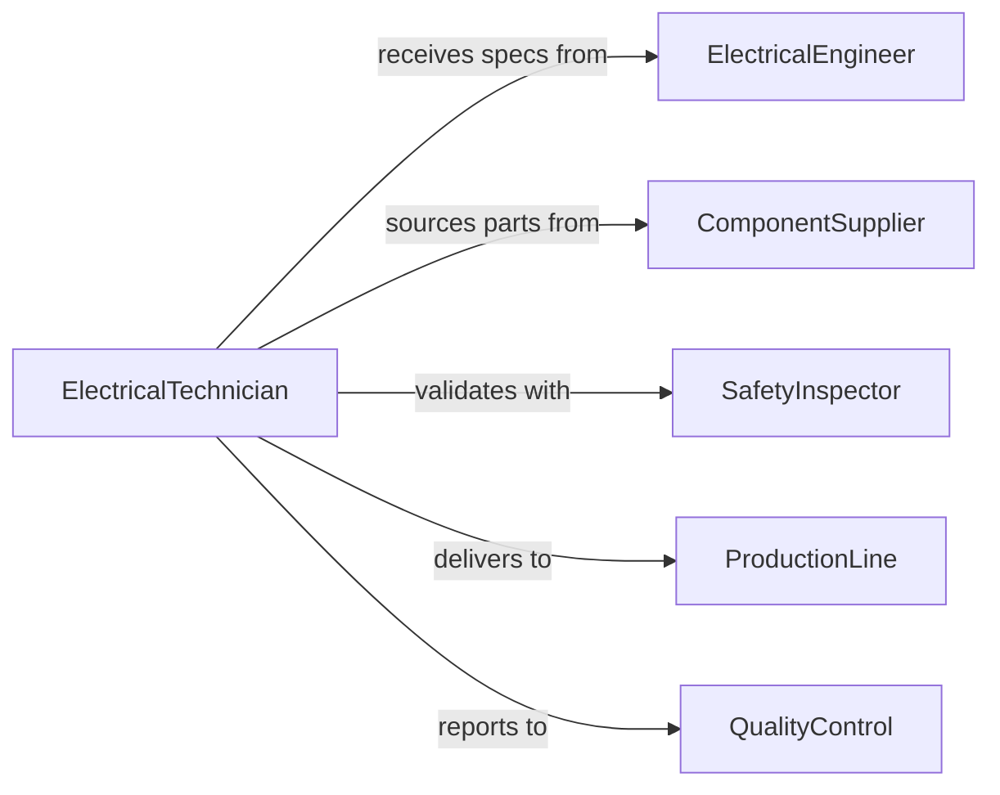

# Test Electrical Circuits Components Proper

> Business-as-Code definition for electrical circuit and component testing. Validates electrical integrity, continuity, and performance of circuits and individual components.

## Overview

Electrical circuit and component testing verifies that wiring, circuit boards, and electronic parts function correctly and safely. This definition provides actions for continuity testing, voltage measurement, and component validation to ensure electrical systems meet design specifications.

## Actors

| Actor | Description |
|-------|-------------|
| ComponentSupplier | Provides electrical parts and specifications |
| ElectricalEngineer | Designs circuits and defines test criteria |
| SafetyInspector | Validates electrical safety compliance |
| ProductionLine | Assembles circuits using tested components |
| QualityControl | Certifies components meet acceptance standards |
| EndUser | Operates equipment containing tested circuits |

## Roles

| Role | Description |
|------|-------------|
| ElectricalTechnician | Performs circuit and component testing |
| TestEngineer | Develops test procedures and specifications |
| CalibrationSpecialist | Maintains test equipment accuracy |
| ComponentInspector | Validates individual part functionality |

## Entities

| Entity | Description |
|--------|-------------|
| Circuit | Electrical pathway connecting components |
| Component | Individual electrical part under test |
| TestResult | Outcome of circuit or component measurement |
| TestProcedure | Defined method for validating electrical function |
| Measurement | Recorded electrical characteristic value |
| Defect | Identified deviation from specification |

## Actions

| Action | Description |
|--------|-------------|
| testContinuity | Verify electrical path is complete and conductive |
| measureVoltage | Record voltage levels at test points |
| checkResistance | Measure resistance of components or circuits |
| validateCurrent | Verify current flow meets specifications |
| testIsolation | Confirm electrical separation between circuits |
| identifyDefect | Locate and characterize circuit or component failure |
| approveComponent | Certify part meets acceptance criteria |

## Events

| Event | Description |
|-------|-------------|
| continuityTested | Electrical path verification completed |
| voltageMeasured | Voltage levels recorded |
| resistanceChecked | Resistance measurement completed |
| currentValidated | Current flow verified |
| isolationTested | Circuit separation confirmed |
| defectIdentified | Failure located and characterized |
| componentApproved | Part certified for use |

## Searches

| Search | Description |
|--------|-------------|
| findTests | Query tests by circuit, component, or date |
| getResults | Retrieve test outcomes and measurements |
| getDefects | Fetch identified failures and characteristics |
| getApprovals | Access component certification records |

## Entity Relationships



## State Diagram



## Workflow



## Actor Relationships



## Usage

### Calling Actions

```typescript
import { testElectricalCircuitsComponentsProper } from '@headlessly/test-electrical-circuits-components-proper'

const testing = testElectricalCircuitsComponentsProper()

// Test circuit continuity
const continuity = await testing.testContinuity({
  circuitId: 'power-distribution-board-03',
  testPoints: [
    { from: 'J1-1', to: 'J2-5' },
    { from: 'J2-5', to: 'R3-1' }
  ]
})

// Measure voltage at test points
const voltage = await testing.measureVoltage({
  circuitId: 'power-distribution-board-03',
  testPoints: ['TP1', 'TP5', 'TP12'],
  expectedVoltages: [5.0, 12.0, 24.0],
  tolerance: 0.1
})

// Validate component resistance
const resistance = await testing.checkResistance({
  componentId: 'R15-10K',
  nominalValue: 10000,
  tolerance: 5
})

// Approve component after all tests pass
await testing.approveComponent({
  componentId: 'power-distribution-board-03',
  testResults: [continuity.id, voltage.id, resistance.id]
})
```

### Event-Driven Automation

```typescript
// Auto-reject components with defects
testing.defectIdentified(async ({ componentId, defectType, severity }) => {
  if (severity === 'critical') {
    await rejectComponent({
      componentId,
      reason: defectType,
      disposition: 'scrap'
    })
  }
})

// Trigger calibration on out-of-tolerance measurements
testing.voltageMeasured(async ({ testEquipmentId, measurements }) => {
  const outOfTolerance = measurements.filter((m) => Math.abs(m.error) > 0.5)
  if (outOfTolerance.length > 3) {
    await scheduleCalibration({
      equipmentId: testEquipmentId,
      priority: 'high'
    })
  }
})
```
