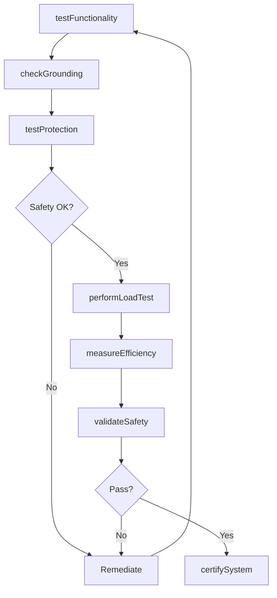
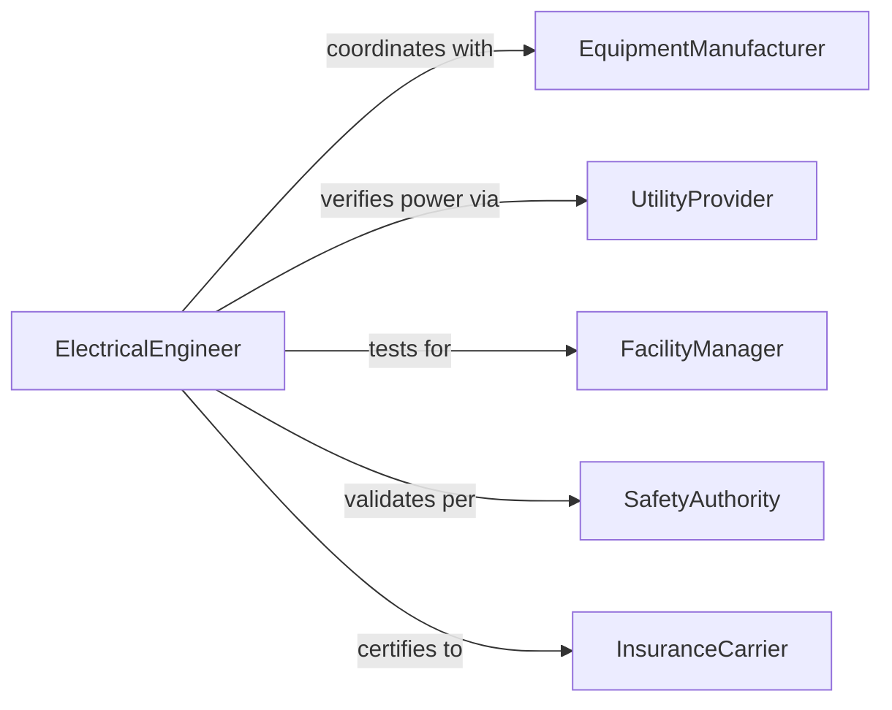

# Test Electrical Equipment Systems Ensure

> Business-as-Code definition for electrical equipment and systems testing. Validates operational integrity, safety, and performance of electrical infrastructure and powered equipment.

## Overview

Electrical equipment systems testing verifies that power distribution systems, motors, generators, and electrical machinery operate safely and efficiently. This definition provides actions for functional testing, load testing, and safety validation of electrical systems.

## Actors

| Actor | Description |
|-------|-------------|
| EquipmentManufacturer | Provides electrical equipment and specifications |
| UtilityProvider | Supplies electrical power to systems |
| FacilityManager | Operates buildings with electrical systems |
| SafetyAuthority | Enforces electrical codes and regulations |
| InsuranceCarrier | Requires safety testing for coverage |
| MaintenanceContractor | Services electrical equipment |

## Roles

| Role | Description |
|------|-------------|
| ElectricalEngineer | Designs test procedures and interprets results |
| SystemTechnician | Executes equipment and system tests |
| SafetyTester | Validates electrical safety compliance |
| LoadTestSpecialist | Performs equipment capacity testing |

## Entities

| Entity | Description |
|--------|-------------|
| ElectricalSystem | Integrated power distribution or equipment |
| Equipment | Individual electrical device under test |
| FunctionalTest | Validation of operational capability |
| LoadTest | Assessment of performance under demand |
| SafetyTest | Verification of electrical code compliance |
| TestReport | Documentation of system test results |

## Actions

| Action | Description |
|--------|-------------|
| testFunctionality | Verify equipment operates as designed |
| performLoadTest | Validate performance under rated capacity |
| checkGrounding | Confirm proper electrical grounding |
| testProtection | Verify overcurrent and fault protection |
| measureEfficiency | Assess energy consumption vs. output |
| validateSafety | Confirm compliance with electrical codes |
| certifySystem | Approve system for operational use |

## Events

| Event | Description |
|-------|-------------|
| functionalityTested | Operational capability verified |
| loadTestPerformed | Capacity assessment completed |
| groundingChecked | Electrical grounding confirmed |
| protectionTested | Overcurrent protection verified |
| efficiencyMeasured | Energy performance assessed |
| safetyValidated | Code compliance confirmed |
| systemCertified | System approved for operation |

## Searches

| Search | Description |
|--------|-------------|
| findTests | Query tests by equipment, system, or date |
| getResults | Retrieve test outcomes and measurements |
| getReports | Fetch system test documentation |
| getCertifications | Access equipment approval records |

## Workflow



## Actor Relationships



## Usage

### Calling Actions

```typescript
import { testElectricalEquipmentSystemsEnsure } from '@headlessly/test-electrical-equipment-systems-ensure'

const testing = testElectricalEquipmentSystemsEnsure()

// Test equipment functionality
const functional = await testing.testFunctionality({
  equipmentId: 'transformer-480-208V-500kVA',
  testProcedure: 'no-load-excitation',
  duration: 30
})

// Perform load test
const loadTest = await testing.performLoadTest({
  equipmentId: 'transformer-480-208V-500kVA',
  loadPercentage: 100,
  duration: 120,
  temperature: true
})

// Check grounding and protection
await testing.checkGrounding({
  systemId: 'electrical-room-03',
  testPoints: ['main-panel', 'sub-panel-A', 'sub-panel-B']
})

await testing.testProtection({
  systemId: 'electrical-room-03',
  circuitBreakers: ['CB-100A-main', 'CB-60A-1', 'CB-30A-2'],
  tripCurrent: true
})

// Certify system
await testing.certifySystem({
  systemId: 'electrical-room-03',
  standard: 'NEC-2023',
  certifiedBy: 'licensed-electrician-12345'
})
```

### Event-Driven Automation

```typescript
// Alert on load test failure
testing.loadTestPerformed(async ({ equipmentId, result, ratedCapacity }) => {
  if (result.actualCapacity < ratedCapacity * 0.9) {
    await notify({
      to: 'facilities-team',
      message: `Equipment ${equipmentId} failed to achieve rated capacity`
    })
  }
})

// Schedule maintenance on efficiency decline
testing.efficiencyMeasured(async ({ equipmentId, efficiency, baseline }) => {
  if (efficiency < baseline * 0.85) {
    await scheduleMaintenance({
      equipmentId,
      reason: 'efficiency-degradation',
      priority: 'medium'
    })
  }
})
```
