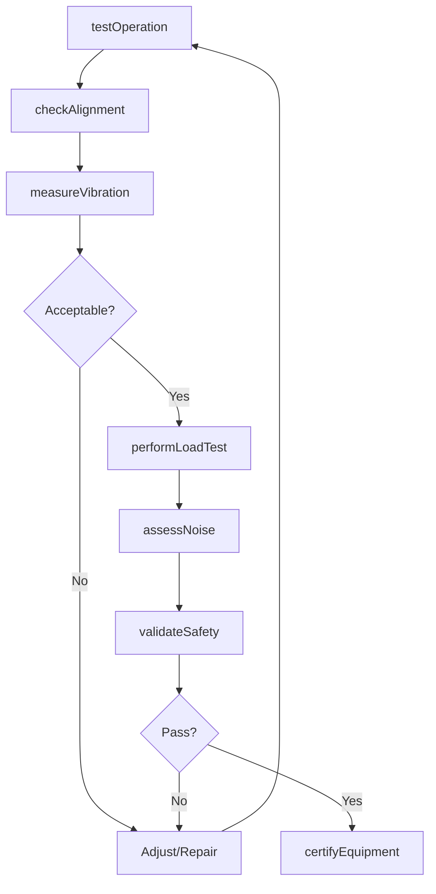
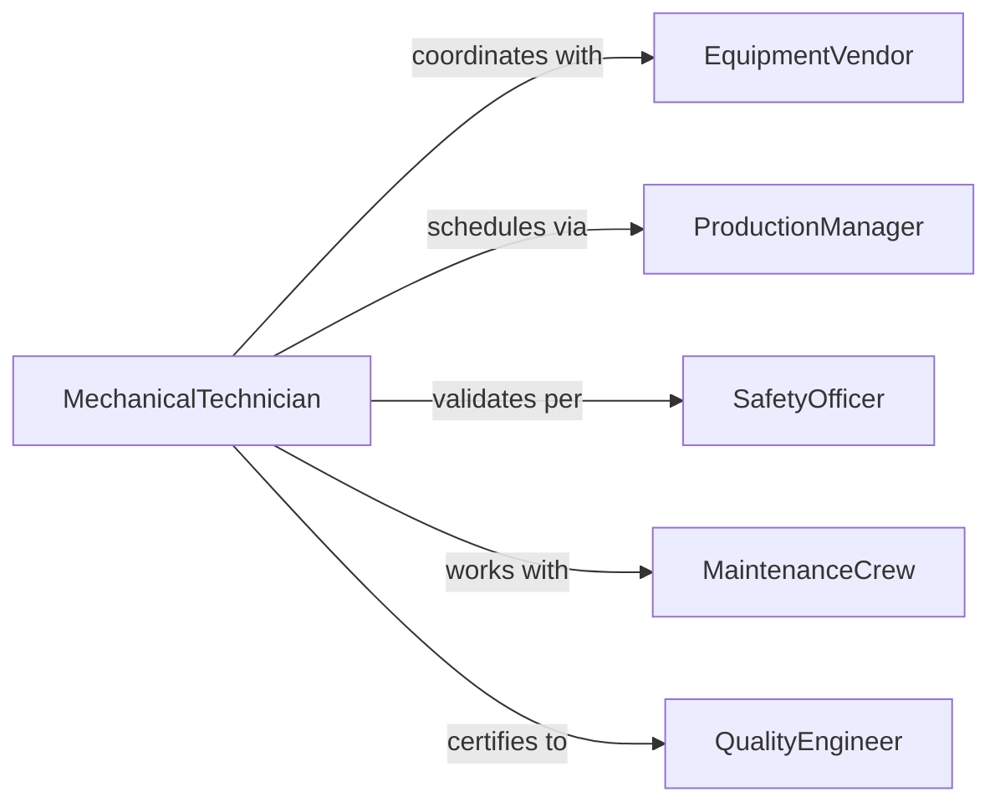

# Test Mechanical Equipment Ensure Proper

> Business-as-Code definition for mechanical equipment testing. Validates operational performance, precision, and reliability of machinery, tools, and mechanical systems.

## Overview

Mechanical equipment testing verifies that motors, pumps, compressors, conveyors, and other machinery operate within design specifications. This definition provides actions for performance testing, vibration analysis, and operational validation of mechanical systems.

## Actors

| Actor | Description |
|-------|-------------|
| EquipmentVendor | Provides machinery and technical specifications |
| ProductionManager | Schedules equipment for testing and operation |
| SafetyOfficer | Validates mechanical safety compliance |
| MaintenanceCrew | Performs preventive and corrective maintenance |
| QualityEngineer | Defines acceptance criteria for equipment |
| InsuranceInspector | Validates equipment safety for coverage |

## Roles

| Role | Description |
|------|-------------|
| MechanicalTechnician | Executes equipment tests and diagnostics |
| VibrationAnalyst | Measures and interprets vibration signatures |
| PerformanceTester | Validates equipment output and efficiency |
| CertificationInspector | Approves equipment for operational use |

## Entities

| Entity | Description |
|--------|-------------|
| Equipment | Mechanical device or machinery under test |
| PerformanceTest | Validation of operational capability |
| VibrationAnalysis | Measurement of mechanical oscillations |
| LoadTest | Assessment of equipment under rated capacity |
| Alignment | Verification of mechanical component positioning |
| Certification | Approval for equipment operational use |

## Actions

| Action | Description |
|--------|-------------|
| testOperation | Verify equipment functions as designed |
| measureVibration | Record vibration levels and frequencies |
| checkAlignment | Validate mechanical component positioning |
| performLoadTest | Test equipment under rated capacity |
| assessNoise | Measure acoustic emissions from equipment |
| validateSafety | Confirm mechanical safety compliance |
| certifyEquipment | Approve equipment for production use |

## Events

| Event | Description |
|-------|-------------|
| operationTested | Equipment functionality verified |
| vibrationMeasured | Vibration analysis completed |
| alignmentChecked | Component positioning validated |
| loadTestPerformed | Capacity test executed |
| noiseAssessed | Acoustic measurements recorded |
| safetyValidated | Safety compliance confirmed |
| equipmentCertified | Equipment approved for operation |

## Searches

| Search | Description |
|--------|-------------|
| findTests | Query equipment tests by device or date |
| getResults | Retrieve test outcomes and measurements |
| getVibration | Fetch vibration analysis data |
| getCertifications | Access equipment approval records |

## Workflow



## Actor Relationships



## Usage

### Calling Actions

```typescript
import { testMechanicalEquipmentEnsureProper } from '@headlessly/test-mechanical-equipment-ensure-proper'

const testing = testMechanicalEquipmentEnsureProper()

// Test equipment operation
const operation = await testing.testOperation({
  equipmentId: 'centrifugal-pump-08',
  testProcedure: 'no-load-run',
  duration: 60,
  parameters: { speed: 1750 }
})

// Measure vibration
const vibration = await testing.measureVibration({
  equipmentId: 'centrifugal-pump-08',
  locations: ['motor-bearing', 'pump-bearing', 'coupling'],
  duration: 120
})

// Check alignment
await testing.checkAlignment({
  equipmentId: 'centrifugal-pump-08',
  components: ['motor-shaft', 'pump-shaft'],
  tolerance: 0.003
})

// Perform load test
const loadTest = await testing.performLoadTest({
  equipmentId: 'centrifugal-pump-08',
  loadPercentage: 100,
  duration: 180,
  measurements: ['flow', 'pressure', 'power']
})

// Certify equipment
await testing.certifyEquipment({
  equipmentId: 'centrifugal-pump-08',
  testResults: [operation.id, vibration.id, loadTest.id],
  certifiedBy: 'mechanic-tech-456'
})
```

### Event-Driven Automation

```typescript
// Alert on excessive vibration
testing.vibrationMeasured(async ({ equipmentId, vibration, threshold }) => {
  if (vibration.overall > threshold * 1.5) {
    await notify({
      to: 'maintenance-team',
      message: `Equipment ${equipmentId} vibration exceeds acceptable limits`,
      severity: 'high'
    })
  }
})

// Schedule maintenance on alignment drift
testing.alignmentChecked(async ({ equipmentId, alignment, tolerance }) => {
  if (Math.abs(alignment.offset) > tolerance) {
    await scheduleMaintenance({
      equipmentId,
      reason: 'misalignment-detected',
      priority: 'high'
    })
  }
})
```
