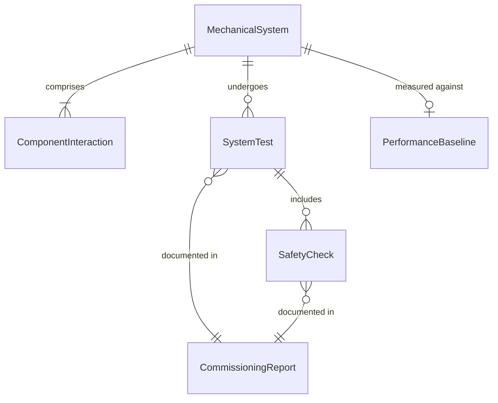
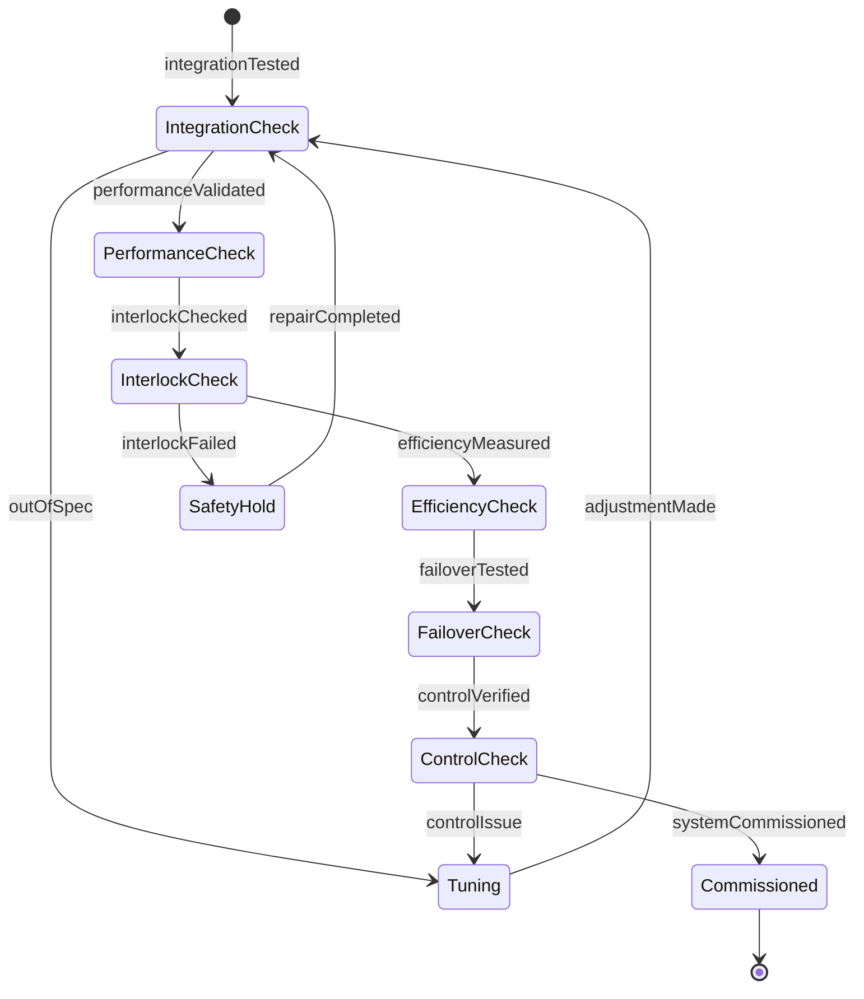
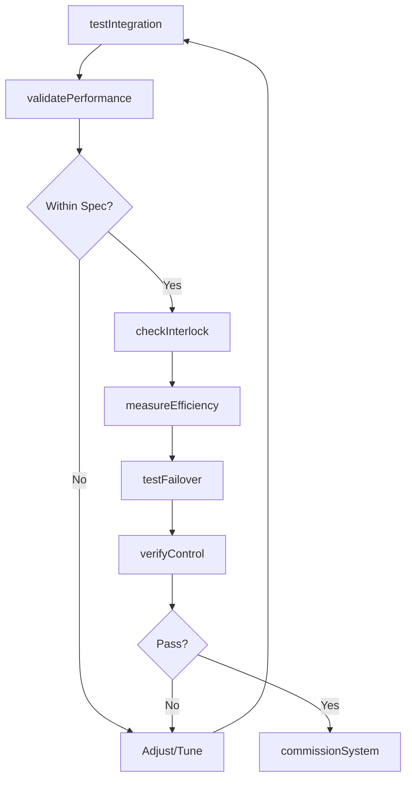
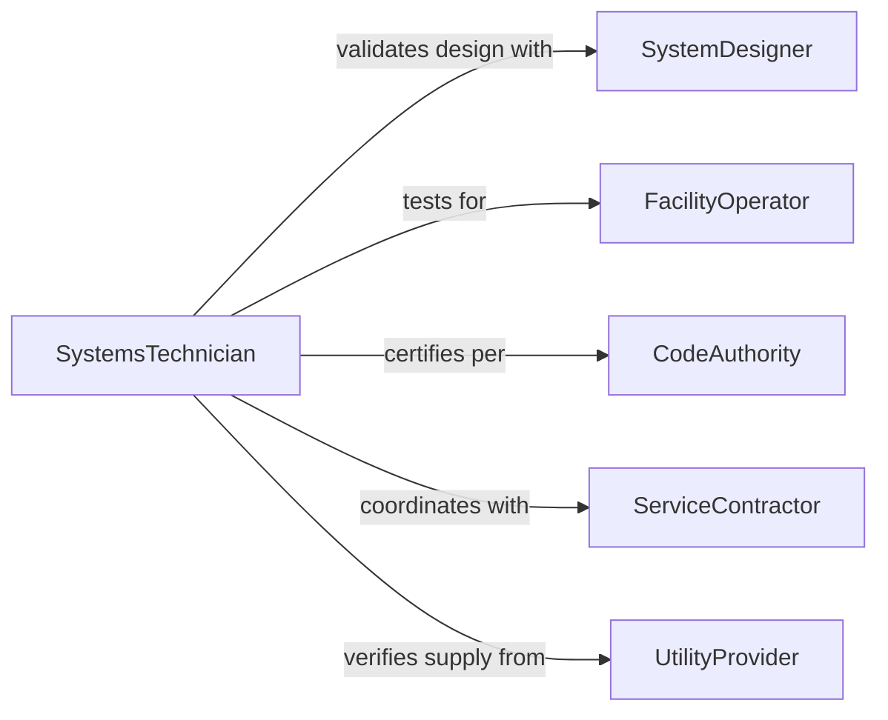

# Test Mechanical Systems Ensure Proper

> Business-as-Code definition for mechanical systems testing. Validates integrated mechanical assemblies including HVAC, hydraulics, pneumatics, and material handling systems for operational integrity.

## Overview

Mechanical systems testing verifies that integrated assemblies of machinery, piping, actuators, and control components work together reliably. This definition provides actions for system-level testing, performance validation, and operational certification of complex mechanical systems.

## Actors

| Actor | Description |
|-------|-------------|
| SystemDesigner | Engineers integrated mechanical system |
| FacilityOperator | Operates building or plant mechanical systems |
| CodeAuthority | Enforces mechanical system regulations |
| ServiceContractor | Maintains mechanical system components |
| UtilityProvider | Supplies compressed air, water, or steam |
| EndUser | Relies on mechanical system functionality |

## Roles

| Role | Description |
|------|-------------|
| SystemsTechnician | Tests integrated mechanical assemblies |
| CommissioningAgent | Validates new system installations |
| PerformanceEngineer | Measures system efficiency and capacity |
| ComplianceInspector | Verifies regulatory conformance |

## Entities

| Entity | Description |
|--------|-------------|
| MechanicalSystem | Integrated assembly of mechanical components |
| SystemTest | Validation of integrated system performance |
| ComponentInteraction | How system parts work together |
| PerformanceBaseline | Expected system operational metrics |
| SafetyCheck | Verification of system safety interlocks |
| CommissioningReport | Documentation of system acceptance |

## Actions

| Action | Description |
|--------|-------------|
| testIntegration | Verify system components work together |
| validatePerformance | Measure system output against specifications |
| checkInterlock | Verify safety systems function correctly |
| measureEfficiency | Assess system energy or resource consumption |
| testFailover | Validate redundancy and backup systems |
| verifyControl | Confirm control systems respond properly |
| commissionSystem | Approve system for operational use |

## Events

| Event | Description |
|-------|-------------|
| integrationTested | Component interaction validated |
| performanceValidated | System output verified against specs |
| interlockChecked | Safety systems functionality confirmed |
| efficiencyMeasured | Resource consumption assessed |
| failoverTested | Backup systems validated |
| controlVerified | Control response confirmed |
| systemCommissioned | System approved for operation |

## Searches

| Search | Description |
|--------|-------------|
| findTests | Query system tests by facility or date |
| getResults | Retrieve test outcomes and measurements |
| getBaselines | Fetch expected system performance metrics |
| getReports | Access commissioning documentation |

## Entity Relationships



## State Diagram



## Workflow



## Actor Relationships



## Usage

### Calling Actions

```typescript
import { testMechanicalSystemsEnsureProper } from '@headlessly/test-mechanical-systems-ensure-proper'

const testing = testMechanicalSystemsEnsureProper()

// Test system integration
const integration = await testing.testIntegration({
  systemId: 'hvac-north-wing',
  subsystems: ['air-handlers', 'chillers', 'cooling-tower', 'controls'],
  duration: 480
})

// Validate performance
const performance = await testing.validatePerformance({
  systemId: 'hvac-north-wing',
  designCapacity: { cooling: 500, heating: 300 },
  tolerance: 0.05
})

// Check safety interlocks
await testing.checkInterlock({
  systemId: 'hvac-north-wing',
  interlocks: ['freeze-protection', 'high-pressure-cutoff', 'fire-damper']
})

// Test failover systems
const failover = await testing.testFailover({
  systemId: 'hvac-north-wing',
  scenarios: ['primary-chiller-failure', 'power-loss', 'pump-failure']
})

// Commission system
await testing.commissionSystem({
  systemId: 'hvac-north-wing',
  testResults: [integration.id, performance.id, failover.id],
  commissionedBy: 'commissioning-agent-789'
})
```

### Event-Driven Automation

```typescript
// Alert on performance degradation
testing.performanceValidated(async ({ systemId, actual, design }) => {
  if (actual < design * 0.9) {
    await notify({
      to: 'facilities-team',
      message: `System ${systemId} operating below design capacity`,
      severity: 'medium'
    })
  }
})

// Escalate interlock failures
testing.interlockChecked(async ({ systemId, interlock, status }) => {
  if (status === 'failed') {
    await escalate({
      to: 'safety-officer',
      message: `Safety interlock ${interlock} failed on ${systemId}`,
      severity: 'critical'
    })
  }
})
```
