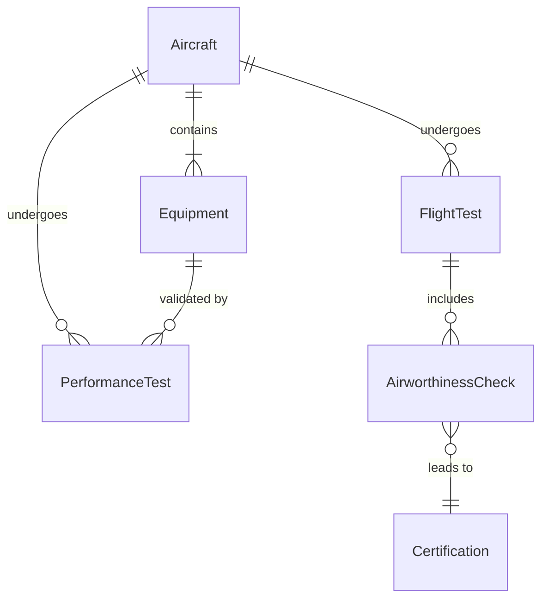
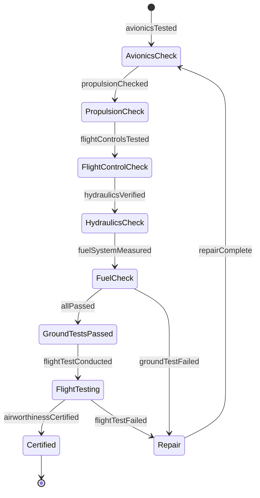
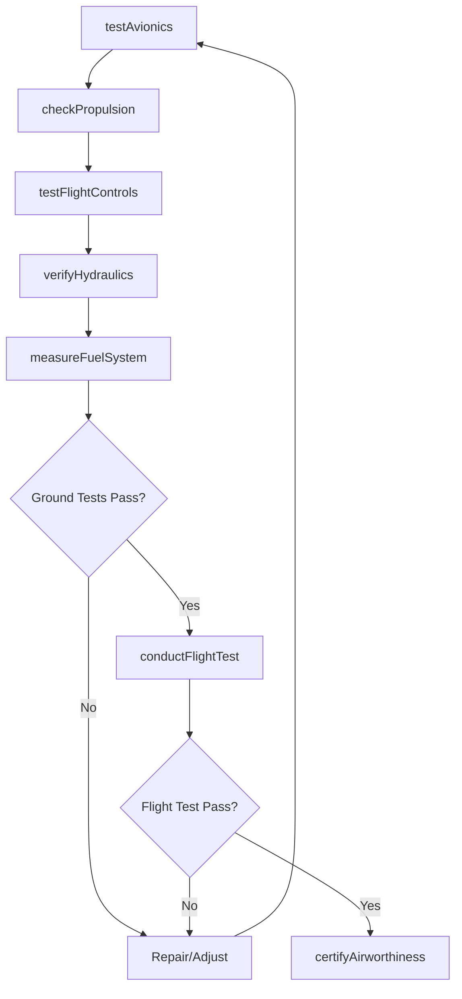
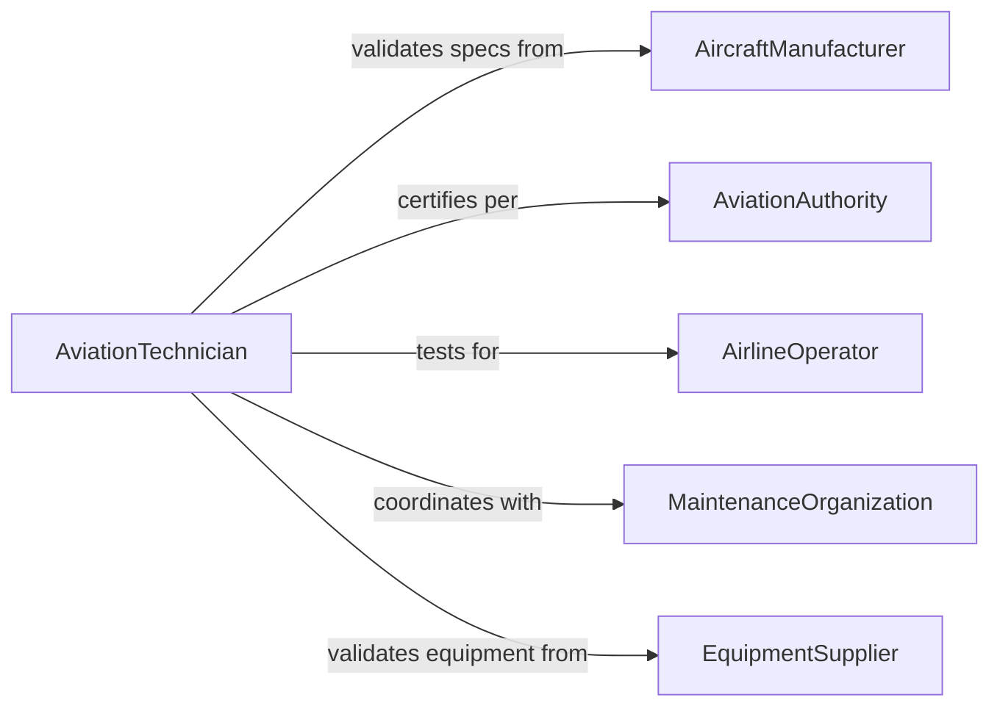

# Test Performance Aircraft Equipment

> Business-as-Code definition for aircraft equipment performance testing. Validates avionics, propulsion, hydraulics, and flight control systems to ensure airworthiness and regulatory compliance.

## Overview

Aircraft equipment performance testing verifies that navigation systems, engines, flight controls, and other critical components meet stringent aviation standards. This definition provides actions for functional testing, performance validation, and airworthiness certification of aircraft systems and equipment.

## Actors

| Actor | Description |
|-------|-------------|
| AircraftManufacturer | Provides aircraft and equipment specifications |
| AviationAuthority | Enforces airworthiness regulations and standards |
| AirlineOperator | Operates aircraft with tested equipment |
| MaintenanceOrganization | Performs aircraft maintenance and repairs |
| EquipmentSupplier | Provides avionics and component systems |
| FlightCrew | Operates aircraft with certified equipment |

## Roles

| Role | Description |
|------|-------------|
| AviationTechnician | Executes aircraft equipment tests |
| FlightTestEngineer | Validates equipment during flight operations |
| CertificationInspector | Approves equipment for airworthiness |
| AvionicsSpecialist | Tests electronic flight systems |

## Entities

| Entity | Description |
|--------|-------------|
| Aircraft | Vehicle containing equipment under test |
| Equipment | Avionics, propulsion, or system component |
| PerformanceTest | Validation of equipment operational capability |
| FlightTest | In-flight validation of equipment performance |
| AirworthinessCheck | Verification of regulatory compliance |
| Certification | Approval for aircraft operation |

## Actions

| Action | Description |
|--------|-------------|
| testAvionics | Validate navigation and communication systems |
| checkPropulsion | Verify engine and propulsion performance |
| testFlightControls | Validate control surface and actuation systems |
| measureFuelSystem | Assess fuel delivery and consumption |
| verifyHydraulics | Confirm hydraulic system functionality |
| conductFlightTest | Validate equipment during flight operations |
| certifyAirworthiness | Approve aircraft for operational use |

## Events

| Event | Description |
|-------|-------------|
| avionicsTested | Navigation and communication validated |
| propulsionChecked | Engine performance verified |
| flightControlsTested | Control systems validated |
| fuelSystemMeasured | Fuel system assessed |
| hydraulicsVerified | Hydraulic functionality confirmed |
| flightTestConducted | In-flight equipment validation completed |
| airworthinessCertified | Aircraft approved for operation |

## Searches

| Search | Description |
|--------|-------------|
| findTests | Query equipment tests by aircraft or date |
| getResults | Retrieve test outcomes and measurements |
| getFlightTests | Fetch in-flight validation data |
| getCertifications | Access airworthiness approval records |

## Entity Relationships



## State Diagram



## Workflow



## Actor Relationships



## Usage

### Calling Actions

```typescript
import { testPerformanceAircraftEquipment } from '@headlessly/test-performance-aircraft-equipment'

const testing = testPerformanceAircraftEquipment()

// Test avionics systems
const avionics = await testing.testAvionics({
  aircraftId: 'N12345-boeing-737',
  systems: ['autopilot', 'ils', 'tcas', 'fms'],
  duration: 120
})

// Check propulsion
const propulsion = await testing.checkPropulsion({
  aircraftId: 'N12345-boeing-737',
  engines: ['engine-1', 'engine-2'],
  tests: ['idle', 'cruise-power', 'max-thrust'],
  duration: 300
})

// Test flight controls
await testing.testFlightControls({
  aircraftId: 'N12345-boeing-737',
  controls: ['ailerons', 'elevators', 'rudder', 'flaps', 'spoilers'],
  ranges: 'full'
})

// Conduct flight test
const flightTest = await testing.conductFlightTest({
  aircraftId: 'N12345-boeing-737',
  flightPlan: 'test-profile-A',
  duration: 180,
  validations: ['avionics', 'propulsion', 'flight-controls', 'hydraulics']
})

// Certify airworthiness
await testing.certifyAirworthiness({
  aircraftId: 'N12345-boeing-737',
  testResults: [avionics.id, propulsion.id, flightTest.id],
  standard: 'FAA-Part-25',
  certifiedBy: 'inspector-FAA-456'
})
```

### Event-Driven Automation

```typescript
// Alert on critical system failure
testing.avionicsTested(async ({ aircraftId, system, result }) => {
  if (result.status === 'failed' && system.criticality === 'dispatch') {
    await groundAircraft({
      aircraftId,
      reason: `Critical avionics system ${system.name} failed test`
    })
  }
})

// Schedule maintenance on performance degradation
testing.propulsionChecked(async ({ aircraftId, engine, performance }) => {
  if (performance.thrust < performance.rated * 0.95) {
    await scheduleMaintenance({
      aircraftId,
      component: engine,
      reason: 'thrust-degradation',
      priority: 'high'
    })
  }
})
```
