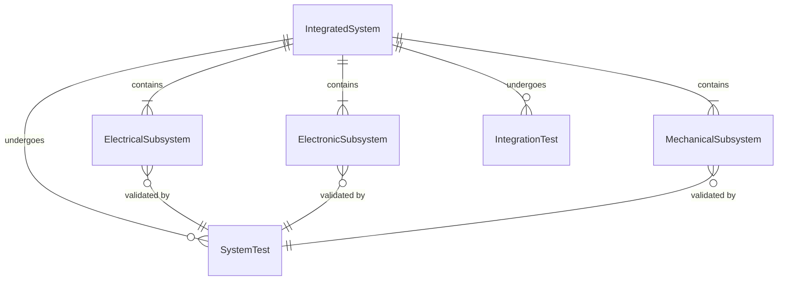
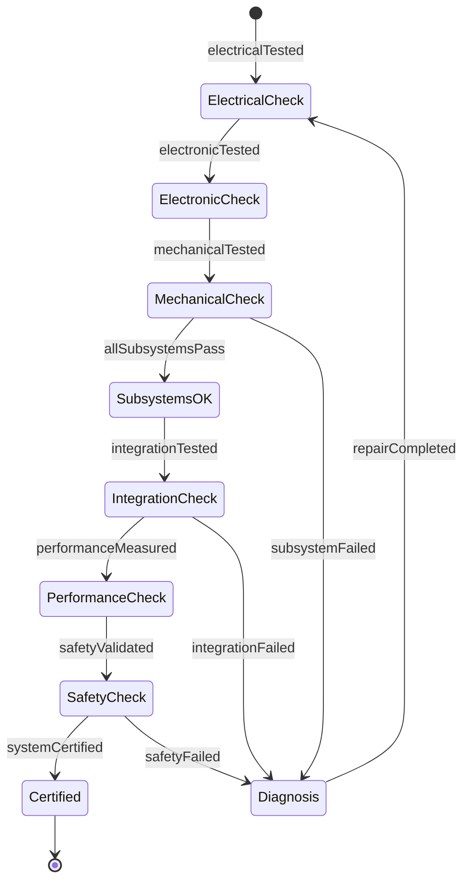
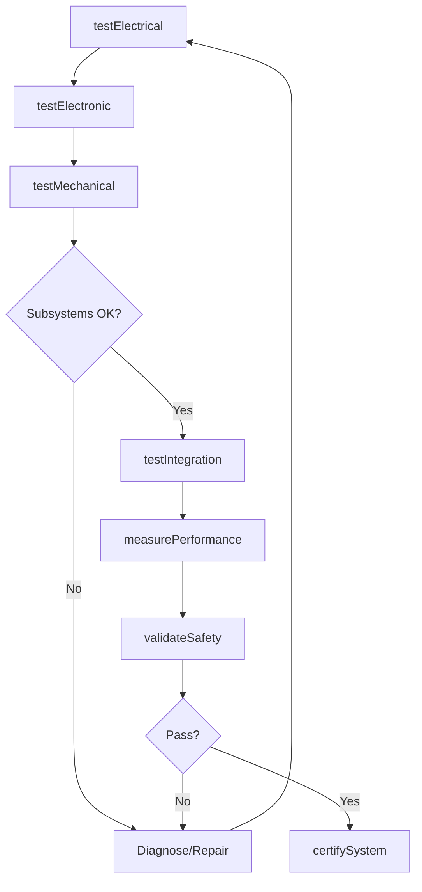
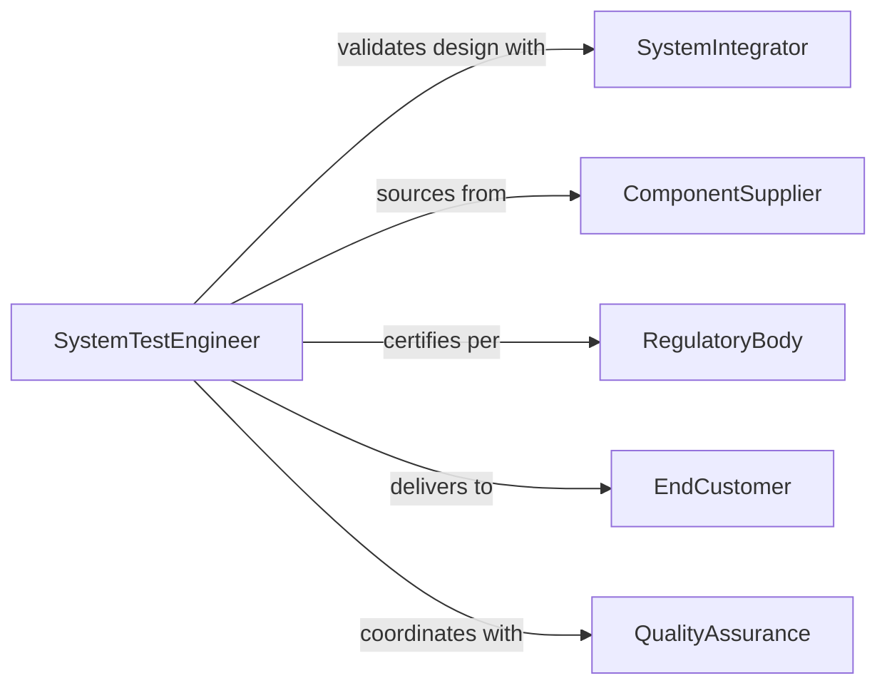

# Test Performance Electrical Electronic Mechanical

> Business-as-Code definition for integrated system performance testing. Validates complex systems combining electrical, electronic, and mechanical components for operational excellence.

## Overview

Integrated system performance testing validates equipment that combines electrical power, electronic controls, and mechanical motion into unified assemblies. This definition provides actions for multi-domain testing, system integration validation, and performance certification of complex electromechanical systems.

## Actors

| Actor | Description |
|-------|-------------|
| SystemIntegrator | Assembles multi-domain systems |
| ComponentSupplier | Provides electrical, electronic, and mechanical parts |
| EndCustomer | Purchases and operates integrated systems |
| RegulatoryBody | Enforces safety and performance standards |
| ServiceOrganization | Maintains integrated equipment |
| QualityAssurance | Validates system meets specifications |

## Roles

| Role | Description |
|------|-------------|
| SystemTestEngineer | Executes multi-domain system tests |
| IntegrationSpecialist | Validates component interoperability |
| PerformanceAnalyst | Measures system efficiency and output |
| CertificationEngineer | Approves systems for deployment |

## Entities

| Entity | Description |
|--------|-------------|
| IntegratedSystem | Equipment combining electrical, electronic, and mechanical |
| ElectricalSubsystem | Power distribution and electrical components |
| ElectronicSubsystem | Control systems and signal processing |
| MechanicalSubsystem | Motion, actuation, and structural components |
| SystemTest | Multi-domain performance validation |
| IntegrationTest | Validation of component interaction |

## Actions

| Action | Description |
|--------|-------------|
| testElectrical | Validate power distribution and electrical function |
| testElectronic | Verify control systems and signal processing |
| testMechanical | Validate motion, actuation, and structure |
| testIntegration | Verify subsystem interoperability |
| measurePerformance | Assess overall system output and efficiency |
| validateSafety | Confirm multi-domain safety compliance |
| certifySystem | Approve integrated system for use |

## Events

| Event | Description |
|-------|-------------|
| electricalTested | Power systems validated |
| electronicTested | Control systems verified |
| mechanicalTested | Motion systems validated |
| integrationTested | Component interaction verified |
| performanceMeasured | System output assessed |
| safetyValidated | Multi-domain compliance confirmed |
| systemCertified | Integrated system approved |

## Searches

| Search | Description |
|--------|-------------|
| findTests | Query system tests by equipment or date |
| getResults | Retrieve test outcomes across domains |
| getIntegration | Fetch subsystem interaction data |
| getCertifications | Access system approval records |

## Entity Relationships



## State Diagram



## Workflow



## Actor Relationships



## Usage

### Calling Actions

```typescript
import { testPerformanceElectricalElectronicMechanical } from '@headlessly/test-performance-electrical-electronic-mechanical'

const testing = testPerformanceElectricalElectronicMechanical()

// Test electrical subsystem
const electrical = await testing.testElectrical({
  systemId: 'robotic-arm-assembly-01',
  tests: ['power-distribution', 'motor-drive', 'sensor-power'],
  voltage: 480,
  current: 50
})

// Test electronic subsystem
const electronic = await testing.testElectronic({
  systemId: 'robotic-arm-assembly-01',
  controllers: ['motion-controller', 'safety-plc', 'vision-system'],
  protocols: ['EtherCAT', 'Modbus', 'Ethernet-IP']
})

// Test mechanical subsystem
const mechanical = await testing.testMechanical({
  systemId: 'robotic-arm-assembly-01',
  tests: ['positioning-accuracy', 'repeatability', 'payload-capacity'],
  cycles: 1000
})

// Test integration
const integration = await testing.testIntegration({
  systemId: 'robotic-arm-assembly-01',
  scenarios: ['pick-and-place', 'path-following', 'force-control'],
  duration: 600
})

// Measure overall performance
const performance = await testing.measurePerformance({
  systemId: 'robotic-arm-assembly-01',
  metrics: ['throughput', 'accuracy', 'energy-efficiency'],
  duration: 3600
})
```

### Event-Driven Automation

```typescript
// Alert on subsystem failure
testing.integrationTested(async ({ systemId, subsystem, result }) => {
  if (result.status === 'failed') {
    await notify({
      to: 'engineering-team',
      message: `Subsystem ${subsystem} integration failed on ${systemId}`
    })
  }
})

// Schedule maintenance on performance degradation
testing.performanceMeasured(async ({ systemId, metrics, baseline }) => {
  if (metrics.efficiency < baseline.efficiency * 0.9) {
    await scheduleMaintenance({
      systemId,
      reason: 'performance-degradation',
      priority: 'medium'
    })
  }
})
```
