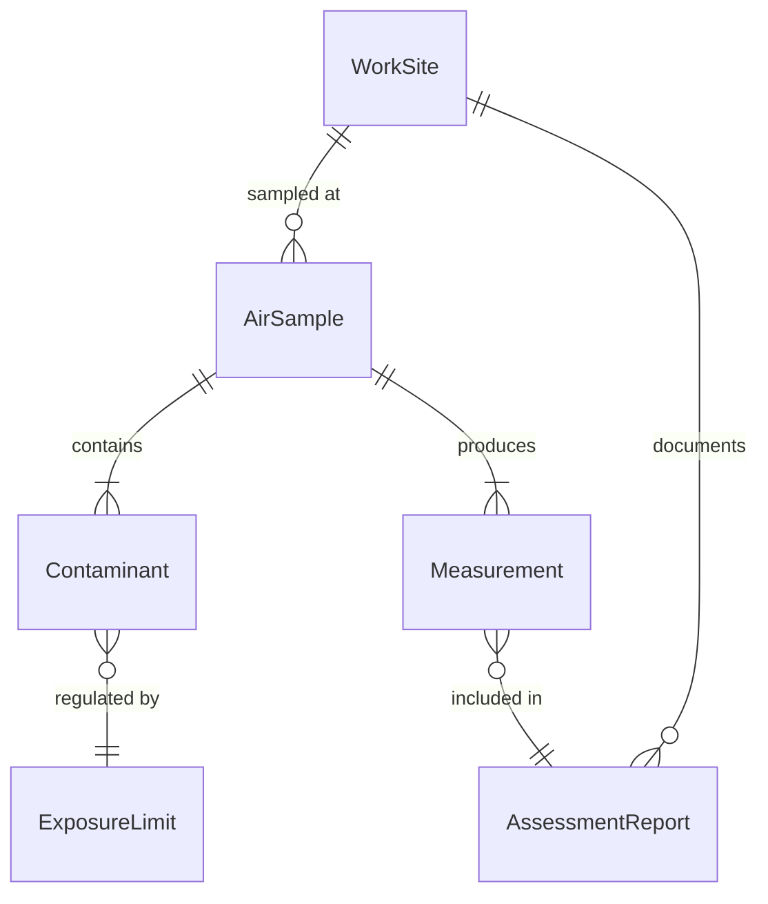
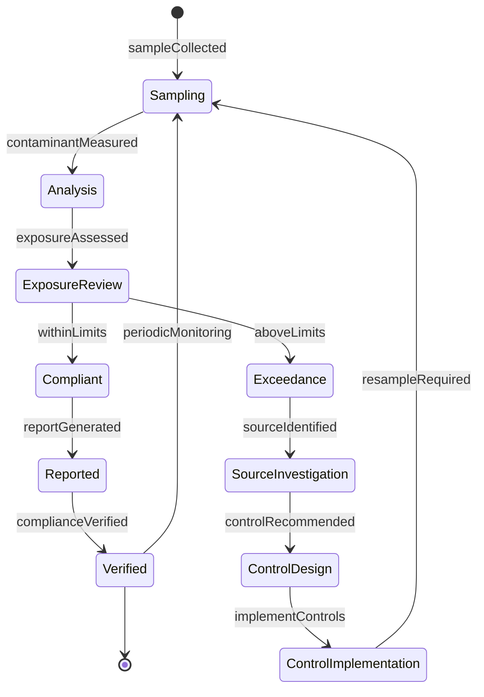
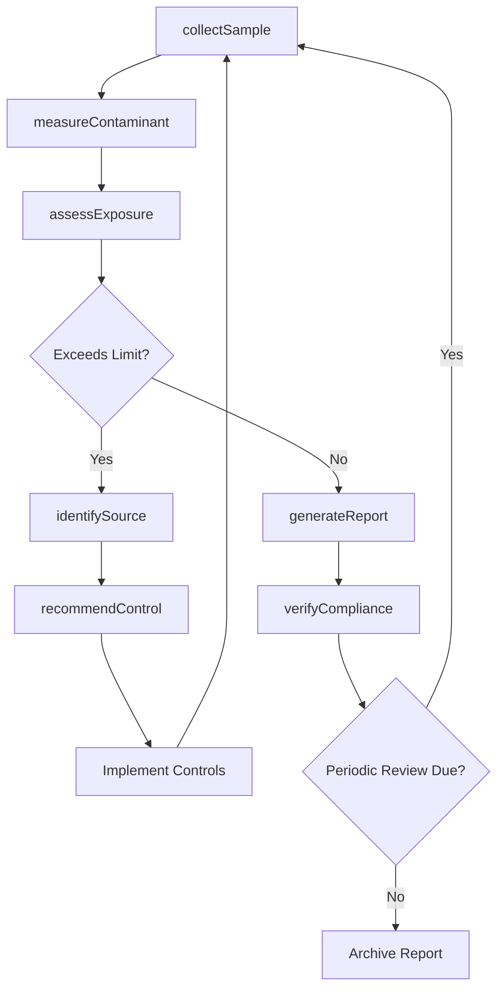
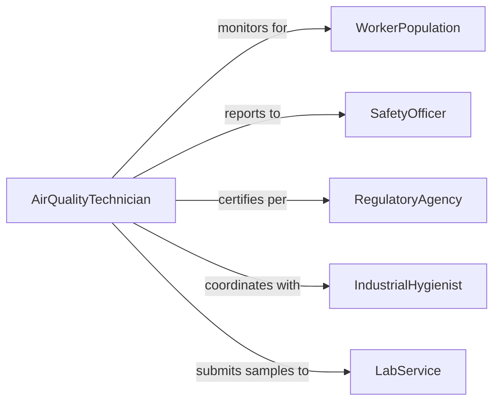

# Test Air Quality Work Sites

> Business-as-Code definition for workplace air quality testing. Monitors airborne contaminants, particulates, and gases to ensure worker safety and regulatory compliance.

## Overview

Workplace air quality testing measures concentrations of dust, fumes, vapors, and gases to protect worker health and meet occupational exposure limits. This definition provides actions for air sampling, contaminant analysis, and exposure assessment at industrial and commercial work sites.

## Actors

| Actor | Description |
|-------|-------------|
| WorkerPopulation | Employees exposed to workplace air |
| SafetyOfficer | Oversees workplace health and safety programs |
| RegulatoryAgency | Enforces occupational exposure standards |
| IndustrialHygienist | Assesses workplace environmental hazards |
| FacilityManager | Maintains building ventilation systems |
| LabService | Analyzes air samples for contaminants |

## Roles

| Role | Description |
|------|-------------|
| AirQualityTechnician | Collects air samples and performs field tests |
| ExposureAssessmentSpecialist | Evaluates worker exposure to contaminants |
| VentilationEngineer | Designs controls to improve air quality |
| ComplianceAuditor | Verifies conformance to exposure limits |

## Entities

| Entity | Description |
|--------|-------------|
| WorkSite | Location where air quality is monitored |
| AirSample | Collected specimen for contaminant analysis |
| Contaminant | Airborne substance measured in sample |
| ExposureLimit | Regulatory threshold for safe concentration |
| Measurement | Recorded contaminant concentration |
| AssessmentReport | Documentation of air quality findings |

## Actions

| Action | Description |
|--------|-------------|
| collectSample | Gather air specimen from work location |
| measureContaminant | Analyze sample for specific substance |
| assessExposure | Compare measurements to regulatory limits |
| identifySource | Locate origin of airborne contaminant |
| recommendControl | Propose ventilation or process improvements |
| generateReport | Document air quality findings |
| verifyCompliance | Confirm conformance to exposure standards |

## Events

| Event | Description |
|-------|-------------|
| sampleCollected | Air specimen gathered from work site |
| contaminantMeasured | Substance concentration analyzed |
| exposureAssessed | Measurements compared to limits |
| sourceIdentified | Contaminant origin located |
| controlRecommended | Improvement measures proposed |
| reportGenerated | Air quality findings documented |
| complianceVerified | Regulatory conformance confirmed |

## Searches

| Search | Description |
|--------|-------------|
| findSamples | Query air samples by site or date |
| getMeasurements | Retrieve contaminant concentration data |
| getExposures | Fetch worker exposure assessments |
| getReports | Access air quality documentation |

## Entity Relationships



## State Diagram



## Workflow



## Actor Relationships



## Usage

### Calling Actions

```typescript
import { testAirQualityWorkSites } from '@headlessly/test-air-quality-work-sites'

const testing = testAirQualityWorkSites()

// Collect air sample
const sample = await testing.collectSample({
  workSiteId: 'manufacturing-floor-03',
  location: 'welding-station-12',
  duration: 480,
  flowRate: 2.0,
  method: 'personal-breathing-zone'
})

// Measure contaminant concentration
const measurement = await testing.measureContaminant({
  sampleId: sample.id,
  contaminant: 'hexavalent-chromium',
  method: 'NIOSH-7604'
})

// Assess worker exposure
const exposure = await testing.assessExposure({
  workSiteId: 'manufacturing-floor-03',
  contaminant: 'hexavalent-chromium',
  measurements: [measurement.id],
  exposureLimit: { value: 5, unit: 'ug/m3', standard: 'OSHA-PEL' }
})

// Recommend controls if exposure exceeds limit
if (exposure.exceedsLimit) {
  await testing.recommendControl({
    workSiteId: 'manufacturing-floor-03',
    contaminant: 'hexavalent-chromium',
    controls: ['local-exhaust-ventilation', 'process-enclosure', 'respirator-program']
  })
}
```

### Event-Driven Automation

```typescript
// Alert on exposure limit exceedance
testing.exposureAssessed(async ({ workSiteId, contaminant, exposure, limit }) => {
  if (exposure > limit) {
    await notify({
      to: 'safety-officer',
      message: `${contaminant} exposure at ${workSiteId} exceeds ${limit.standard}`,
      severity: 'high'
    })
  }
})

// Auto-schedule resampling after controls implemented
testing.controlRecommended(async ({ workSiteId, contaminant, controls }) => {
  await scheduleResampling({
    workSiteId,
    contaminant,
    delay: 30,
    reason: 'verify-control-effectiveness'
  })
})
```
