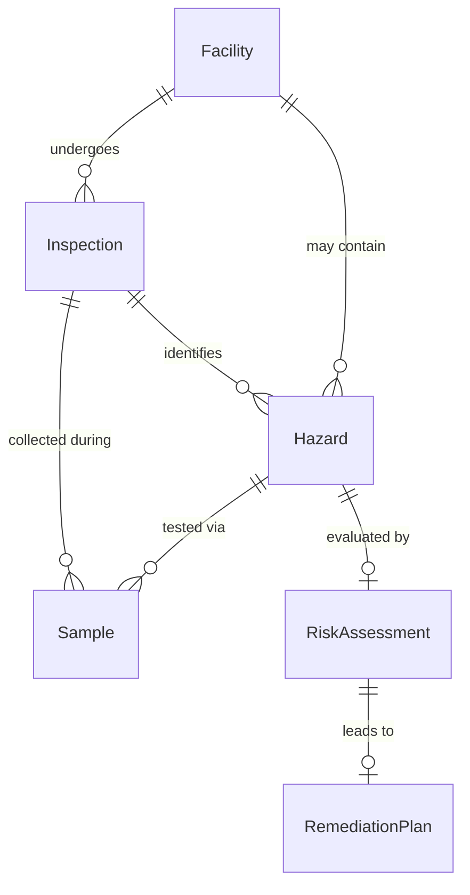
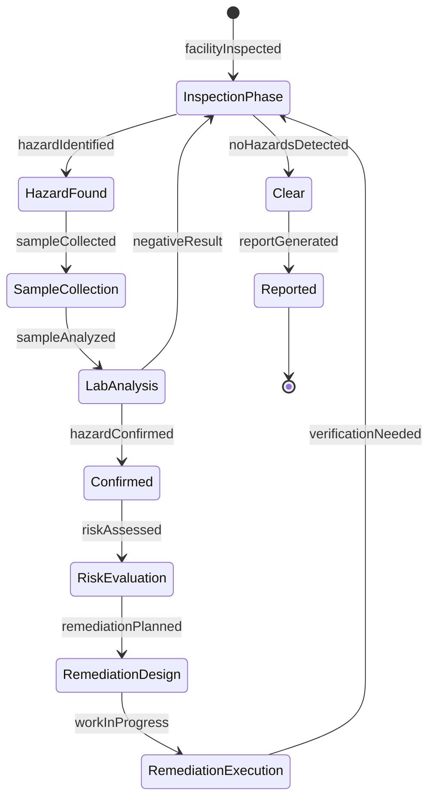
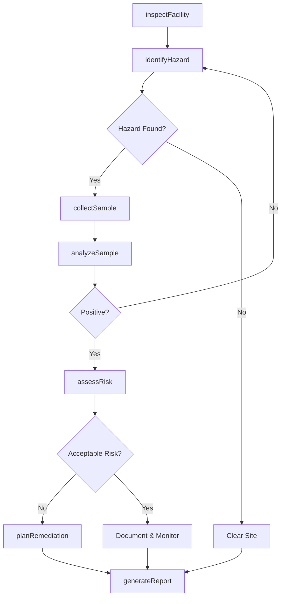
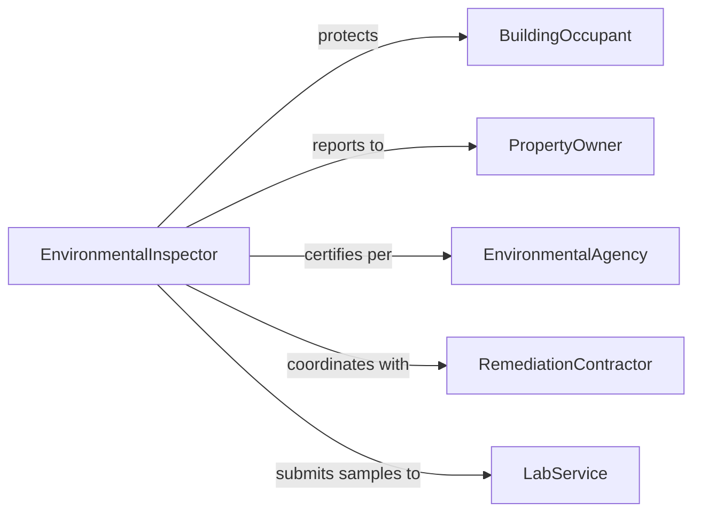

# Test Facilities Environmental Hazards

> Business-as-Code definition for facility environmental hazard testing. Identifies and assesses contamination, toxins, and hazardous conditions in buildings and industrial sites.

## Overview

Facility environmental hazard testing evaluates buildings and sites for asbestos, lead, mold, chemical contamination, and other health risks. This definition provides actions for hazard inspection, sample collection, risk assessment, and remediation planning to protect occupants and comply with environmental regulations.

## Actors

| Actor | Description |
|-------|-------------|
| BuildingOccupant | Works or resides in facility under assessment |
| PropertyOwner | Responsible for facility maintenance and safety |
| EnvironmentalAgency | Enforces hazardous material regulations |
| RemediationContractor | Removes or mitigates identified hazards |
| InsuranceProvider | Requires hazard testing for coverage |
| LabService | Analyzes environmental samples |

## Roles

| Role | Description |
|------|-------------|
| EnvironmentalInspector | Conducts facility hazard assessments |
| HazardIdentificationSpecialist | Locates and characterizes environmental risks |
| RiskAssessor | Evaluates health impact of identified hazards |
| RemediationPlanner | Designs hazard mitigation strategies |

## Entities

| Entity | Description |
|--------|-------------|
| Facility | Building or site under environmental assessment |
| Hazard | Environmental contaminant or dangerous condition |
| Sample | Specimen collected for hazard analysis |
| Inspection | Systematic facility examination for hazards |
| RiskAssessment | Evaluation of hazard health impact |
| RemediationPlan | Strategy for hazard removal or mitigation |

## Actions

| Action | Description |
|--------|-------------|
| inspectFacility | Systematically examine building for hazards |
| identifyHazard | Locate and characterize environmental risk |
| collectSample | Gather specimen for laboratory analysis |
| analyzeSample | Test specimen for contaminant presence |
| assessRisk | Evaluate health impact of identified hazard |
| planRemediation | Design hazard removal or mitigation strategy |
| generateReport | Document facility hazard findings |

## Events

| Event | Description |
|-------|-------------|
| facilityInspected | Building examination completed |
| hazardIdentified | Environmental risk located |
| sampleCollected | Specimen gathered for analysis |
| sampleAnalyzed | Laboratory testing completed |
| riskAssessed | Health impact evaluated |
| remediationPlanned | Mitigation strategy designed |
| reportGenerated | Hazard findings documented |

## Searches

| Search | Description |
|--------|-------------|
| findInspections | Query facility assessments by site or date |
| getHazards | Retrieve identified environmental risks |
| getSamples | Fetch specimen collection records |
| getReports | Access facility hazard documentation |

## Entity Relationships



## State Diagram



## Workflow



## Actor Relationships



## Usage

### Calling Actions

```typescript
import { testFacilitiesEnvironmentalHazards } from '@headlessly/test-facilities-environmental-hazards'

const testing = testFacilitiesEnvironmentalHazards()

// Inspect facility for hazards
const inspection = await testing.inspectFacility({
  facilityId: 'warehouse-building-05',
  areas: ['ceiling-tiles', 'pipe-insulation', 'paint-surfaces', 'hvac-ducts'],
  inspectionType: 'comprehensive'
})

// Identify specific hazard
const hazard = await testing.identifyHazard({
  facilityId: 'warehouse-building-05',
  location: 'ceiling-tiles-section-A',
  hazardType: 'suspected-asbestos',
  condition: 'friable'
})

// Collect sample for analysis
const sample = await testing.collectSample({
  facilityId: 'warehouse-building-05',
  hazardId: hazard.id,
  location: 'ceiling-tiles-section-A',
  quantity: 3,
  method: 'bulk-sample'
})

// Analyze sample
const analysis = await testing.analyzeSample({
  sampleId: sample.id,
  tests: ['asbestos-plm', 'lead-paint', 'mold-culture'],
  labId: 'certified-lab-123'
})

// Assess risk if hazard confirmed
if (analysis.asbestosDetected) {
  const risk = await testing.assessRisk({
    facilityId: 'warehouse-building-05',
    hazard: 'asbestos-containing-material',
    exposure: 'occupant-contact',
    occupancy: 'commercial-warehouse'
  })

  await testing.planRemediation({
    facilityId: 'warehouse-building-05',
    hazard: 'asbestos-containing-material',
    strategy: 'encapsulation',
    timeline: 30
  })
}
```

### Event-Driven Automation

```typescript
// Alert on high-risk hazard identification
testing.riskAssessed(async ({ facilityId, hazard, riskLevel }) => {
  if (riskLevel === 'high' || riskLevel === 'imminent') {
    await notify({
      to: 'property-owner',
      message: `High-risk ${hazard} identified at ${facilityId}`,
      severity: 'critical'
    })
  }
})

// Auto-schedule remediation on confirmed contamination
testing.sampleAnalyzed(async ({ facilityId, sampleId, hazards }) => {
  if (hazards.length > 0) {
    await scheduleRemediation({
      facilityId,
      hazards,
      priority: 'urgent'
    })
  }
})
```
