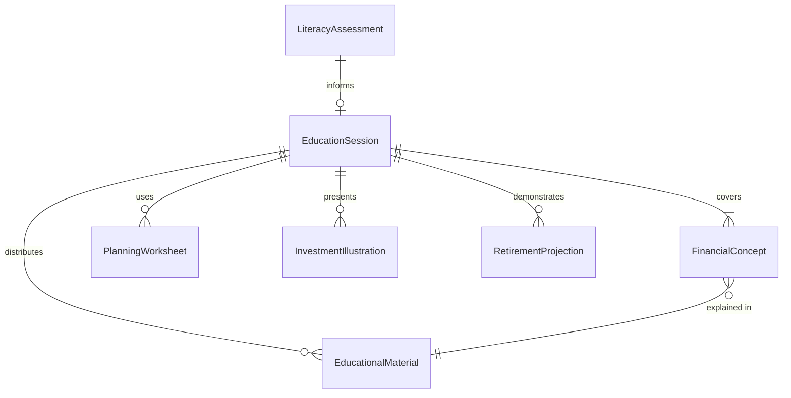
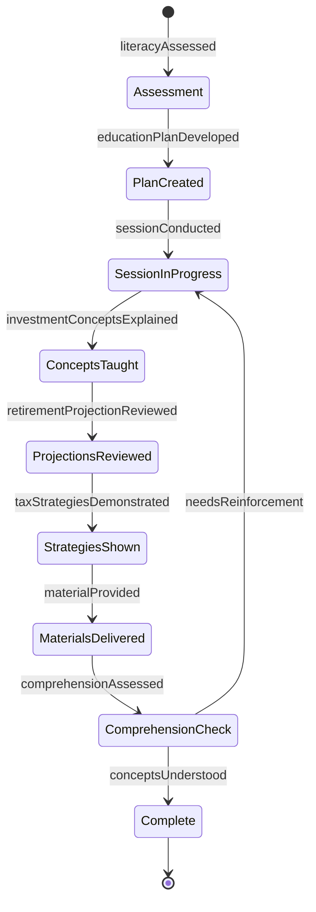
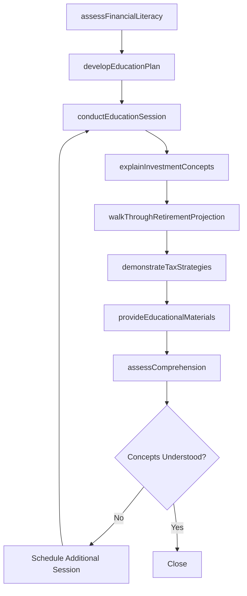
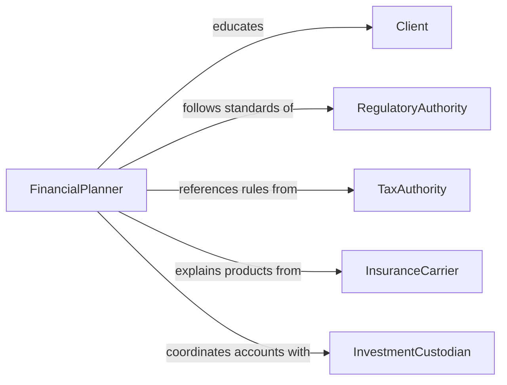

# Educate Clients on Financial Planning Topics

> Business-as-Code definition for educating clients on financial planning topics. Models the advisory education process where financial professionals teach clients about investment strategies, retirement planning, tax optimization, estate planning, and risk management.

## Overview

Educating clients on financial planning topics involves assessing client financial literacy, developing educational materials, conducting planning workshops, explaining investment concepts, and guiding clients through decision frameworks for retirement, tax, estate, and insurance planning. This definition covers one-on-one advisory sessions, group seminars, digital learning modules, and ongoing financial literacy programs, enabling financial advisors and planners to ensure clients make informed decisions about their financial futures.

## Actors

| Actor | Description |
|-------|-------------|
| Client | The individual or family seeking financial planning education |
| RegulatoryAuthority | Enforces standards for financial education and suitability |
| TaxAuthority | Provides tax rules that influence financial planning decisions |
| InsuranceCarrier | Offers products relevant to risk management education |
| InvestmentCustodian | Holds client assets and provides account-level education materials |

## Roles

| Role | Description |
|------|-------------|
| FinancialPlanner | Educates clients on comprehensive financial planning strategies |
| WealthAdvisor | Provides investment-focused education for high-net-worth clients |
| RetirementSpecialist | Focuses on retirement income planning education |
| TaxStrategist | Educates clients on tax-efficient financial decisions |

## Entities

| Entity | Description |
|--------|-------------|
| EducationSession | A scheduled meeting to teach a client about financial topics |
| FinancialConcept | A specific topic or principle being explained |
| PlanningWorksheet | A tool used to walk clients through financial calculations |
| InvestmentIllustration | A visual representation of investment growth or risk scenarios |
| RetirementProjection | A model showing expected retirement income under various assumptions |
| EducationalMaterial | Written or digital content about financial planning topics |
| LiteracyAssessment | An evaluation of the client's financial knowledge level |

## Actions

| Action | Description |
|--------|-------------|
| assessFinancialLiteracy | Evaluate the client's current understanding of financial concepts |
| developEducationPlan | Create a tailored learning path based on client needs and goals |
| conductEducationSession | Deliver a financial planning lesson to the client |
| explainInvestmentConcepts | Teach about asset classes, diversification, and risk-return tradeoffs |
| walkThroughRetirementProjection | Guide the client through retirement income scenarios |
| demonstrateTaxStrategies | Show how different approaches affect tax obligations |
| provideEducationalMaterials | Deliver written or digital resources for continued learning |
| assessComprehension | Verify that the client understands the concepts taught |

## Events

| Event | Description |
|-------|-------------|
| literacyAssessed | The client's financial knowledge level has been evaluated |
| educationPlanDeveloped | A tailored learning path has been created |
| sessionConducted | A financial planning lesson has been delivered |
| investmentConceptsExplained | Asset class and risk concepts have been taught |
| retirementProjectionReviewed | Retirement income scenarios have been walked through |
| taxStrategiesDemonstrated | Tax optimization approaches have been explained |
| materialProvided | Educational resources have been delivered to the client |
| comprehensionAssessed | Client understanding has been verified |

## Searches

| Search | Description |
|--------|-------------|
| findSessions | List education sessions by client, topic, or date |
| getMaterials | Retrieve educational resources by topic or client level |
| findByTopic | Locate education sessions covering a specific financial topic |
| getLiteracyScores | Retrieve client financial literacy assessment results |
| getClientProgress | Track a client's learning journey across education sessions |

## Entity Relationships



## State Diagram



## Workflow



## Actor Relationships



## Usage

### Calling Actions

```typescript
import { educateClientsFinancialPlanningTopics } from '@headlessly/educate-clients-financial-planning-topics'

const education = educateClientsFinancialPlanningTopics()

// Assess and plan client education
const assessment = await education.assessFinancialLiteracy({
  client: 'Martinez Family',
  topics: ['investment-basics', 'retirement-planning', 'tax-optimization', 'estate-planning'],
  currentKnowledge: 'beginner'
})

const plan = await education.developEducationPlan({
  assessmentId: assessment.id,
  sessions: 6,
  frequency: 'bi-weekly',
  priorityTopics: ['retirement-planning', 'tax-optimization']
})

// Conduct session and walk through projections
await education.conductEducationSession({
  planId: plan.id,
  session: 1,
  topic: 'Understanding Your Retirement Timeline',
  format: 'in-person'
})

await education.walkThroughRetirementProjection({
  client: 'Martinez Family',
  currentAge: 45,
  targetRetirementAge: 65,
  currentSavings: 350000,
  monthlyContribution: 2000,
  scenarios: ['conservative', 'moderate', 'aggressive']
})
```

### Event-Driven Automation

```typescript
// Send materials after each session
education.sessionConducted(async ({ planId, topic, client }) => {
  await education.provideEducationalMaterials({
    client,
    topic,
    format: 'digital-guide'
  })
})

// Schedule follow-up when comprehension is low
education.comprehensionAssessed(async ({ client, score, topic }) => {
  if (score < 70) {
    await notify({
      to: 'financial-advisor',
      message: `${client} needs reinforcement on ${topic} (score: ${score}%)`
    })
  }
})
```
