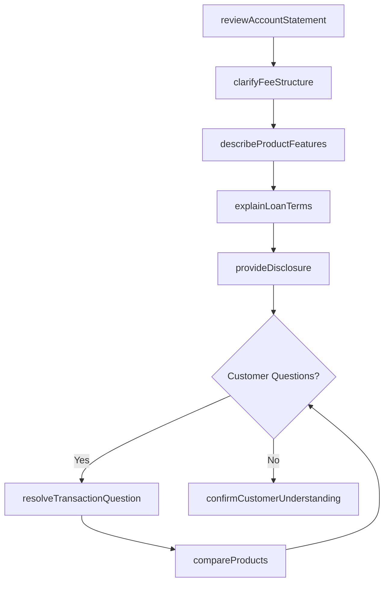
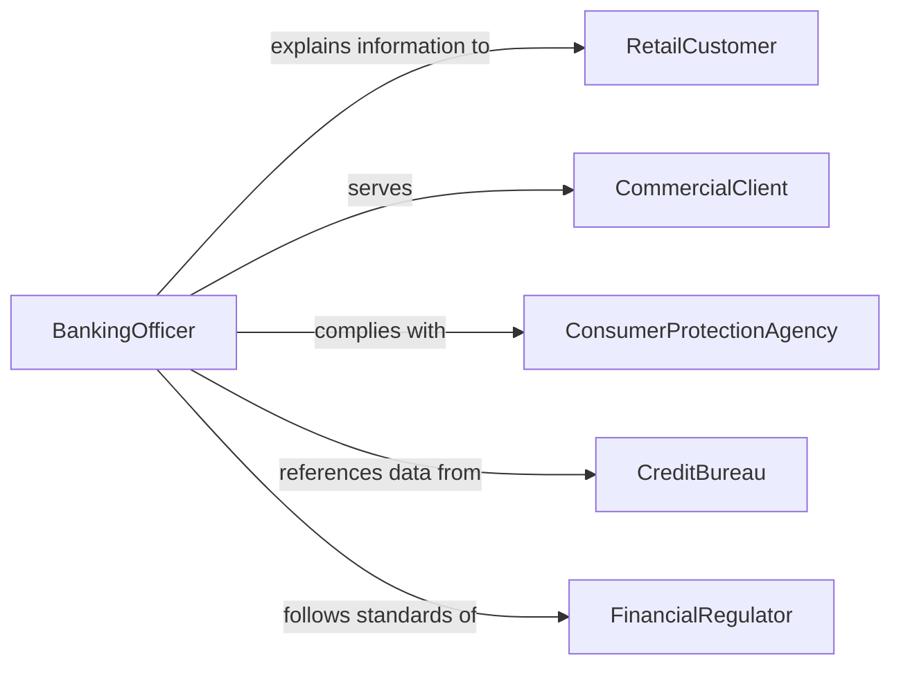

# Explain Financial Information to Customers

> Business-as-Code definition for explaining financial information to customers. Models the customer-facing communication process where financial services professionals clarify account statements, loan terms, fee structures, and financial product details for retail and commercial clients.

## Overview

Explaining financial information to customers involves reviewing account statements, clarifying transaction details, describing fee structures, explaining loan terms and conditions, and helping customers understand their financial products and obligations. This definition covers bank teller interactions, loan officer consultations, insurance policy explanations, and customer service financial inquiries, enabling financial services organizations to deliver clear, compliant, and accessible financial communication that builds customer trust and reduces disputes.

## Actors

| Actor | Description |
|-------|-------------|
| RetailCustomer | An individual account holder seeking financial clarification |
| CommercialClient | A business customer requiring explanation of financial products |
| ConsumerProtectionAgency | Enforces truth-in-lending and disclosure requirements |
| CreditBureau | Provides credit data that may require explanation to customers |
| FinancialRegulator | Sets standards for customer financial communication |

## Roles

| Role | Description |
|------|-------------|
| BankingOfficer | Explains account, loan, and deposit product details to customers |
| LoanOfficer | Clarifies loan terms, rates, and repayment schedules |
| InsuranceAgent | Explains policy coverage, exclusions, and premium structures |
| CustomerServiceRepresentative | Addresses routine financial questions from account holders |

## Entities

| Entity | Description |
|--------|-------------|
| AccountStatement | A periodic summary of transactions and balances |
| LoanDisclosure | A document outlining loan terms, rates, and total cost |
| FeeSchedule | A listing of charges associated with a financial product |
| TransactionDetail | A specific record of a financial activity on an account |
| InterestCalculation | An explanation of how interest is computed and applied |
| PaymentSchedule | A timeline of required payments on a loan or obligation |
| ProductComparison | A side-by-side analysis of financial product options |

## Actions

| Action | Description |
|--------|-------------|
| reviewAccountStatement | Walk the customer through their account activity and balances |
| explainLoanTerms | Describe interest rates, payment schedules, and total cost of borrowing |
| clarifyFeeStructure | Detail the charges associated with a product or service |
| describeProductFeatures | Explain the benefits and limitations of a financial product |
| resolveTransactionQuestion | Address a specific inquiry about a transaction on the customer's account |
| compareProducts | Present side-by-side comparisons of financial product alternatives |
| provideDisclosure | Deliver required regulatory disclosures in understandable language |
| confirmCustomerUnderstanding | Verify the customer comprehends the financial information |

## Events

| Event | Description |
|-------|-------------|
| statementReviewed | The customer's account activity has been walked through |
| loanTermsExplained | Loan conditions and costs have been described |
| feeStructureClarified | Product charges have been detailed |
| productFeaturesDescribed | Financial product benefits and limitations have been explained |
| transactionQuestionResolved | A specific transaction inquiry has been addressed |
| productsCompared | Financial product alternatives have been presented |
| disclosureProvided | Required regulatory information has been delivered |
| understandingConfirmed | Customer comprehension has been verified |

## Searches

| Search | Description |
|--------|-------------|
| findInteractions | List customer financial explanation sessions by account or date |
| getDisclosures | Retrieve disclosure records by product type or customer |
| findByProduct | Locate explanation sessions for a specific financial product |
| getTransactionQuestions | Retrieve customer inquiries about specific transactions |
| getProductComparisons | List product comparison sessions by customer or date |

## Workflow



## Actor Relationships



## Usage

### Calling Actions

```typescript
import { explainFinancialInformationCustomers } from '@headlessly/explain-financial-information-customers'

const finance = explainFinancialInformationCustomers()

// Walk customer through their account
await finance.reviewAccountStatement({
  customer: 'Sarah Chen',
  accountId: 'CHK-9874521',
  period: 'January 2026',
  focusAreas: ['unusual-transactions', 'fee-charges', 'interest-earned']
})

// Explain loan terms
await finance.explainLoanTerms({
  customer: 'Sarah Chen',
  product: 'Home Equity Line of Credit',
  terms: {
    creditLimit: 75000,
    interestRate: '7.25% variable',
    drawPeriod: '10 years',
    repaymentPeriod: '20 years',
    annualFee: 50
  }
})

// Compare product alternatives
await finance.compareProducts({
  customer: 'Sarah Chen',
  products: ['heloc-standard', 'heloc-premium', 'personal-loan-fixed'],
  criteria: ['interest-rate', 'fees', 'flexibility', 'tax-deductibility']
})
```

### Event-Driven Automation

```typescript
// Provide disclosure documents after loan terms are explained
finance.loanTermsExplained(async ({ customer, product }) => {
  await finance.provideDisclosure({ customer, product, type: 'truth-in-lending' })
})

// Alert supervisor when complex questions arise
finance.transactionQuestionResolved(async ({ customer, complexity }) => {
  if (complexity === 'escalated') {
    await notify({
      to: 'branch-supervisor',
      message: `Escalated transaction question from ${customer} - review recommended`
    })
  }
})
```
