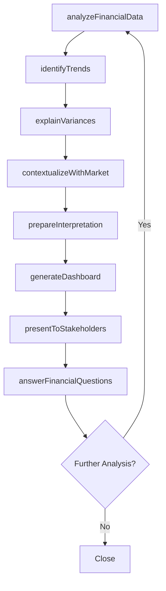
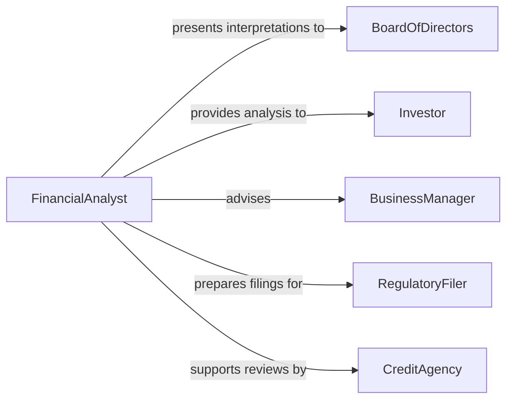

# Interpret Financial Information for Others

> Business-as-Code definition for interpreting financial information for others. Models the analytical communication process where financial professionals translate complex financial statements, market data, and economic indicators into actionable insights for non-financial audiences.

## Overview

Interpreting financial information for others involves analyzing financial statements, market data, economic reports, and investment performance, then translating those findings into clear, actionable language for decision-makers, investors, and non-financial stakeholders. This definition covers earnings report presentations, board financial briefings, investor updates, budget variance explanations, and economic outlook summaries, enabling finance professionals to bridge the gap between raw financial data and informed decision-making.

## Actors

| Actor | Description |
|-------|-------------|
| BoardOfDirectors | Receives financial interpretations for governance decisions |
| Investor | Seeks financial analysis to inform investment decisions |
| BusinessManager | Needs financial interpretation for operational planning |
| RegulatoryFiler | Requires standardized financial interpretations for compliance filings |
| CreditAgency | Evaluates financial information for creditworthiness assessments |

## Roles

| Role | Description |
|------|-------------|
| FinancialAnalyst | Analyzes data and prepares financial interpretations |
| CFO | Presents financial information to the board and investors |
| Controller | Interprets operational financial data for management |
| TreasuryAnalyst | Explains cash flow, liquidity, and capital structure data |

## Entities

| Entity | Description |
|--------|-------------|
| FinancialStatement | A standardized report of financial position or performance |
| AnalystInterpretation | A narrative explanation of what financial data means |
| VarianceAnalysis | An explanation of differences between planned and actual results |
| TrendReport | A summary of financial performance patterns over time |
| EconomicIndicator | A macroeconomic data point relevant to business decisions |
| FinancialDashboard | A visual summary of key financial metrics |
| ExecutiveSummary | A concise interpretation of financial results for leadership |

## Actions

| Action | Description |
|--------|-------------|
| analyzeFinancialData | Examine financial statements and identify key takeaways |
| prepareInterpretation | Draft a narrative explanation of financial findings |
| presentToStakeholders | Deliver the financial interpretation to the target audience |
| explainVariances | Describe why actual results differ from plan or prior periods |
| identifyTrends | Highlight patterns in financial performance over time |
| contextualizeWithMarket | Place financial results in the context of industry and economic conditions |
| answerFinancialQuestions | Respond to stakeholder inquiries about the financial data |
| generateDashboard | Create visual summaries of key financial metrics |

## Events

| Event | Description |
|-------|-------------|
| dataAnalyzed | Financial statements have been examined and key findings identified |
| interpretationPrepared | A narrative financial explanation has been drafted |
| presentationDelivered | The financial interpretation has been delivered to stakeholders |
| variancesExplained | Differences between planned and actual results have been described |
| trendsIdentified | Financial performance patterns have been highlighted |
| marketContextProvided | Results have been placed in industry and economic context |
| financialQuestionsAnswered | Stakeholder inquiries about financial data have been addressed |
| dashboardGenerated | A visual financial summary has been created |

## Searches

| Search | Description |
|--------|-------------|
| findInterpretations | List financial interpretations by period, audience, or topic |
| getVariances | Retrieve variance analyses by account, department, or period |
| findTrends | Locate trend reports by metric, period, or business unit |
| getDashboards | Retrieve financial dashboards by audience or reporting period |
| getQuestions | List stakeholder questions about financial interpretations |

## Workflow



## Actor Relationships



## Usage

### Calling Actions

```typescript
import { interpretFinancialInformationOthers } from '@headlessly/interpret-financial-information-others'

const finance = interpretFinancialInformationOthers()

// Analyze Q4 results and prepare board interpretation
const analysis = await finance.analyzeFinancialData({
  period: 'Q4-2025',
  statements: ['income-statement', 'balance-sheet', 'cash-flow'],
  comparePeriods: ['Q4-2024', 'Q3-2025']
})

await finance.identifyTrends({
  analysisId: analysis.id,
  metrics: ['revenue-growth', 'gross-margin', 'operating-expenses', 'free-cash-flow'],
  periodRange: '8 quarters'
})

await finance.explainVariances({
  analysisId: analysis.id,
  threshold: 5,
  focusAreas: ['revenue', 'cogs', 'sg&a', 'r&d']
})

// Present to board
const interpretation = await finance.prepareInterpretation({
  analysisId: analysis.id,
  audience: 'board-of-directors',
  format: 'executive-summary'
})

await finance.presentToStakeholders({
  interpretationId: interpretation.id,
  audience: 'board-of-directors',
  format: 'quarterly-review-meeting'
})
```

### Event-Driven Automation

```typescript
// Auto-generate dashboard when analysis is complete
finance.dataAnalyzed(async ({ analysisId, period }) => {
  await finance.generateDashboard({ analysisId, period })
})

// Notify CFO when significant variances are found
finance.variancesExplained(async ({ analysisId, significantVariances }) => {
  if (significantVariances.length > 0) {
    await notify({
      to: 'cfo',
      message: `${significantVariances.length} significant variances identified in ${analysisId}`
    })
  }
})
```
