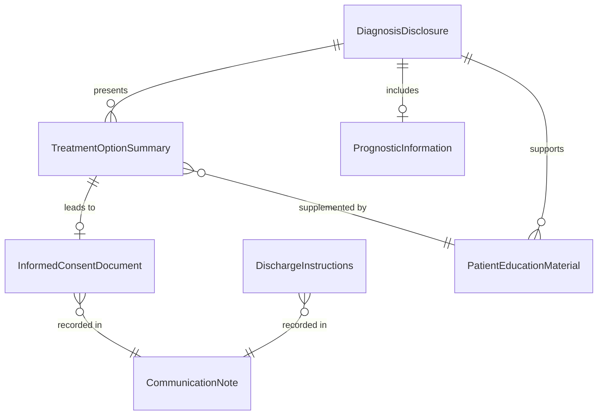
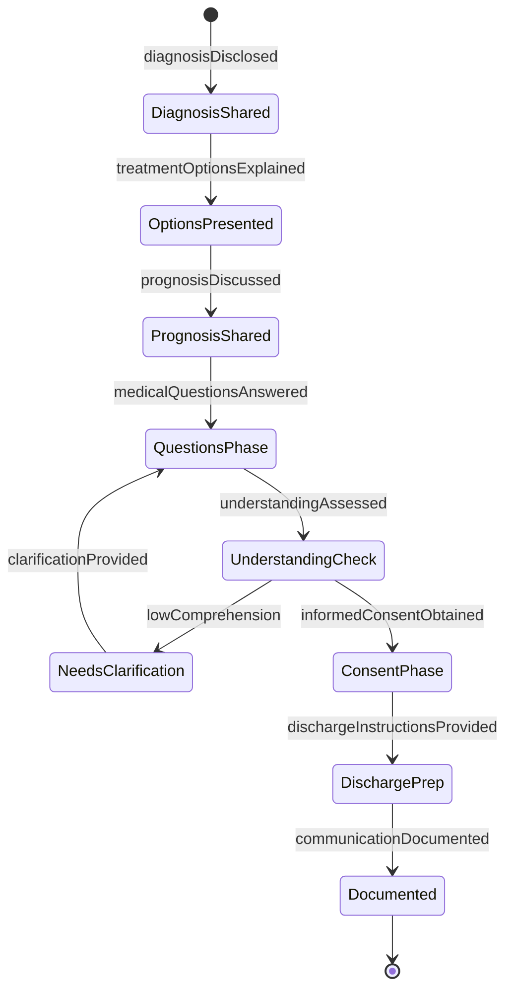
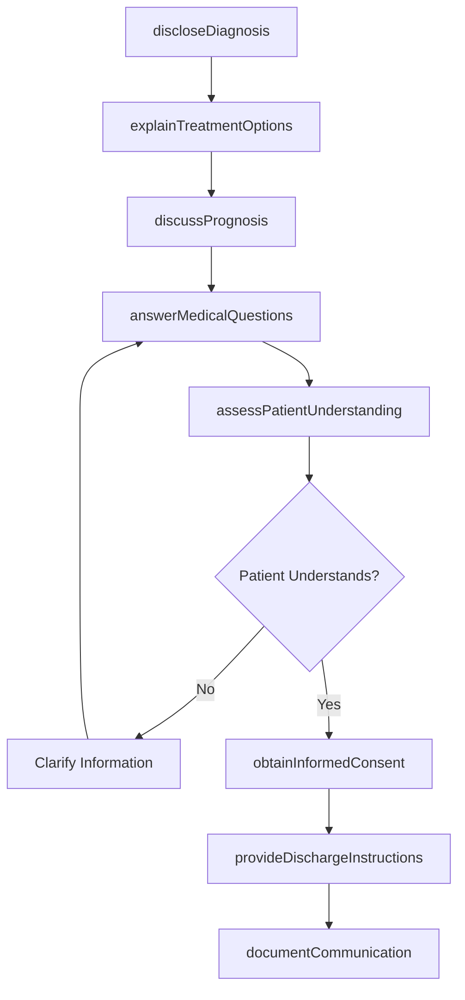
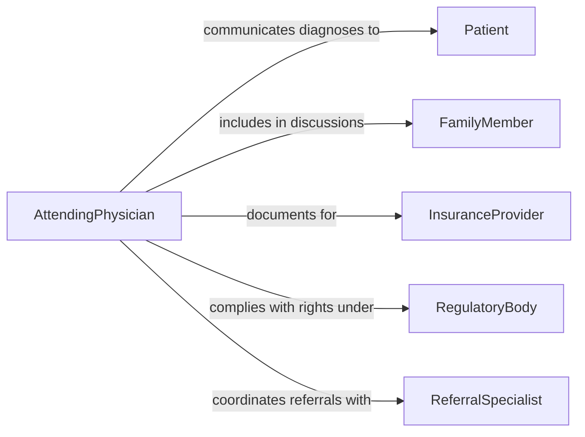

# Communicate Detailed Medical Information to Patients or Family Members

> Business-as-Code definition for communicating detailed medical information to patients and family members. Models the clinical communication process where healthcare providers convey diagnoses, treatment options, prognoses, and care instructions in language that patients and their families can understand and act upon.

## Overview

Communicating detailed medical information to patients or family members involves translating clinical findings, diagnostic results, treatment recommendations, and prognostic data into accessible language, ensuring informed consent, and addressing emotional and informational needs. This definition covers diagnostic disclosures, treatment option discussions, discharge planning conversations, and ongoing care coordination communications, enabling healthcare teams to deliver patient-centered communication that supports shared decision-making and treatment adherence.

## Actors

| Actor | Description |
|-------|-------------|
| Patient | The individual receiving medical information about their condition |
| FamilyMember | A relative or caregiver involved in the patient's medical decisions |
| InsuranceProvider | Requires documentation of medical communication for coverage decisions |
| RegulatoryBody | Enforces patient rights and informed consent requirements |
| ReferralSpecialist | Receives communication handoffs for specialized care coordination |

## Roles

| Role | Description |
|------|-------------|
| AttendingPhysician | Delivers primary diagnostic and treatment information to patients |
| ClinicalNurse | Reinforces medical information and answers follow-up questions |
| PatientNavigator | Helps patients and families understand the healthcare system and options |
| MedicalInterpreter | Facilitates communication for patients with language barriers |

## Entities

| Entity | Description |
|--------|-------------|
| DiagnosisDisclosure | A communication event where a medical condition is explained |
| TreatmentOptionSummary | A description of available treatment approaches and their tradeoffs |
| PrognosticInformation | Data about expected disease progression and outcomes |
| InformedConsentDocument | A record confirming the patient understands and agrees to treatment |
| DischargeInstructions | Written guidance for post-hospital care and medication management |
| PatientEducationMaterial | Printed or digital resources explaining a medical condition |
| CommunicationNote | A clinical record of information shared with the patient or family |

## Actions

| Action | Description |
|--------|-------------|
| discloseDiagnosis | Communicate the medical diagnosis to the patient and family |
| explainTreatmentOptions | Describe available treatment approaches and their risks and benefits |
| discussPrognosis | Share expected outcomes and disease progression information |
| obtainInformedConsent | Ensure the patient understands and agrees to the proposed treatment |
| provideDischargeInstructions | Deliver written and verbal guidance for post-care management |
| answerMedicalQuestions | Respond to patient and family inquiries about the medical situation |
| assessPatientUnderstanding | Verify that the patient comprehends the communicated information |
| documentCommunication | Record the information shared and the patient's response |

## Events

| Event | Description |
|-------|-------------|
| diagnosisDisclosed | The medical diagnosis has been communicated to the patient |
| treatmentOptionsExplained | Available treatment approaches have been described |
| prognosisDiscussed | Expected outcomes have been shared with the patient |
| informedConsentObtained | The patient has confirmed understanding and agreement |
| dischargeInstructionsProvided | Post-care guidance has been delivered |
| medicalQuestionsAnswered | Patient and family inquiries have been addressed |
| understandingAssessed | Patient comprehension has been verified |
| communicationDocumented | The information exchange has been recorded in the medical record |

## Searches

| Search | Description |
|--------|-------------|
| findDisclosures | List diagnosis disclosure events by patient, provider, or date |
| getConsentRecords | Retrieve informed consent documentation by patient or procedure |
| findByCondition | Locate communication records for a specific medical condition |
| getDischargeInstructions | Retrieve discharge guidance by patient or admission |
| getPatientQuestions | List patient questions and responses by encounter |

## Entity Relationships



## State Diagram



## Workflow



## Actor Relationships



## Usage

### Calling Actions

```typescript
import { communicateDetailedMedicalInformationPatients } from '@headlessly/communicate-detailed-medical-information-patients'

const medical = communicateDetailedMedicalInformationPatients()

// Disclose diagnosis and explain options
await medical.discloseDiagnosis({
  patient: 'patient-2026-4521',
  diagnosis: 'Type 2 Diabetes Mellitus',
  severity: 'moderate',
  familyPresent: ['spouse'],
  interpreterNeeded: false
})

await medical.explainTreatmentOptions({
  patient: 'patient-2026-4521',
  options: [
    { treatment: 'lifestyle-modification', risks: 'minimal', timeline: 'ongoing' },
    { treatment: 'metformin-therapy', risks: 'gi-side-effects', timeline: '3-month-trial' },
    { treatment: 'combination-therapy', risks: 'hypoglycemia', timeline: '6-month-review' }
  ]
})

// Obtain consent and document
await medical.obtainInformedConsent({
  patient: 'patient-2026-4521',
  treatment: 'metformin-therapy',
  consentType: 'treatment-plan'
})

await medical.documentCommunication({
  patient: 'patient-2026-4521',
  encounter: 'outpatient-2026-02-05',
  summary: 'Diagnosis disclosed, treatment options reviewed, consent obtained'
})
```

### Event-Driven Automation

```typescript
// Provide education materials after diagnosis disclosure
medical.diagnosisDisclosed(async ({ patient, diagnosis }) => {
  await sendEducationMaterials({
    to: patient,
    condition: diagnosis,
    format: 'patient-portal'
  })
})

// Alert care team when informed consent is obtained
medical.informedConsentObtained(async ({ patient, treatment }) => {
  await notify({
    to: 'care-coordination',
    message: `Consent obtained for ${treatment} - proceed with treatment initiation`
  })
})
```
