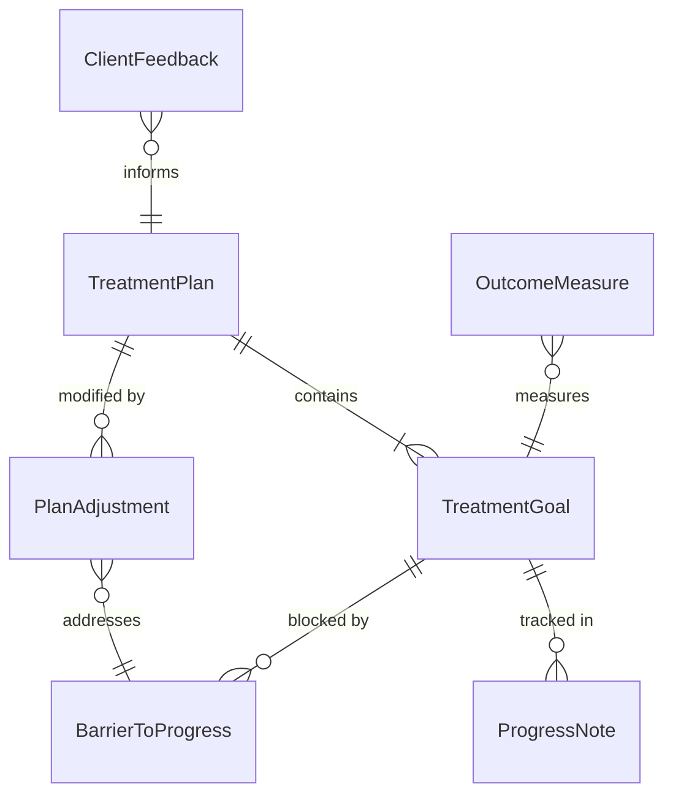
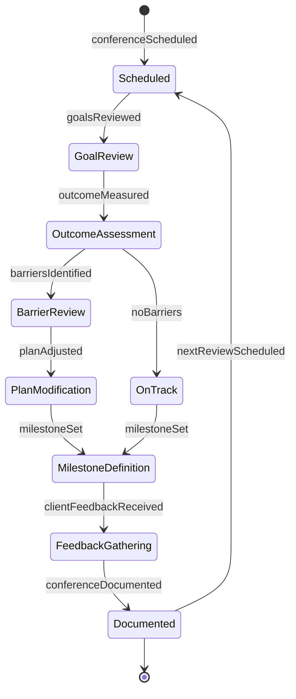
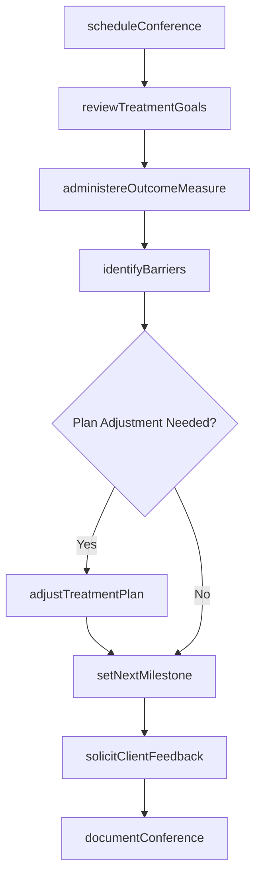
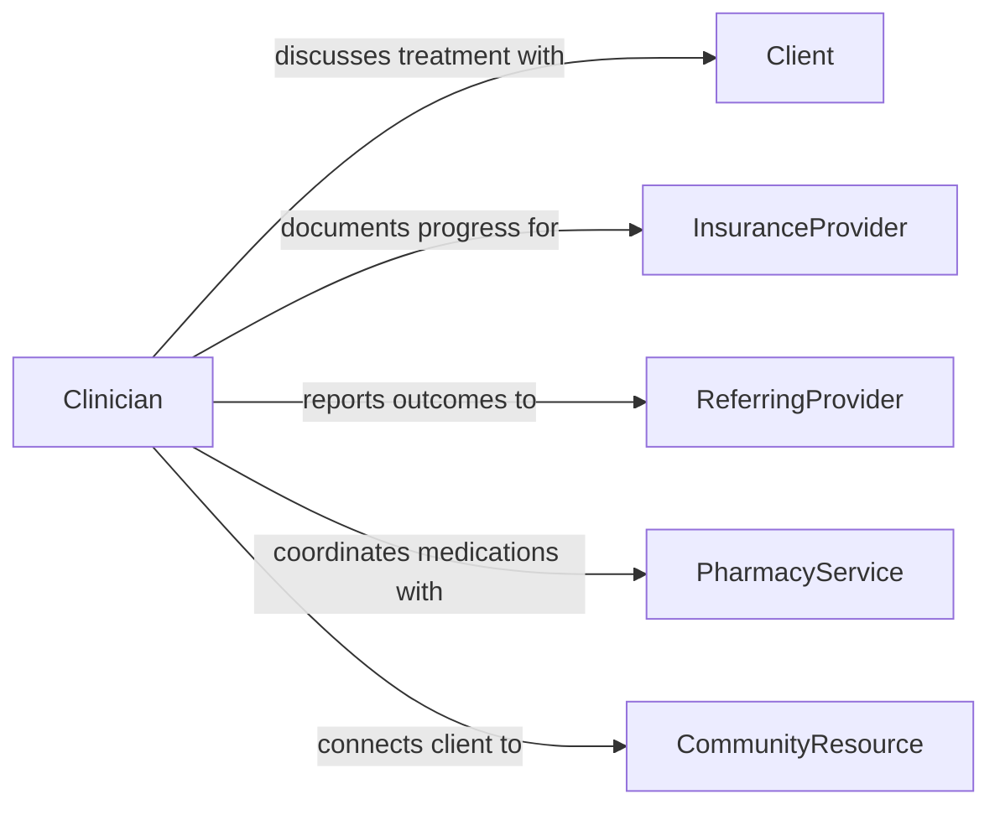

# Confer with Clients to Discuss Treatment Plans or Progress

> Business-as-Code definition for conferring with clients about treatment plans and progress. Models the provider-client communication process where healthcare and social services professionals review treatment goals, assess progress, adjust care plans, and ensure client engagement in their own treatment.

## Overview

Conferring with clients to discuss treatment plans or progress involves conducting scheduled check-ins, reviewing therapeutic goals, measuring outcomes against benchmarks, discussing barriers to progress, and collaboratively adjusting care plans. This definition covers therapy progress reviews, chronic disease management check-ins, rehabilitation milestone assessments, and behavioral health treatment conferences, enabling providers to maintain client engagement, monitor treatment effectiveness, and adapt care approaches based on evolving client needs.

## Actors

| Actor | Description |
|-------|-------------|
| Client | The individual receiving treatment who participates in plan discussions |
| InsuranceProvider | Requires treatment plan documentation and progress updates |
| ReferringProvider | The clinician who initiated the treatment referral |
| PharmacyService | Manages medication adjustments discussed during conferences |
| CommunityResource | Provides supplementary services that support the treatment plan |

## Roles

| Role | Description |
|------|-------------|
| Clinician | Leads the treatment discussion and provides clinical guidance |
| Therapist | Conducts therapeutic interventions and tracks behavioral progress |
| CareCoordinator | Manages scheduling and follow-up for treatment conferences |
| OutcomesMeasurementSpecialist | Administers and interprets standardized progress assessments |

## Entities

| Entity | Description |
|--------|-------------|
| TreatmentPlan | A documented plan of care with goals, interventions, and timelines |
| ProgressNote | A clinical record of the client's advancement toward treatment goals |
| OutcomeMeasure | A standardized assessment of treatment effectiveness |
| TreatmentGoal | A specific, measurable objective within the care plan |
| BarrierToProgress | A documented obstacle preventing the client from meeting goals |
| PlanAdjustment | A modification to the treatment plan based on progress review |
| ClientFeedback | The client's own assessment of their treatment experience |

## Actions

| Action | Description |
|--------|-------------|
| scheduleConference | Arrange a treatment plan review meeting with the client |
| reviewTreatmentGoals | Assess the client's progress toward each documented goal |
| administereOutcomeMeasure | Conduct a standardized assessment of treatment effectiveness |
| identifyBarriers | Document obstacles preventing progress toward treatment goals |
| adjustTreatmentPlan | Modify interventions, goals, or timelines based on the review |
| solicitClientFeedback | Gather the client's perspective on their treatment experience |
| setNextMilestone | Define the next measurable target for the client to work toward |
| documentConference | Record the treatment discussion and any plan changes |

## Events

| Event | Description |
|-------|-------------|
| conferenceScheduled | A treatment review meeting has been arranged |
| goalsReviewed | The client's progress toward treatment objectives has been assessed |
| outcomeMeasured | A standardized effectiveness assessment has been completed |
| barriersIdentified | Obstacles to progress have been documented |
| planAdjusted | The treatment plan has been modified based on the review |
| clientFeedbackReceived | The client's treatment experience perspective has been gathered |
| milestoneSet | The next measurable target has been defined |
| conferenceDocumented | The treatment discussion has been recorded |

## Searches

| Search | Description |
|--------|-------------|
| findConferences | List treatment conferences by client, provider, or date |
| getProgressNotes | Retrieve progress documentation by client or treatment period |
| findBarriers | Locate documented barriers by client or category |
| getOutcomes | Retrieve outcome measure results by client or assessment type |
| getAdjustments | List treatment plan modifications by client or date |

## Entity Relationships



## State Diagram



## Workflow



## Actor Relationships



## Usage

### Calling Actions

```typescript
import { conferClientsDiscussTreatmentPlans } from '@headlessly/confer-clients-discuss-treatment-plans'

const treatment = conferClientsDiscussTreatmentPlans()

// Schedule and conduct a treatment review
const conference = await treatment.scheduleConference({
  client: 'client-2026-3092',
  provider: 'therapist-jdavis',
  date: '2026-02-14',
  type: '90-day-review'
})

const review = await treatment.reviewTreatmentGoals({
  conferenceId: conference.id,
  goals: [
    { goal: 'reduce-anxiety-symptoms', baseline: 28, current: 18, target: 12, measure: 'GAD-7' },
    { goal: 'improve-sleep-quality', baseline: 'poor', current: 'fair', target: 'good' },
    { goal: 'increase-social-engagement', baseline: 1, current: 3, target: 5, unit: 'events-per-week' }
  ]
})

// Identify barriers and adjust
await treatment.identifyBarriers({
  conferenceId: conference.id,
  barriers: [
    { barrier: 'work-schedule-conflict', impact: 'missed-sessions', mitigation: 'telehealth-option' }
  ]
})

await treatment.adjustTreatmentPlan({
  conferenceId: conference.id,
  adjustments: [
    { goal: 'reduce-anxiety-symptoms', change: 'add-mindfulness-component' },
    { intervention: 'session-format', change: 'alternate-in-person-telehealth' }
  ]
})
```

### Event-Driven Automation

```typescript
// Notify referring provider when outcomes are measured
treatment.outcomeMeasured(async ({ client, measure, score }) => {
  await notify({
    to: 'referring-provider',
    message: `${measure} score for ${client}: ${score} - review progress report`
  })
})

// Alert care coordinator when barriers are identified
treatment.barriersIdentified(async ({ client, barriers }) => {
  await notify({
    to: 'care-coordinator',
    message: `${barriers.length} barriers identified for ${client} - mitigation needed`
  })
})
```
