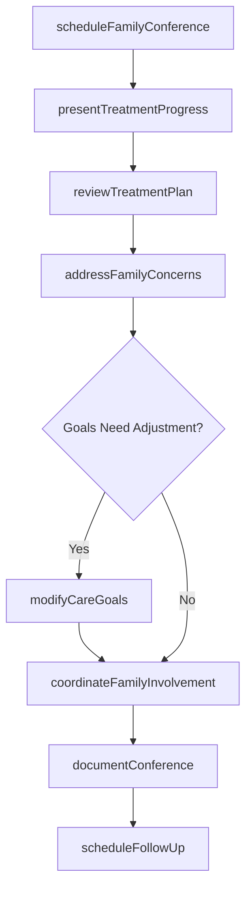
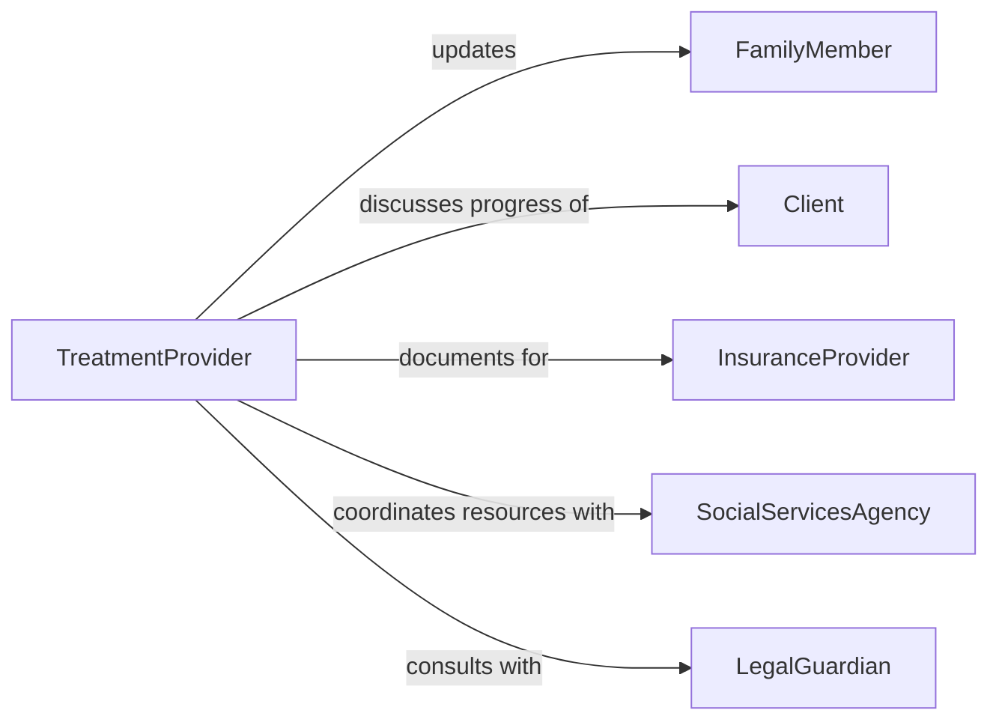

# Confer with Family Members to Discuss Client Treatment Plans or Progress

> Business-as-Code definition for conferring with family members about client treatment plans and progress. Models the family communication process in healthcare and social services where providers share treatment updates, discuss care goals, address family concerns, and coordinate family involvement in the client's care.

## Overview

Conferring with family members to discuss client treatment plans or progress involves scheduling family meetings, presenting treatment progress, explaining care plan modifications, addressing family questions and concerns, and coordinating family participation in ongoing care. This definition covers family conferences in hospitals, progress updates in behavioral health, parent meetings in pediatric care, and caregiver consultations in geriatric services, enabling care teams to maintain family engagement and support the client's treatment outcomes through informed family participation.

## Actors

| Actor | Description |
|-------|-------------|
| FamilyMember | A relative or designated caregiver of the client |
| Client | The individual receiving treatment whose progress is being discussed |
| InsuranceProvider | May require family involvement documentation for coverage |
| SocialServicesAgency | Coordinates community support services for the client and family |
| LegalGuardian | Holds decision-making authority for clients unable to consent themselves |

## Roles

| Role | Description |
|------|-------------|
| TreatmentProvider | Leads the family conference and presents clinical information |
| SocialWorker | Facilitates family communication and addresses psychosocial concerns |
| CaseManager | Coordinates care transitions and community resource referrals |
| FamilyTherapist | Addresses family dynamics that affect treatment outcomes |

## Entities

| Entity | Description |
|--------|-------------|
| FamilyConference | A scheduled meeting between the care team and family members |
| TreatmentPlan | The current plan of care for the client |
| ProgressReport | A summary of the client's advancement toward treatment goals |
| CareGoal | A specific objective within the client's treatment plan |
| FamilyConcern | A question or worry raised by family members during the conference |
| ConferenceNote | A documented record of the family meeting and its outcomes |
| ActionPlan | A set of agreed-upon steps for family involvement in care |

## Actions

| Action | Description |
|--------|-------------|
| scheduleFamilyConference | Arrange a meeting with family members to discuss treatment |
| presentTreatmentProgress | Share the client's advancement toward care goals |
| reviewTreatmentPlan | Walk family members through the current plan of care |
| addressFamilyConcerns | Respond to questions, worries, or objections from family members |
| modifyCareGoals | Adjust treatment objectives based on family input and clinical progress |
| coordinateFamilyInvolvement | Define specific roles for family members in supporting treatment |
| documentConference | Record the meeting content, decisions, and follow-up actions |
| scheduleFollowUp | Arrange the next family update meeting |

## Events

| Event | Description |
|-------|-------------|
| conferenceScheduled | A family meeting has been arranged |
| progressPresented | The client's treatment progress has been shared with family |
| treatmentPlanReviewed | The care plan has been walked through with family members |
| concernsAddressed | Family questions and worries have been responded to |
| goalsModified | Treatment objectives have been adjusted |
| familyInvolvementCoordinated | Family roles in supporting care have been defined |
| conferenceDocumented | The meeting record has been completed |
| followUpScheduled | The next family update has been arranged |

## Searches

| Search | Description |
|--------|-------------|
| findConferences | List family conferences by client, date, or provider |
| getProgressReports | Retrieve client progress summaries by treatment period |
| findConcerns | Locate documented family concerns by client or topic |
| getActionPlans | Retrieve family involvement plans by client |
| findByFamily | List all conferences for a specific family group |

## Workflow



## Actor Relationships



## Usage

### Calling Actions

```typescript
import { conferFamilyMembersDiscussClient } from '@headlessly/confer-family-members-discuss-client'

const familyComm = conferFamilyMembersDiscussClient()

// Schedule and conduct a family conference
const conference = await familyComm.scheduleFamilyConference({
  client: 'client-2026-1847',
  familyMembers: ['mother', 'father', 'adult-sibling'],
  date: '2026-02-12',
  format: 'in-person',
  topics: ['treatment-progress', 'discharge-planning', 'home-care-needs']
})

await familyComm.presentTreatmentProgress({
  conferenceId: conference.id,
  goals: [
    { goal: 'mobility-restoration', status: 'on-track', metric: '75%-range-of-motion' },
    { goal: 'pain-management', status: 'improving', metric: '3-out-of-10-pain-scale' }
  ]
})

await familyComm.addressFamilyConcerns({
  conferenceId: conference.id,
  concerns: [
    { topic: 'home-safety-modifications', raisedBy: 'mother' },
    { topic: 'medication-side-effects', raisedBy: 'father' }
  ]
})

await familyComm.documentConference({ conferenceId: conference.id })
```

### Event-Driven Automation

```typescript
// Auto-send conference summary to family
familyComm.conferenceDocumented(async ({ conferenceId, client }) => {
  await notify({
    to: 'family-portal',
    message: `Conference summary for ${client} is available in the family portal`
  })
})

// Alert social worker when goals are modified
familyComm.goalsModified(async ({ client, modifications }) => {
  await notify({
    to: 'social-worker',
    message: `Treatment goals modified for ${client} - review updated care plan`
  })
})
```
