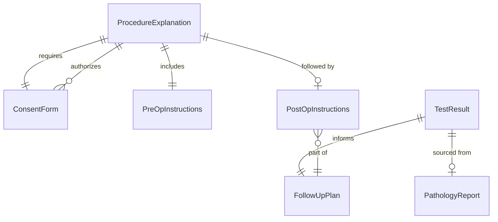
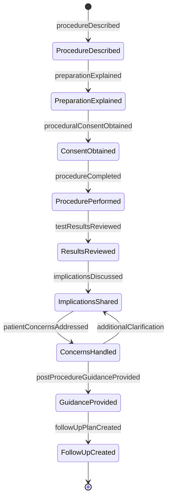
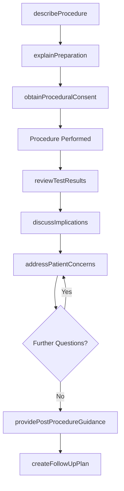
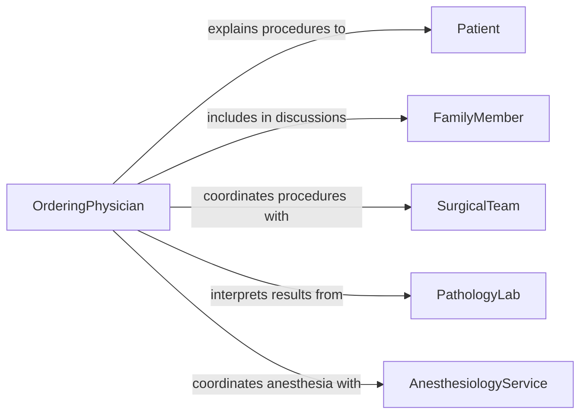

# Explain Medical Procedures or Test Results to Patients or Family Members

> Business-as-Code definition for explaining medical procedures and test results to patients and family members. Models the clinical communication process where healthcare providers describe upcoming procedures, review diagnostic test outcomes, discuss implications, and ensure patients and families are prepared for next steps.

## Overview

Explaining medical procedures or test results to patients or family members involves describing what a procedure entails, what to expect before and after, interpreting diagnostic test outcomes, discussing clinical implications, and outlining follow-up steps. This definition covers pre-operative counseling, post-procedure debriefs, pathology result discussions, and genetic test interpretations, enabling healthcare teams to prepare patients for procedures and help them understand diagnostic findings so they can make informed decisions about their care.

## Actors

| Actor | Description |
|-------|-------------|
| Patient | The individual undergoing the procedure or receiving test results |
| FamilyMember | A relative involved in the patient's care decisions |
| SurgicalTeam | Performs the procedure being explained to the patient |
| PathologyLab | Produces tissue or genetic analysis results requiring explanation |
| AnesthesiologyService | Provides anesthesia-related information for procedural explanations |

## Roles

| Role | Description |
|------|-------------|
| Surgeon | Explains surgical procedures and their expected outcomes |
| OrderingPhysician | Discusses test results and their clinical implications |
| PreOpNurse | Provides procedural preparation instructions to patients |
| GeneticCounselor | Interprets genetic test results and explains hereditary implications |

## Entities

| Entity | Description |
|--------|-------------|
| ProcedureExplanation | A documented description of a medical procedure for the patient |
| TestResult | A diagnostic finding that requires patient-facing interpretation |
| PreOpInstructions | Guidance for patient preparation before a procedure |
| PostOpInstructions | Instructions for recovery and aftercare following a procedure |
| PathologyReport | A laboratory analysis of tissue or fluid samples |
| ConsentForm | A document confirming patient understanding and agreement |
| FollowUpPlan | The next steps in care based on procedure or test outcomes |

## Actions

| Action | Description |
|--------|-------------|
| describeProcedure | Explain what the medical procedure involves and why it is needed |
| explainPreparation | Provide instructions for what the patient should do before the procedure |
| reviewTestResults | Present and interpret diagnostic test findings for the patient |
| discussImplications | Explain what the results or procedure outcomes mean for the patient's health |
| obtainProceduralConsent | Secure the patient's informed agreement before the procedure |
| providePostProcedureGuidance | Deliver aftercare instructions and recovery expectations |
| addressPatientConcerns | Respond to patient and family questions about the procedure or results |
| createFollowUpPlan | Define the next steps in care based on findings or outcomes |

## Events

| Event | Description |
|-------|-------------|
| procedureDescribed | The medical procedure has been explained to the patient |
| preparationExplained | Pre-procedure instructions have been provided |
| testResultsReviewed | Diagnostic findings have been presented and interpreted |
| implicationsDiscussed | The meaning of results for the patient's health has been explained |
| proceduralConsentObtained | The patient has agreed to the procedure with understanding |
| postProcedureGuidanceProvided | Aftercare and recovery instructions have been delivered |
| patientConcernsAddressed | Questions from the patient and family have been answered |
| followUpPlanCreated | Next steps in care have been defined |

## Searches

| Search | Description |
|--------|-------------|
| findExplanations | List procedure or result explanations by patient, provider, or date |
| getTestResults | Retrieve diagnostic results by patient, test type, or date |
| findConsentRecords | Locate procedural consent forms by patient or procedure |
| getFollowUpPlans | Retrieve post-procedure care plans by patient |
| findByProcedure | List explanations for a specific procedure type |

## Entity Relationships



## State Diagram



## Workflow



## Actor Relationships



## Usage

### Calling Actions

```typescript
import { explainMedicalProceduresTestResults } from '@headlessly/explain-medical-procedures-test-results'

const procedures = explainMedicalProceduresTestResults()

// Explain an upcoming procedure
await procedures.describeProcedure({
  patient: 'patient-2026-5612',
  procedure: 'Colonoscopy with Polypectomy',
  reason: 'Routine screening with polyp removal if found',
  duration: '30-60 minutes',
  anesthesia: 'moderate-sedation',
  risks: ['bleeding', 'perforation', 'reaction-to-sedation'],
  familyPresent: ['spouse']
})

await procedures.explainPreparation({
  patient: 'patient-2026-5612',
  instructions: [
    { timing: '7 days before', action: 'stop-blood-thinners' },
    { timing: '1 day before', action: 'clear-liquid-diet' },
    { timing: 'evening before', action: 'bowel-preparation' },
    { timing: 'morning of', action: 'nothing-by-mouth' }
  ]
})

// Review results post-procedure
await procedures.reviewTestResults({
  patient: 'patient-2026-5612',
  results: [
    { finding: '2 tubular adenomas removed', significance: 'precancerous-polyps-removed' },
    { finding: 'No evidence of malignancy', significance: 'negative-for-cancer' }
  ],
  pathologyPending: true
})

await procedures.createFollowUpPlan({
  patient: 'patient-2026-5612',
  plan: [
    { action: 'pathology-review', timeline: '7-10 days' },
    { action: 'follow-up-colonoscopy', timeline: '3 years' }
  ]
})
```

### Event-Driven Automation

```typescript
// Send preparation instructions after procedure is described
procedures.procedureDescribed(async ({ patient, procedure }) => {
  await procedures.explainPreparation({ patient, procedure })
})

// Notify provider when pathology results are ready
procedures.testResultsReviewed(async ({ patient, pathologyPending }) => {
  if (pathologyPending) {
    await notify({
      to: 'ordering-physician',
      message: `Pathology results pending for ${patient} - follow up when available`
    })
  }
})
```
