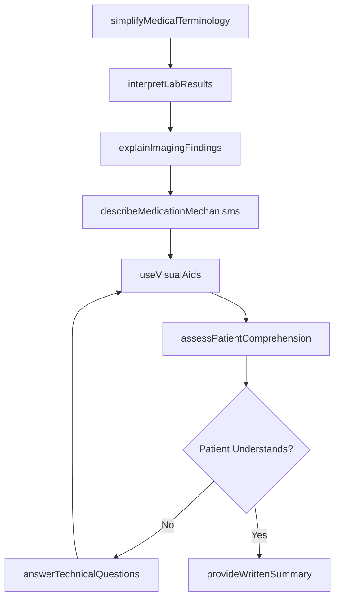
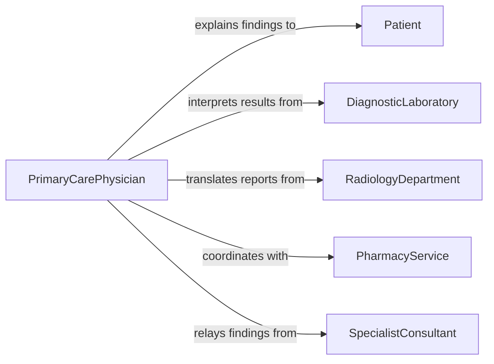

# Explain Technical Medical Information to Patients

> Business-as-Code definition for explaining technical medical information to patients. Models the clinical communication process where healthcare providers translate complex medical terminology, diagnostic data, imaging results, and pharmacological information into language that patients can understand to support informed healthcare decisions.

## Overview

Explaining technical medical information to patients involves translating clinical terminology into plain language, interpreting diagnostic imaging and laboratory results, describing medication mechanisms and interactions, and helping patients understand the physiological basis of their conditions. This definition covers radiology result explanations, lab work interpretations, surgical procedure descriptions, and pharmacological counseling, enabling healthcare providers to ensure patients comprehend the technical aspects of their care and can participate meaningfully in treatment decisions.

## Actors

| Actor | Description |
|-------|-------------|
| Patient | The individual receiving the technical medical explanation |
| DiagnosticLaboratory | Produces test results that require patient-facing interpretation |
| RadiologyDepartment | Generates imaging studies that need translation for patients |
| PharmacyService | Provides medication information that must be explained to patients |
| SpecialistConsultant | Produces technical reports that referring providers must explain |

## Roles

| Role | Description |
|------|-------------|
| PrimaryCarePhysician | Explains a broad range of medical information to patients |
| Radiologist | Interprets imaging studies and communicates findings |
| Pharmacist | Explains medication mechanisms, interactions, and side effects |
| NursePractitioner | Provides technical medical explanations during patient encounters |

## Entities

| Entity | Description |
|--------|-------------|
| LabResult | A numerical or categorical finding from a diagnostic test |
| ImagingReport | A narrative interpretation of diagnostic imaging studies |
| MedicationProfile | A summary of prescribed medications and their interactions |
| AnatomicalDiagram | A visual aid used to explain medical conditions or procedures |
| MedicalTermGlossary | A collection of plain-language definitions for clinical terms |
| PatientSummary | A simplified version of the clinical record for patient understanding |
| VisualExplanation | A diagram, model, or video used to clarify technical concepts |

## Actions

| Action | Description |
|--------|-------------|
| interpretLabResults | Translate numerical lab findings into meaningful patient information |
| explainImagingFindings | Describe what diagnostic images show in understandable terms |
| describeMedicationMechanisms | Explain how prescribed medications work in the body |
| simplifyMedicalTerminology | Convert clinical jargon into plain language |
| useVisualAids | Employ diagrams, models, or videos to clarify technical concepts |
| assessPatientComprehension | Verify the patient understands the technical information |
| provideWrittenSummary | Deliver a simplified written version of the technical information |
| answerTechnicalQuestions | Respond to patient inquiries about medical details |

## Events

| Event | Description |
|-------|-------------|
| labResultsInterpreted | Lab findings have been translated for patient understanding |
| imagingFindingsExplained | Diagnostic imaging results have been described in plain language |
| medicationMechanismsDescribed | Drug mechanisms and interactions have been explained |
| terminologySimplified | Clinical jargon has been converted to accessible language |
| visualAidsUsed | Diagrams or models have been employed to aid understanding |
| comprehensionAssessed | Patient understanding of technical information has been verified |
| writtenSummaryProvided | A simplified written summary has been delivered |
| technicalQuestionsAnswered | Patient inquiries about medical details have been addressed |

## Searches

| Search | Description |
|--------|-------------|
| findExplanations | List patient explanation sessions by encounter, condition, or provider |
| getLabInterpretations | Retrieve lab result explanations by patient or test type |
| findByCondition | Locate explanation sessions for a specific medical condition |
| getVisualAids | Retrieve educational visual materials by condition or procedure |
| getPatientSummaries | List simplified clinical summaries by patient |

## Workflow



## Actor Relationships



## Usage

### Calling Actions

```typescript
import { explainTechnicalMedicalInformationPatients } from '@headlessly/explain-technical-medical-information-patients'

const medExplain = explainTechnicalMedicalInformationPatients()

// Interpret lab results for a patient
await medExplain.interpretLabResults({
  patient: 'patient-2026-7834',
  results: [
    { test: 'HbA1c', value: 7.2, unit: '%', reference: '4.0-5.6', interpretation: 'above-target' },
    { test: 'LDL-cholesterol', value: 142, unit: 'mg/dL', reference: '<100', interpretation: 'elevated' },
    { test: 'eGFR', value: 72, unit: 'mL/min', reference: '>90', interpretation: 'mildly-reduced' }
  ],
  plainLanguage: true
})

// Explain imaging findings
await medExplain.explainImagingFindings({
  patient: 'patient-2026-7834',
  study: 'chest-x-ray',
  findings: 'Normal cardiac silhouette, clear lung fields, no acute process',
  visualAid: 'annotated-chest-xray-diagram'
})

// Describe medication changes
await medExplain.describeMedicationMechanisms({
  patient: 'patient-2026-7834',
  medications: [
    { drug: 'empagliflozin', mechanism: 'blocks-sugar-reabsorption-in-kidneys', benefit: 'lowers-blood-sugar-and-protects-kidneys' },
    { drug: 'rosuvastatin', mechanism: 'reduces-cholesterol-production-in-liver', benefit: 'lowers-ldl-cholesterol' }
  ]
})
```

### Event-Driven Automation

```typescript
// Provide written summary after comprehension is confirmed
medExplain.comprehensionAssessed(async ({ patient, comprehensionLevel }) => {
  if (comprehensionLevel === 'adequate') {
    await medExplain.provideWrittenSummary({ patient, format: 'patient-portal' })
  }
})

// Alert provider when patient has difficulty understanding
medExplain.technicalQuestionsAnswered(async ({ patient, questionCount }) => {
  if (questionCount > 5) {
    await notify({
      to: 'patient-education',
      message: `Patient ${patient} had ${questionCount} questions - consider health literacy assessment`
    })
  }
})
```
