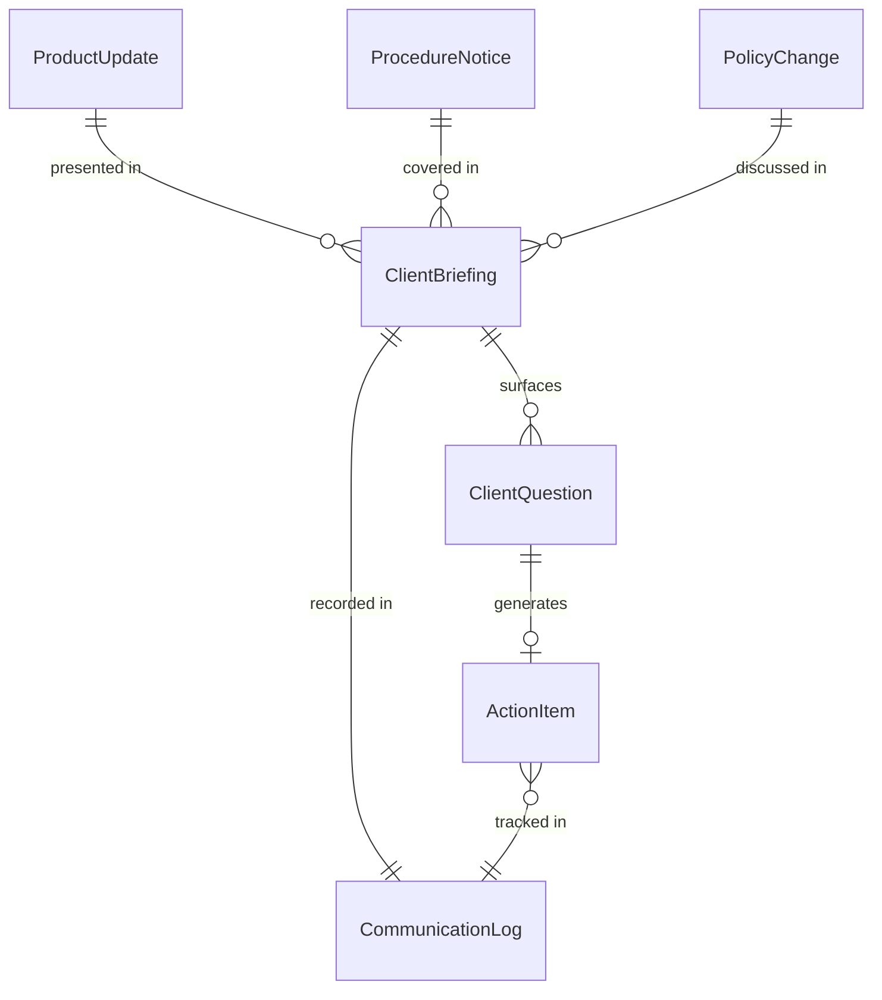
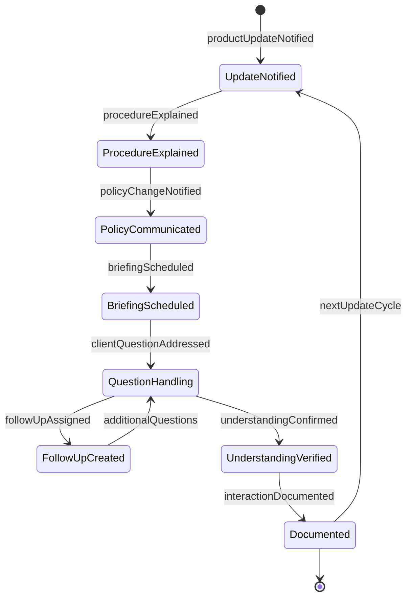
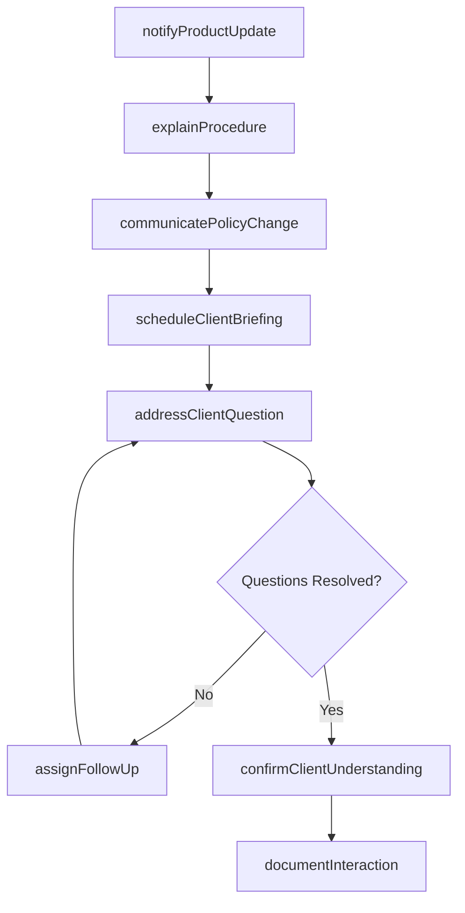
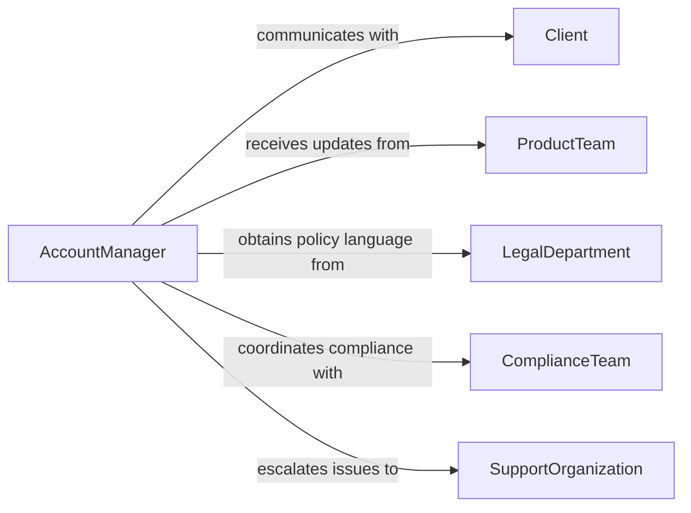

# Communicate with Clients About Products, Procedures, and Policies

> Business-as-Code definition for communicating with clients about products, procedures, and policies. Models the ongoing client communication process where account teams share product updates, procedural requirements, and policy information relevant to the client's engagement.

## Overview

Communicating with clients about products, procedures, and policies involves maintaining regular contact to share product updates, explain procedural requirements, clarify policy terms, and address client questions about how organizational rules affect their relationship. This definition covers account review meetings, product update notifications, onboarding procedure explanations, and policy change communications, enabling client-facing teams to keep clients informed and aligned with current offerings and requirements.

## Actors

| Actor | Description |
|-------|-------------|
| Client | The customer or account holder receiving product and policy information |
| ProductTeam | Provides product updates, roadmap information, and feature details |
| LegalDepartment | Supplies policy language and contract terms for client communication |
| ComplianceTeam | Ensures client communications meet regulatory requirements |
| SupportOrganization | Handles escalated client questions about products or policies |

## Roles

| Role | Description |
|------|-------------|
| AccountManager | Maintains the primary communication relationship with the client |
| ClientSuccessAdvisor | Proactively shares relevant product and policy information |
| ProductLiaison | Translates product updates into client-relevant messaging |
| PolicyCommunicator | Explains organizational policies and their impact on clients |

## Entities

| Entity | Description |
|--------|-------------|
| ProductUpdate | A communication about new features, changes, or deprecations |
| ProcedureNotice | An explanation of procedural requirements the client must follow |
| PolicyChange | A notification about revised terms, conditions, or organizational rules |
| ClientBriefing | A scheduled meeting to discuss products, procedures, and policies |
| ClientQuestion | A documented inquiry from the client about a product or policy |
| CommunicationLog | A record of all interactions with the client on these topics |
| ActionItem | A follow-up task resulting from a client communication |

## Actions

| Action | Description |
|--------|-------------|
| notifyProductUpdate | Inform the client about product changes or new features |
| explainProcedure | Walk the client through required procedures or processes |
| communicatePolicyChange | Notify the client about revised policies or terms |
| scheduleClientBriefing | Arrange a meeting to discuss products, procedures, or policies |
| addressClientQuestion | Respond to a specific client inquiry about a product or policy |
| documentInteraction | Record the communication in the client relationship log |
| assignFollowUp | Create action items resulting from the client discussion |
| confirmClientUnderstanding | Verify that the client comprehends the communicated information |

## Events

| Event | Description |
|-------|-------------|
| productUpdateNotified | The client has been informed about product changes |
| procedureExplained | Required procedures have been walked through with the client |
| policyChangeNotified | The client has been notified about revised policies |
| briefingScheduled | A client meeting has been arranged |
| clientQuestionAddressed | A client inquiry has been answered |
| interactionDocumented | The communication has been recorded in the client log |
| followUpAssigned | Action items from the discussion have been created |
| understandingConfirmed | The client has confirmed comprehension of the information |

## Searches

| Search | Description |
|--------|-------------|
| findCommunications | List client communications by account, topic, or date |
| getOpenQuestions | Retrieve unanswered client inquiries |
| findByClient | Locate all communications for a specific client account |
| getFollowUps | Retrieve pending action items by client or topic |
| getCommunicationLog | Retrieve the full interaction history for a client |

## Entity Relationships



## State Diagram



## Workflow



## Actor Relationships



## Usage

### Calling Actions

```typescript
import { communicateClientsAboutProductsProcedures } from '@headlessly/communicate-clients-about-products-procedures'

const clientComms = communicateClientsAboutProductsProcedures()

// Notify client about product update
await clientComms.notifyProductUpdate({
  client: 'Apex Financial Group',
  product: 'Risk Analytics Platform',
  update: 'v3.2 release',
  changes: ['enhanced-scenario-modeling', 'new-regulatory-reports', 'api-v2-deprecation'],
  actionRequired: true
})

// Explain new compliance procedure
await clientComms.explainProcedure({
  client: 'Apex Financial Group',
  procedure: 'Annual Data Certification',
  steps: ['review-data-accuracy', 'sign-certification-form', 'submit-by-deadline'],
  deadline: '2026-06-30'
})

// Schedule briefing for policy changes
await clientComms.scheduleClientBriefing({
  client: 'Apex Financial Group',
  topics: ['pricing-structure-update', 'sla-revision', 'data-retention-policy'],
  proposedDate: '2026-03-10',
  format: 'video-conference'
})
```

### Event-Driven Automation

```typescript
// Document all client interactions automatically
clientComms.clientQuestionAddressed(async ({ client, question, response }) => {
  await clientComms.documentInteraction({
    client,
    type: 'question-response',
    summary: question,
    details: response
  })
})

// Notify account team of pending follow-ups
clientComms.followUpAssigned(async ({ client, items }) => {
  await notify({
    to: 'account-team',
    message: `${items.length} follow-up items assigned for ${client}`
  })
})
```
