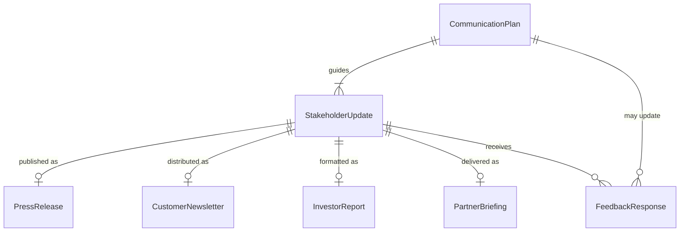
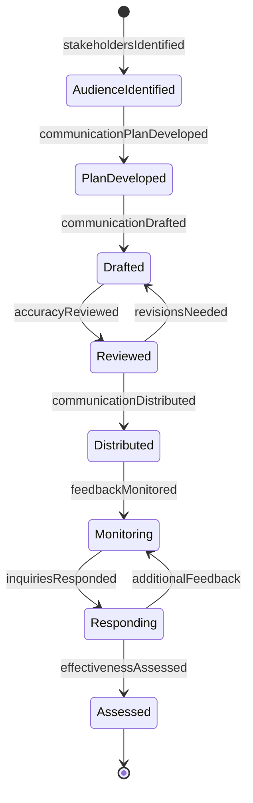
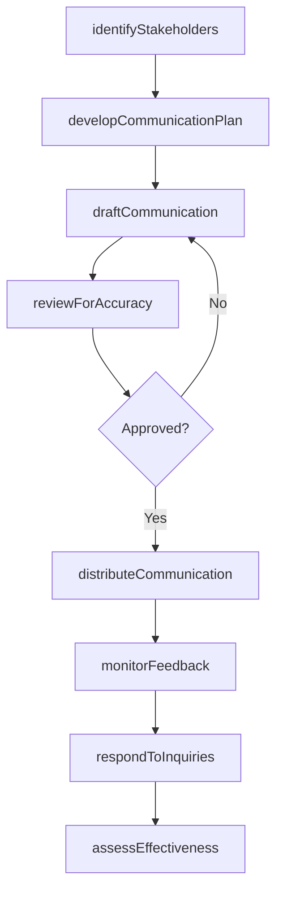
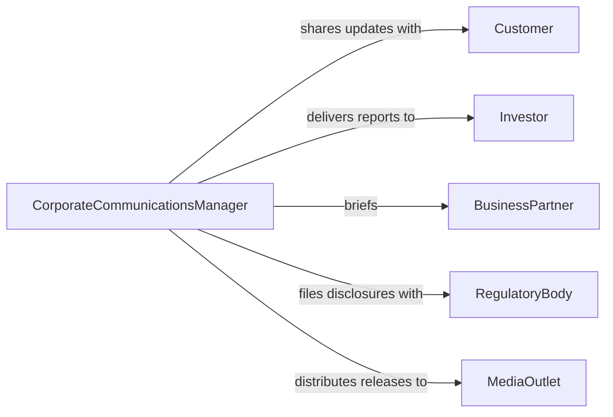

# Communicate Organizational Information to Customers or Stakeholders

> Business-as-Code definition for communicating organizational information to external stakeholders. Models the process of sharing company updates, strategic direction, operational changes, and organizational news with customers, investors, partners, and other external audiences.

## Overview

Communicating organizational information to customers or other stakeholders involves preparing and delivering updates about company direction, service changes, operational milestones, and strategic initiatives to external audiences. This definition covers investor communications, customer newsletters, partner briefings, and stakeholder reports, enabling organizations to maintain transparency, build trust, and ensure that external parties have the information they need to make informed decisions about their relationship with the organization.

## Actors

| Actor | Description |
|-------|-------------|
| Customer | Receives information about products, services, and organizational changes |
| Investor | Receives financial and strategic updates about the organization |
| BusinessPartner | Receives operational information relevant to the partnership |
| RegulatoryBody | Receives required disclosures and organizational filings |
| MediaOutlet | Distributes organizational news to the broader public |

## Roles

| Role | Description |
|------|-------------|
| CorporateCommunicationsManager | Develops and coordinates external messaging |
| InvestorRelationsOfficer | Manages financial and strategic communications to investors |
| CustomerRelationsManager | Delivers service and product updates to customers |
| PublicRelationsSpecialist | Manages media interactions and press communications |

## Entities

| Entity | Description |
|--------|-------------|
| StakeholderUpdate | A communication about organizational changes or news |
| PressRelease | A formal announcement distributed to media outlets |
| CustomerNewsletter | A periodic communication to customers about products and services |
| InvestorReport | A financial or strategic update for shareholders and analysts |
| PartnerBriefing | An operational update shared with business partners |
| CommunicationPlan | A strategy for delivering organizational information to stakeholders |
| FeedbackResponse | A reply to stakeholder questions or concerns about the communication |

## Actions

| Action | Description |
|--------|-------------|
| identifyStakeholders | Determine which external parties need to receive the information |
| developCommunicationPlan | Create a strategy for message content, timing, and channels |
| draftCommunication | Author the organizational update or announcement |
| reviewForAccuracy | Verify that the communication is factually correct and appropriate |
| distributeCommunication | Send the information through the designated channels |
| monitorFeedback | Track stakeholder reactions and questions |
| respondToInquiries | Answer stakeholder questions about the communicated information |
| assessEffectiveness | Evaluate how well the communication achieved its objectives |

## Events

| Event | Description |
|-------|-------------|
| stakeholdersIdentified | The target audience for the communication has been determined |
| communicationPlanDeveloped | A distribution strategy has been created |
| communicationDrafted | The organizational update has been authored |
| accuracyReviewed | The communication has been verified for correctness |
| communicationDistributed | The information has been sent to stakeholders |
| feedbackMonitored | Stakeholder reactions have been tracked |
| inquiriesResponded | Stakeholder questions have been answered |
| effectivenessAssessed | Communication impact has been evaluated |

## Searches

| Search | Description |
|--------|-------------|
| findCommunications | List organizational communications by type, date, or audience |
| getStakeholderFeedback | Retrieve reactions and questions by communication or stakeholder |
| findByAudience | Locate communications targeting a specific stakeholder group |
| getCommunicationPlans | Retrieve distribution strategies by topic or initiative |
| findPendingResponses | List unanswered stakeholder inquiries |

## Entity Relationships



## State Diagram



## Workflow



## Actor Relationships



## Usage

### Calling Actions

```typescript
import { communicateOrganizationalInformationCustomersStakeholders } from '@headlessly/communicate-organizational-information-customers-stakeholders'

const comms = communicateOrganizationalInformationCustomersStakeholders()

// Plan and draft a major organizational announcement
const plan = await comms.developCommunicationPlan({
  topic: 'Acquisition of DataStream Analytics',
  audiences: ['customers', 'investors', 'employees', 'media'],
  timeline: {
    internalAnnouncement: '2026-03-01T08:00:00Z',
    pressRelease: '2026-03-01T09:00:00Z',
    customerEmail: '2026-03-01T10:00:00Z'
  }
})

const draft = await comms.draftCommunication({
  planId: plan.id,
  audience: 'customers',
  format: 'email',
  keyMessages: [
    'expanded-product-capabilities',
    'no-disruption-to-service',
    'enhanced-data-analytics'
  ]
})

await comms.reviewForAccuracy({ communicationId: draft.id, reviewers: ['legal', 'executive'] })
await comms.distributeCommunication({ communicationId: draft.id })
```

### Event-Driven Automation

```typescript
// Monitor feedback after distribution
comms.communicationDistributed(async ({ communicationId, audience }) => {
  await comms.monitorFeedback({ communicationId })
})

// Alert PR team on negative feedback
comms.feedbackMonitored(async ({ communicationId, sentimentScore }) => {
  if (sentimentScore < 3) {
    await notify({
      to: 'public-relations',
      message: `Negative sentiment detected on communication ${communicationId} - response needed`
    })
  }
})
```
