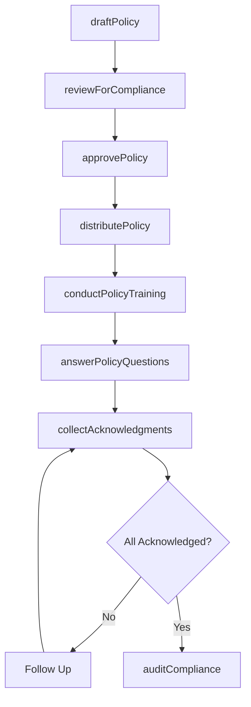
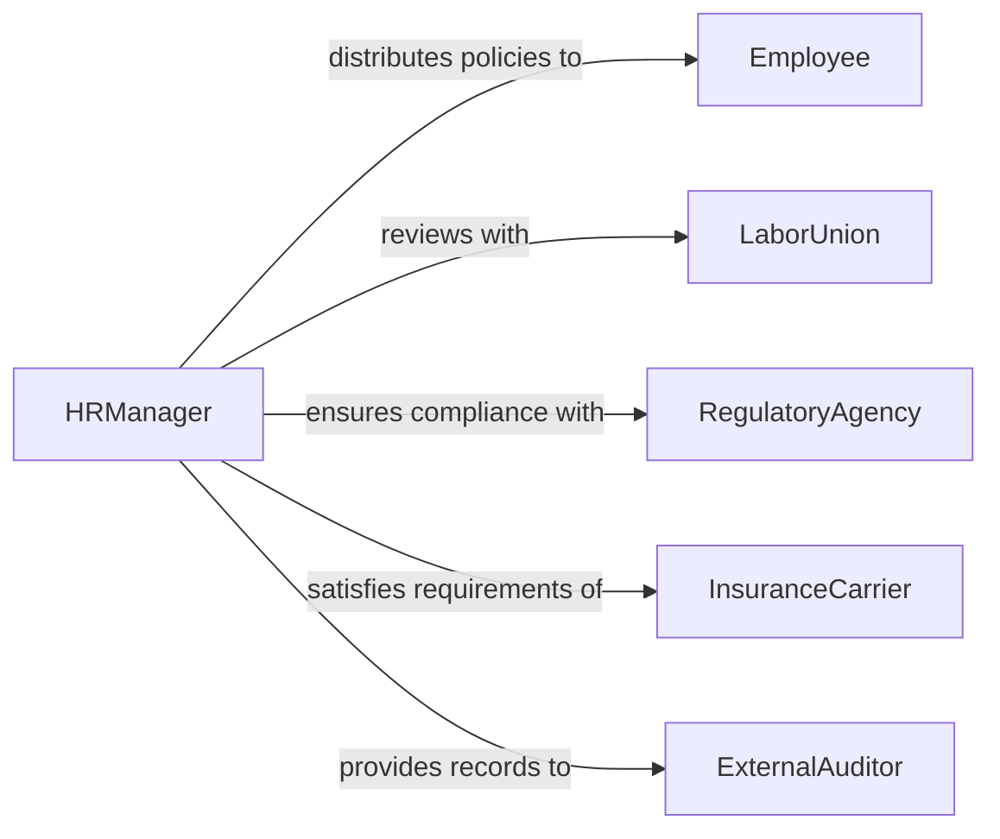

# Communicate Organizational Policies and Procedures

> Business-as-Code definition for communicating organizational policies and procedures. Models the internal communication lifecycle through which organizations disseminate workplace policies, standard operating procedures, and behavioral expectations to employees and contractors.

## Overview

Communicating organizational policies and procedures involves developing policy documentation, distributing it through appropriate channels, conducting orientation and training sessions, answering employee questions, and tracking acknowledgment of receipt. This definition covers employee handbooks, code of conduct communications, safety procedures, IT acceptable use policies, and operational SOPs, enabling HR, compliance, and operations teams to ensure all personnel understand and follow organizational standards.

## Actors

| Actor | Description |
|-------|-------------|
| Employee | The individual receiving and acknowledging policy communications |
| LaborUnion | Negotiates and reviews policies affecting collective bargaining agreements |
| RegulatoryAgency | Sets standards that drive internal policy requirements |
| InsuranceCarrier | Requires certain policies as conditions of coverage |
| ExternalAuditor | Reviews policy communication as part of compliance audits |

## Roles

| Role | Description |
|------|-------------|
| HRManager | Develops and distributes workplace policies to employees |
| PolicyAdministrator | Maintains the policy library and manages version control |
| ComplianceCoordinator | Ensures policies meet regulatory and legal requirements |
| DepartmentManager | Communicates department-specific procedures to their teams |

## Entities

| Entity | Description |
|--------|-------------|
| PolicyDocument | A formal statement of organizational rules or expectations |
| Procedure | Step-by-step instructions for completing a specific process |
| EmployeeHandbook | A comprehensive collection of organizational policies |
| AcknowledgmentRecord | Documentation that an employee has received and understood a policy |
| PolicyUpdate | A revision or amendment to an existing policy |
| TrainingSession | A scheduled session to explain policies or procedures to staff |
| DistributionLog | A record of when and how policies were distributed |

## Actions

| Action | Description |
|--------|-------------|
| draftPolicy | Create or revise a policy document |
| reviewForCompliance | Verify that the policy meets legal and regulatory requirements |
| approvePolicy | Obtain management authorization for the policy |
| distributePolicy | Send the policy to all affected employees through designated channels |
| conductPolicyTraining | Deliver training sessions explaining the policy and its application |
| answerPolicyQuestions | Respond to employee inquiries about policy interpretation |
| collectAcknowledgments | Gather signed confirmations that employees have received the policy |
| auditCompliance | Verify that policy communication requirements have been met |

## Events

| Event | Description |
|-------|-------------|
| policyDrafted | A new or revised policy document has been created |
| complianceReviewed | The policy has been verified for legal and regulatory compliance |
| policyApproved | Management authorization has been obtained |
| policyDistributed | The policy has been sent to all affected employees |
| trainingConducted | A policy training session has been delivered |
| questionsAnswered | Employee policy inquiries have been addressed |
| acknowledgmentsCollected | Employee confirmations of receipt have been gathered |
| complianceAudited | Policy communication compliance has been verified |

## Searches

| Search | Description |
|--------|-------------|
| findPolicies | List policies by category, effective date, or status |
| getAcknowledgments | Retrieve acknowledgment records by employee or policy |
| findPendingAcknowledgments | Locate employees who have not yet acknowledged a policy |
| getPolicyHistory | Retrieve the revision history for a specific policy |
| findByDepartment | List policies applicable to a specific department |

## Workflow



## Actor Relationships



## Usage

### Calling Actions

```typescript
import { communicateOrganizationalPoliciesProcedures } from '@headlessly/communicate-organizational-policies-procedures'

const policies = communicateOrganizationalPoliciesProcedures()

// Draft and approve a new policy
const policy = await policies.draftPolicy({
  title: 'Remote Work Policy',
  category: 'workplace-flexibility',
  applicableTo: ['all-employees'],
  effectiveDate: '2026-03-01'
})

await policies.reviewForCompliance({ policyId: policy.id })
await policies.approvePolicy({ policyId: policy.id, approver: 'vp-human-resources' })

// Distribute and train
await policies.distributePolicy({
  policyId: policy.id,
  channels: ['email', 'intranet', 'employee-portal'],
  acknowledgmentRequired: true
})

await policies.conductPolicyTraining({
  policyId: policy.id,
  sessions: [
    { date: '2026-02-20', format: 'webinar', audience: 'all-managers' },
    { date: '2026-02-25', format: 'recorded', audience: 'all-employees' }
  ]
})
```

### Event-Driven Automation

```typescript
// Remind employees who haven't acknowledged
policies.policyDistributed(async ({ policyId, deadline }) => {
  setTimeout(async () => {
    const pending = await policies.findPendingAcknowledgments({ policyId })
    if (pending.length > 0) {
      await notify({
        to: pending.map(e => e.email),
        message: `Please acknowledge the new policy by ${deadline}`
      })
    }
  }, 7 * 24 * 60 * 60 * 1000) // 7 days
})

// Notify HR when all acknowledgments are collected
policies.acknowledgmentsCollected(async ({ policyId, completionRate }) => {
  if (completionRate === 100) {
    await notify({
      to: 'hr-compliance',
      message: `100% acknowledgment achieved for policy ${policyId}`
    })
  }
})
```
