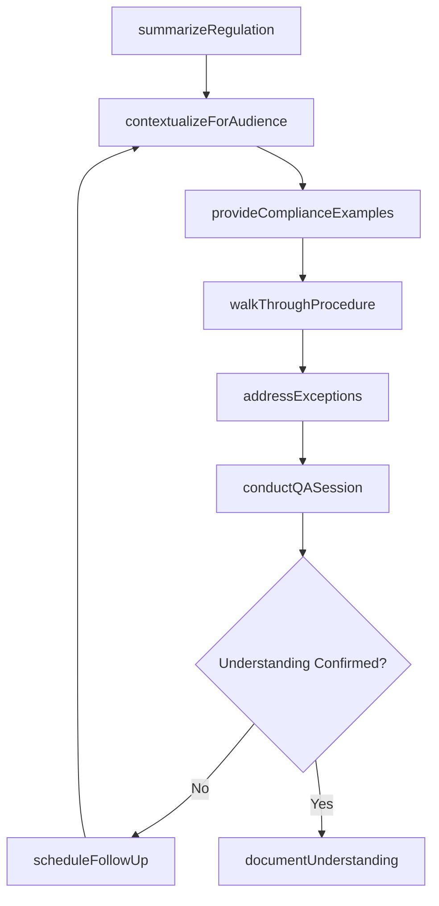
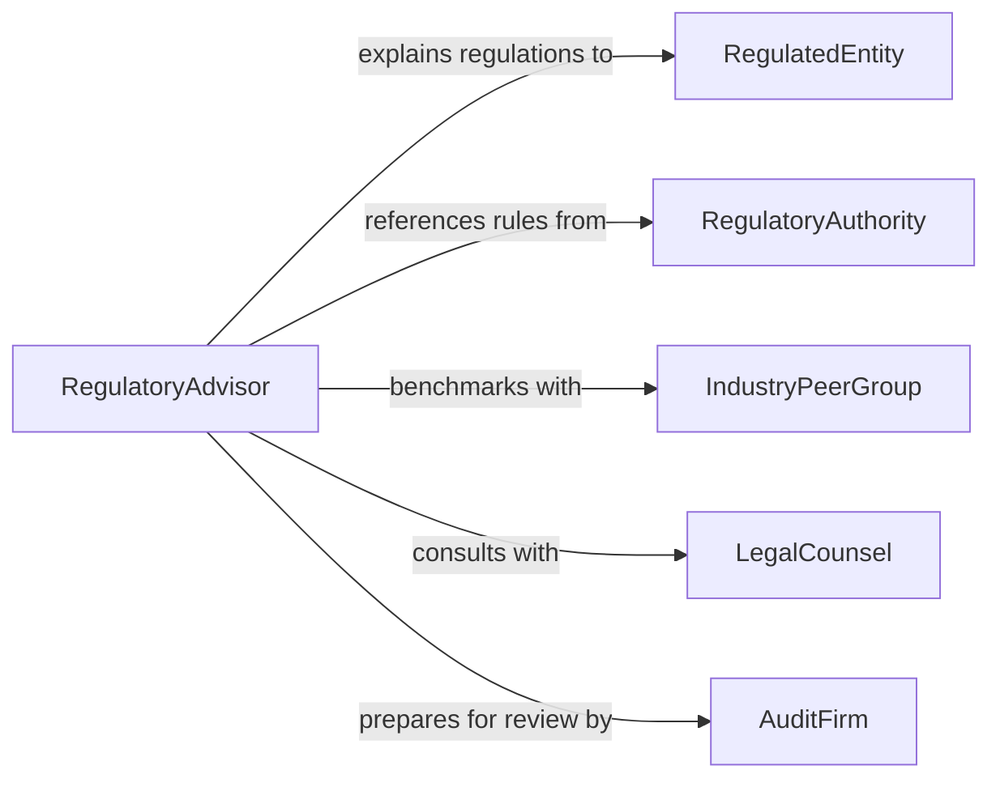

# Explain Regulations, Policies, or Procedures

> Business-as-Code definition for explaining regulations, policies, and procedures. Models the interpretive communication process where subject matter experts translate complex rules, organizational standards, and operational procedures into understandable guidance for stakeholders who must comply with or implement them.

## Overview

Explaining regulations, policies, or procedures involves interpreting formal rules and requirements, contextualizing them for specific audiences, providing practical examples of compliance, and answering questions about application and exceptions. This definition covers regulatory briefings, policy walkthroughs, procedural training, and compliance consultations, enabling organizations to bridge the gap between formal rule-making and practical day-to-day adherence by ensuring that affected parties understand not just what is required, but why and how to comply.

## Actors

| Actor | Description |
|-------|-------------|
| RegulatedEntity | The organization or individual subject to the regulations or policies |
| RegulatoryAuthority | The agency or body that issued the regulation |
| IndustryPeerGroup | Other organizations navigating the same regulatory landscape |
| LegalCounsel | Provides authoritative legal interpretation of regulations |
| AuditFirm | Assesses compliance with explained regulations and policies |

## Roles

| Role | Description |
|------|-------------|
| RegulatoryAdvisor | Interprets and explains regulations to affected parties |
| PolicyAnalyst | Breaks down organizational policies into actionable guidance |
| ProcedureTrainer | Demonstrates procedural steps and answers implementation questions |
| ComplianceLead | Coordinates the explanation effort across departments |

## Entities

| Entity | Description |
|--------|-------------|
| RegulationSummary | A plain-language overview of a specific regulation |
| PolicyExplanation | A contextualized interpretation of an organizational policy |
| ProcedureWalkthrough | A step-by-step demonstration of a required process |
| ComplianceExample | A practical illustration of how to meet a specific requirement |
| ExceptionGuidance | Documentation of allowed exceptions or alternative compliance methods |
| QARecord | A documented question and answer about a regulation or policy |
| ComplianceTimeline | A schedule of regulatory deadlines and milestones |

## Actions

| Action | Description |
|--------|-------------|
| summarizeRegulation | Create a plain-language overview of the regulation or policy |
| contextualizeForAudience | Tailor the explanation to the specific audience's role and responsibilities |
| provideComplianceExamples | Illustrate correct compliance behavior with practical scenarios |
| walkThroughProcedure | Demonstrate the step-by-step process for meeting requirements |
| addressExceptions | Explain allowed exceptions and alternative compliance paths |
| conductQASession | Facilitate a question-and-answer session about the regulation or policy |
| documentUnderstanding | Record the audience's comprehension and remaining questions |
| scheduleFollowUp | Arrange additional explanation sessions for unresolved topics |

## Events

| Event | Description |
|-------|-------------|
| regulationSummarized | A plain-language regulatory overview has been created |
| contextProvided | The explanation has been tailored for the specific audience |
| complianceExamplesProvided | Practical compliance scenarios have been illustrated |
| procedureWalkedThrough | A step-by-step process demonstration has been completed |
| exceptionsAddressed | Exception and alternative compliance paths have been explained |
| qaSessionConducted | A question-and-answer session has been facilitated |
| understandingDocumented | Audience comprehension has been recorded |
| followUpScheduled | Additional explanation sessions have been arranged |

## Searches

| Search | Description |
|--------|-------------|
| findSummaries | List regulation summaries by topic, jurisdiction, or date |
| getQARecords | Retrieve question-and-answer records by regulation or session |
| findByAudience | Locate explanations tailored for a specific department or role |
| getExceptions | Retrieve documented exceptions by regulation or policy |
| findPendingFollowUps | List scheduled follow-up explanation sessions |

## Workflow



## Actor Relationships



## Usage

### Calling Actions

```typescript
import { explainRegulationsPoliciesProcedures } from '@headlessly/explain-regulations-policies-procedures'

const regulations = explainRegulationsPoliciesProcedures()

// Summarize and contextualize a new data privacy regulation
const summary = await regulations.summarizeRegulation({
  regulation: 'State Consumer Privacy Act - 2026 Amendment',
  jurisdiction: 'state-california',
  effectiveDate: '2026-07-01'
})

await regulations.contextualizeForAudience({
  summaryId: summary.id,
  audience: 'marketing-department',
  focus: ['data-collection-consent', 'opt-out-mechanisms', 'retention-limits']
})

// Walk through compliance procedures
await regulations.walkThroughProcedure({
  summaryId: summary.id,
  procedure: 'consumer-data-deletion-request',
  steps: ['receive-request', 'verify-identity', 'locate-records', 'delete-data', 'confirm-deletion']
})

await regulations.conductQASession({
  summaryId: summary.id,
  audience: 'marketing-department',
  format: 'live-webinar'
})
```

### Event-Driven Automation

```typescript
// Auto-generate compliance examples when summary is created
regulations.regulationSummarized(async ({ summaryId, regulation }) => {
  await regulations.provideComplianceExamples({ summaryId })
})

// Notify compliance lead when understanding gaps are identified
regulations.followUpScheduled(async ({ summaryId, audience, topics }) => {
  await notify({
    to: 'compliance-lead',
    message: `Follow-up needed for ${audience}: ${topics.join(', ')}`
  })
})
```
