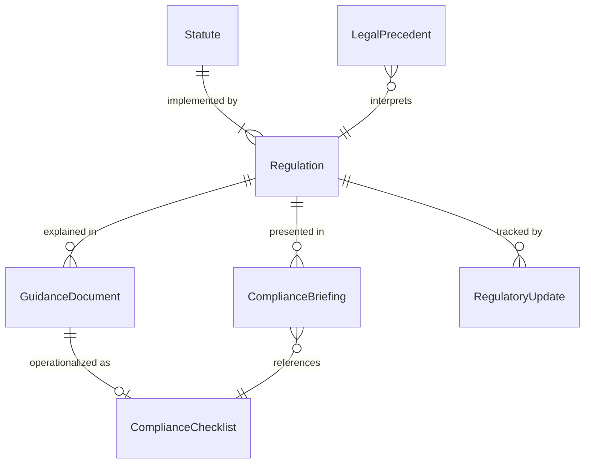
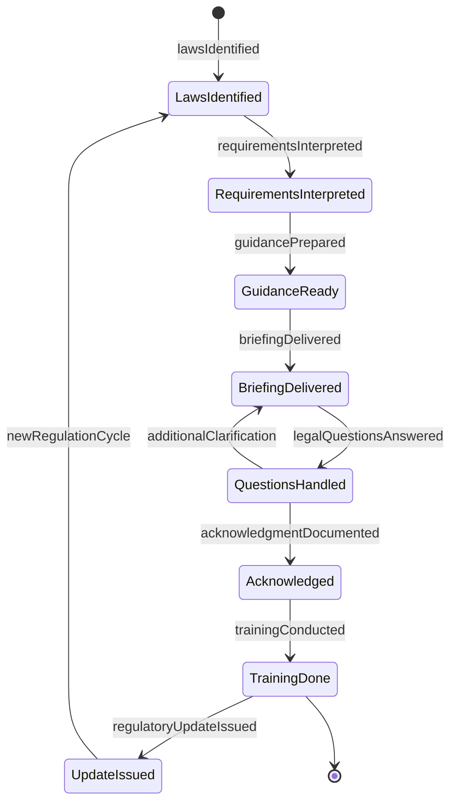
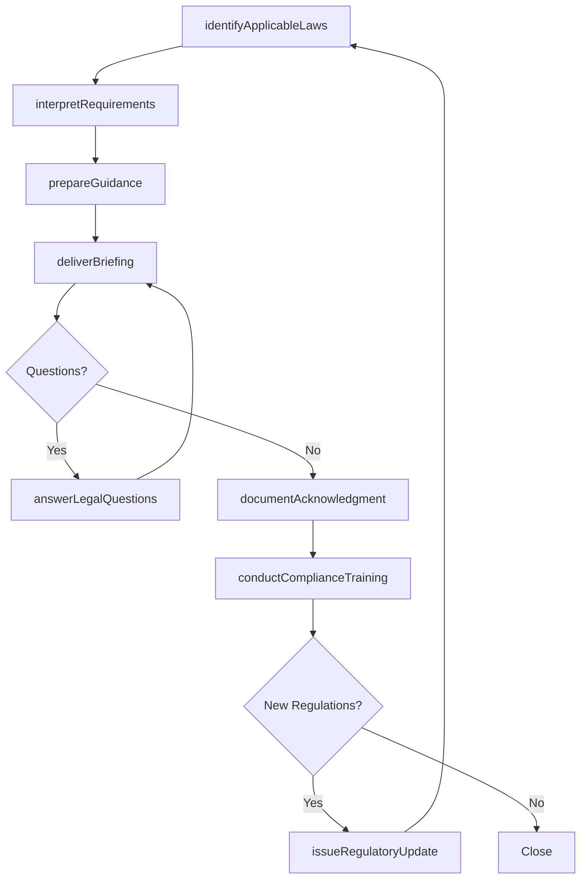
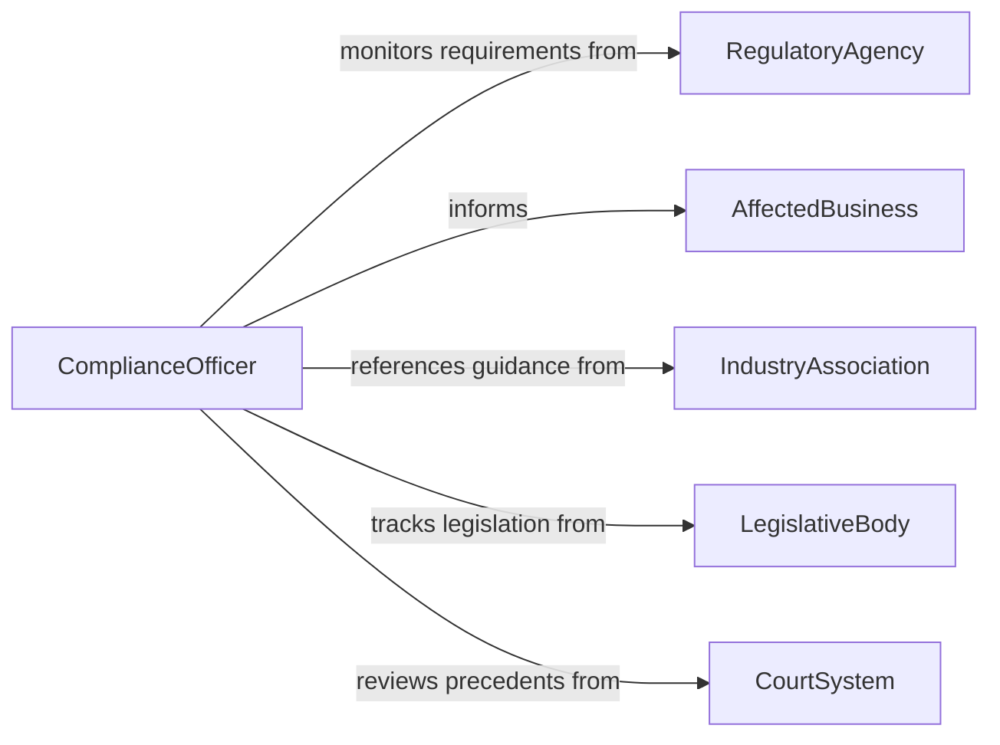

# Inform Others About Laws or Regulations

> Business-as-Code definition for informing others about laws and regulations. Models the process of identifying applicable legal requirements, translating statutory language into practical guidance, and communicating compliance obligations to affected parties.

## Overview

Informing others about laws or regulations involves researching applicable statutes and regulatory frameworks, interpreting legal requirements in the context of specific operations or activities, preparing guidance materials, and delivering compliance briefings to employees, clients, and stakeholders. This definition covers regulatory notifications, compliance training, legal updates, and advisory communications, enabling legal and compliance professionals to ensure that affected parties understand their obligations under current law.

## Actors

| Actor | Description |
|-------|-------------|
| RegulatoryAgency | Issues and enforces the laws and regulations being communicated |
| AffectedBusiness | The organization that must comply with the referenced laws |
| IndustryAssociation | Provides industry-specific regulatory guidance and interpretation |
| LegislativeBody | Enacts the statutes that create regulatory obligations |
| CourtSystem | Interprets laws through rulings and precedents |

## Roles

| Role | Description |
|------|-------------|
| ComplianceOfficer | Researches regulations and communicates obligations to the organization |
| LegalAdvisor | Interprets statutory language and provides compliance guidance |
| RegulatoryAnalyst | Monitors regulatory changes and assesses their impact |
| TrainingCoordinator | Organizes and delivers regulatory awareness sessions |

## Entities

| Entity | Description |
|--------|-------------|
| Regulation | A specific rule or requirement issued by a regulatory authority |
| Statute | A law enacted by a legislative body |
| ComplianceBriefing | A presentation or document summarizing regulatory obligations |
| RegulatoryUpdate | A notification about new or changed laws or regulations |
| GuidanceDocument | A plain-language interpretation of legal requirements |
| ComplianceChecklist | A list of actions required to meet regulatory obligations |
| LegalPrecedent | A court ruling that affects the interpretation of a regulation |

## Actions

| Action | Description |
|--------|-------------|
| identifyApplicableLaws | Determine which laws and regulations apply to the situation |
| interpretRequirements | Translate statutory language into practical compliance guidance |
| prepareGuidance | Create plain-language materials explaining legal obligations |
| deliverBriefing | Present regulatory information to affected parties |
| issueRegulatoryUpdate | Distribute notifications about new or changed regulations |
| conductComplianceTraining | Deliver training sessions on legal requirements |
| answerLegalQuestions | Respond to inquiries about regulatory obligations |
| documentAcknowledgment | Record that affected parties have received the information |

## Events

| Event | Description |
|-------|-------------|
| lawsIdentified | Applicable laws and regulations have been determined |
| requirementsInterpreted | Statutory language has been translated into guidance |
| guidancePrepared | Plain-language compliance materials have been created |
| briefingDelivered | Regulatory information has been presented to stakeholders |
| regulatoryUpdateIssued | A notification about legal changes has been distributed |
| trainingConducted | A compliance training session has been delivered |
| legalQuestionsAnswered | Inquiries about regulatory obligations have been addressed |
| acknowledgmentDocumented | Receipt of information has been recorded |

## Searches

| Search | Description |
|--------|-------------|
| findRegulations | List regulations by jurisdiction, topic, or effective date |
| getGuidanceDocuments | Retrieve guidance materials by regulation or audience |
| findUpdates | Locate regulatory updates by date, jurisdiction, or agency |
| getTrainingRecords | Retrieve compliance training completion records |
| searchByTopic | Find legal communications by subject area or keyword |

## Entity Relationships



## State Diagram



## Workflow



## Actor Relationships



## Usage

### Calling Actions

```typescript
import { informOthersAboutLawsRegulations } from '@headlessly/inform-others-about-laws-regulations'

const legal = informOthersAboutLawsRegulations()

// Identify and interpret new workplace safety regulations
const laws = await legal.identifyApplicableLaws({
  jurisdiction: 'federal',
  topic: 'workplace-safety',
  industry: 'manufacturing',
  effectiveDate: '2026-03-01'
})

await legal.interpretRequirements({
  regulationIds: laws.ids,
  context: 'production-floor-operations',
  audience: 'plant-managers'
})

// Prepare and deliver guidance
const guidance = await legal.prepareGuidance({
  regulationIds: laws.ids,
  format: 'compliance-checklist',
  audience: 'operations-leadership'
})

await legal.deliverBriefing({
  guidanceId: guidance.id,
  recipients: ['plant-managers', 'safety-coordinators', 'hr-directors'],
  format: 'webinar'
})
```

### Event-Driven Automation

```typescript
// Auto-schedule training when new guidance is prepared
legal.guidancePrepared(async ({ guidanceId, topic }) => {
  await legal.conductComplianceTraining({
    guidanceId,
    topic,
    audience: 'all-affected-employees'
  })
})

// Notify leadership when regulatory updates are issued
legal.regulatoryUpdateIssued(async ({ regulation, effectiveDate }) => {
  await notify({
    to: 'executive-team',
    message: `New regulation effective ${effectiveDate}: ${regulation}`
  })
})
```
