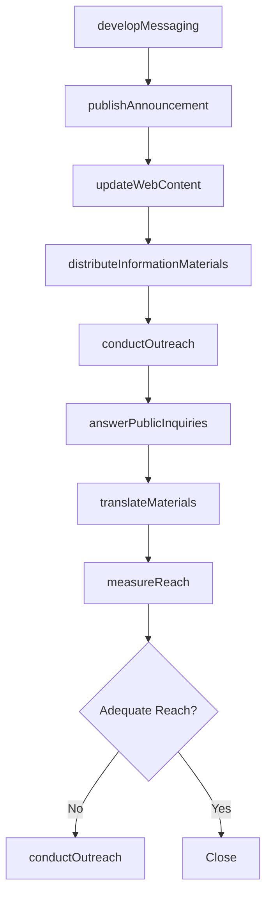
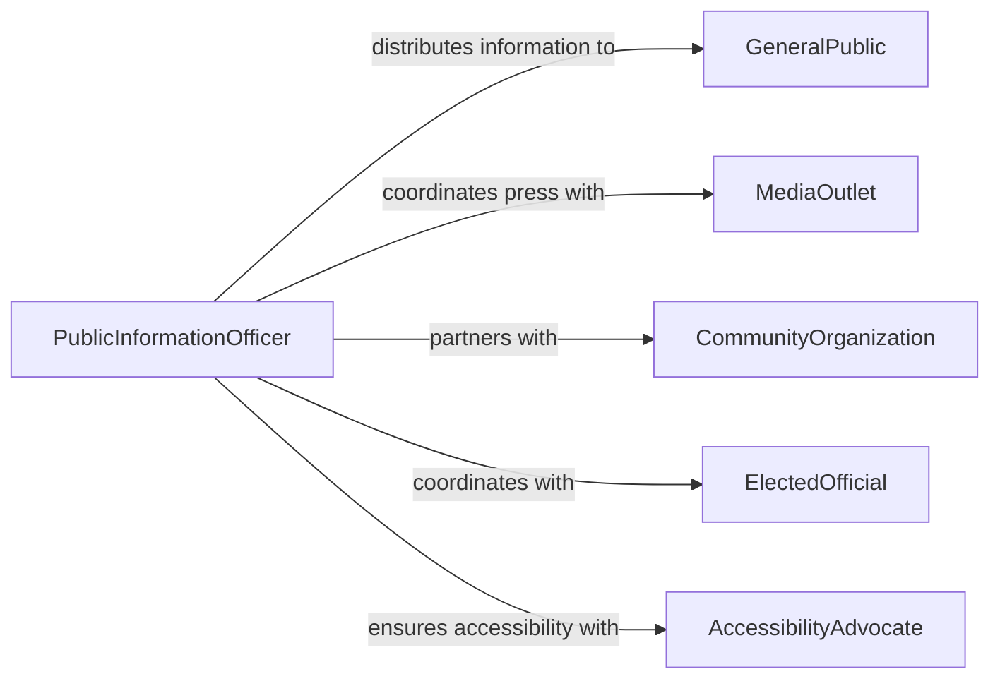

# Inform the Public About Policies, Services, or Procedures

> Business-as-Code definition for informing the public about policies, services, and procedures. Models the outreach and communication process through which government agencies, institutions, and organizations disseminate information about available services, eligibility requirements, and procedural steps to the general public.

## Overview

Informing the public about policies, services, or procedures involves developing clear messaging about organizational offerings, eligibility criteria, application processes, and policy changes, then distributing that information through appropriate channels. This definition covers public service announcements, website content updates, community outreach events, and information desk operations, enabling public-facing organizations to ensure constituents, citizens, and community members can access and understand the services available to them.

## Actors

| Actor | Description |
|-------|-------------|
| GeneralPublic | The citizens or community members receiving the information |
| MediaOutlet | Broadcasts or publishes public information to wide audiences |
| CommunityOrganization | Partners in distributing information to underserved populations |
| ElectedOfficial | Sponsors or endorses public policy communications |
| AccessibilityAdvocate | Ensures information reaches people with disabilities or language barriers |

## Roles

| Role | Description |
|------|-------------|
| PublicInformationOfficer | Develops and distributes public-facing communications |
| CommunityLiaison | Conducts outreach and answers public questions at events |
| ContentManager | Maintains website and digital information resources |
| TranslationSpecialist | Adapts materials for non-English-speaking audiences |

## Entities

| Entity | Description |
|--------|-------------|
| PolicyAnnouncement | A formal communication about a new or changed policy |
| ServiceDescription | A detailed explanation of an available public service |
| ProceduralGuide | Step-by-step instructions for accessing a service or completing a process |
| FAQ | Frequently asked questions about policies or services |
| OutreachEvent | A scheduled public engagement session for information sharing |
| InformationBrochure | A printed or digital summary of services and procedures |
| WebContent | Online information pages about policies and services |

## Actions

| Action | Description |
|--------|-------------|
| developMessaging | Create clear, accessible language about policies or services |
| publishAnnouncement | Release a formal communication about policy changes or services |
| updateWebContent | Revise online information to reflect current policies and procedures |
| conductOutreach | Deliver information sessions at community events or public forums |
| distributeInformationMaterials | Provide brochures, flyers, or guides to the public |
| answerPublicInquiries | Respond to questions from community members |
| translateMaterials | Adapt communications for non-English-speaking audiences |
| measureReach | Evaluate how effectively information has reached the target audience |

## Events

| Event | Description |
|-------|-------------|
| messagingDeveloped | Public-facing language about policies or services has been created |
| announcementPublished | A formal policy or service communication has been released |
| webContentUpdated | Online information pages have been revised |
| outreachConducted | A public information session has been delivered |
| materialsDistributed | Brochures or guides have been provided to the public |
| inquiriesAnswered | Public questions have been addressed |
| materialsTranslated | Communications have been adapted for additional languages |
| reachMeasured | Information distribution effectiveness has been evaluated |

## Searches

| Search | Description |
|--------|-------------|
| findAnnouncements | List policy announcements by date, topic, or agency |
| getServiceDescriptions | Retrieve service information by category or eligibility |
| findOutreachEvents | Locate upcoming or past public information sessions |
| getInquiries | Retrieve public questions by topic or status |
| searchByLanguage | Find translated materials by language or region |

## Workflow



## Actor Relationships



## Usage

### Calling Actions

```typescript
import { informPublicAboutPoliciesServices } from '@headlessly/inform-public-about-policies-services'

const publicInfo = informPublicAboutPoliciesServices()

// Develop and publish a policy change announcement
const messaging = await publicInfo.developMessaging({
  topic: 'Updated Recycling Collection Schedule',
  effectiveDate: '2026-04-01',
  audience: 'city-residents',
  keyPoints: ['new-pickup-days', 'expanded-materials-list', 'app-notifications']
})

await publicInfo.publishAnnouncement({
  messagingId: messaging.id,
  channels: ['city-website', 'social-media', 'local-newspaper'],
  languages: ['en', 'es', 'zh']
})

// Conduct community outreach
await publicInfo.conductOutreach({
  messagingId: messaging.id,
  events: [
    { location: 'community-center-north', date: '2026-03-15', format: 'town-hall' },
    { location: 'library-downtown', date: '2026-03-18', format: 'info-booth' }
  ]
})

await publicInfo.measureReach({
  messagingId: messaging.id,
  metrics: ['website-views', 'brochures-distributed', 'event-attendance']
})
```

### Event-Driven Automation

```typescript
// Auto-translate when messaging is developed
publicInfo.messagingDeveloped(async ({ messagingId, languages }) => {
  for (const lang of languages) {
    await publicInfo.translateMaterials({ messagingId, targetLanguage: lang })
  }
})

// Alert communications team on low reach
publicInfo.reachMeasured(async ({ messagingId, reachPercentage }) => {
  if (reachPercentage < 40) {
    await notify({
      to: 'communications-team',
      message: `Low public reach (${reachPercentage}%) - additional outreach needed`
    })
  }
})
```
