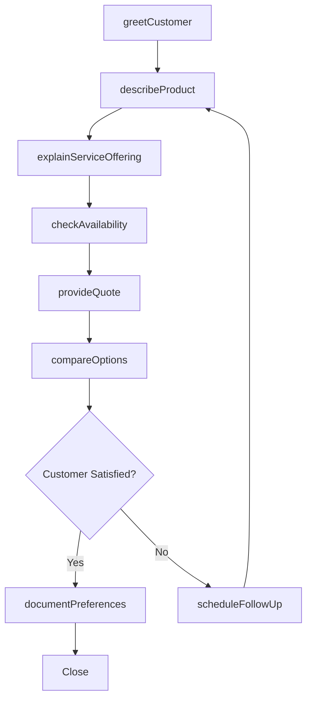
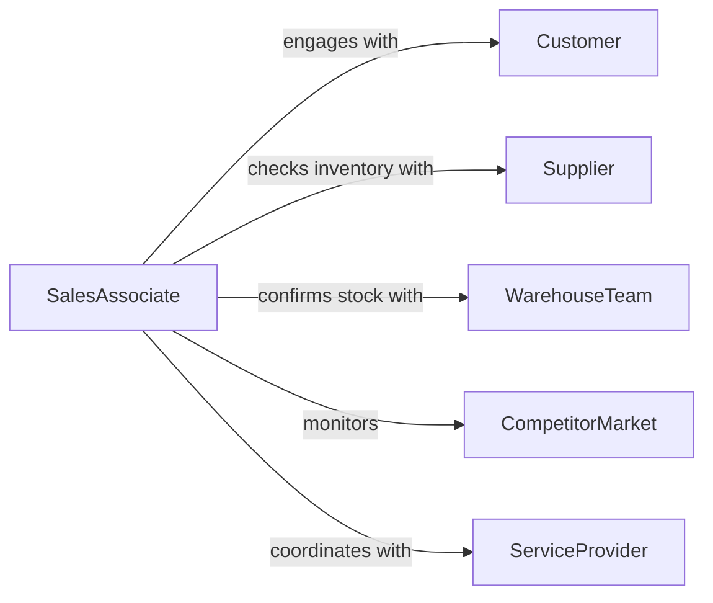

# Discuss Goods or Services Information with Customers

> Business-as-Code definition for discussing goods and services information with customers. Models the consultative process of engaging customers in dialogue about product features, availability, pricing, and suitability for their needs.

## Overview

Discussing goods or services information with customers involves engaging in two-way conversations about product specifications, service offerings, pricing structures, availability, and suitability for the customer's requirements. This definition covers retail consultations, wholesale negotiations, service inquiries, and product comparisons, enabling frontline staff and sales teams to manage customer interactions that inform purchasing decisions and build lasting relationships.

## Actors

| Actor | Description |
|-------|-------------|
| Customer | The individual or business inquiring about goods or services |
| Supplier | Provides inventory data, lead times, and wholesale pricing |
| WarehouseTeam | Confirms stock availability and delivery timelines |
| CompetitorMarket | External market context influencing customer expectations |
| ServiceProvider | Delivers specialized services that complement product offerings |

## Roles

| Role | Description |
|------|-------------|
| SalesAssociate | Engages customers in product and service discussions |
| ProductAdvisor | Provides expert guidance on product selection and fit |
| ServiceCoordinator | Arranges service delivery based on customer discussions |
| PricingAnalyst | Provides pricing and discount information for customer inquiries |

## Entities

| Entity | Description |
|--------|-------------|
| ProductInquiry | A customer question about a specific good or service |
| ServiceDescription | Detailed information about a service offering |
| PriceQuote | A formal pricing response to a customer inquiry |
| AvailabilityCheck | A verification of stock levels or service capacity |
| CustomerPreference | Documented requirements and preferences from the discussion |
| ComparisonSheet | A side-by-side analysis of product or service options |
| FollowUpNote | A record of items to address after the initial discussion |

## Actions

| Action | Description |
|--------|-------------|
| greetCustomer | Initiate the customer interaction and identify their needs |
| describeProduct | Provide detailed information about a specific good or product line |
| explainServiceOffering | Walk through available services and their benefits |
| checkAvailability | Verify stock levels or service capacity for the customer |
| provideQuote | Generate and deliver pricing information |
| compareOptions | Present side-by-side comparisons of relevant alternatives |
| documentPreferences | Record customer requirements for follow-up |
| scheduleFollowUp | Arrange a subsequent discussion or callback |

## Events

| Event | Description |
|-------|-------------|
| customerGreeted | The customer interaction has been initiated |
| productDescribed | Detailed product information has been communicated |
| serviceExplained | Service offerings and benefits have been walked through |
| availabilityChecked | Stock or capacity verification has been completed |
| quoteProvided | Pricing information has been delivered to the customer |
| optionsCompared | Alternative options have been presented side-by-side |
| preferencesDocumented | Customer requirements have been recorded |
| followUpScheduled | A subsequent interaction has been arranged |

## Searches

| Search | Description |
|--------|-------------|
| findInquiries | List customer inquiries by date, product, or status |
| getQuotes | Retrieve price quotes by customer or product |
| findOpenFollowUps | Locate pending follow-up actions from customer discussions |
| getPreferences | Retrieve documented customer preferences by account |
| searchByProduct | Find discussion records by product or service category |

## Workflow



## Actor Relationships



## Usage

### Calling Actions

```typescript
import { discussGoodsServicesInformationCustomers } from '@headlessly/discuss-goods-services-information-customers'

const discussions = discussGoodsServicesInformationCustomers()

// Initiate and conduct a customer discussion
const interaction = await discussions.greetCustomer({
  channel: 'in-store',
  customerType: 'walk-in',
  department: 'home-appliances'
})

await discussions.describeProduct({
  interactionId: interaction.id,
  product: 'ProChef Convection Oven',
  highlights: ['energy-efficiency', 'smart-controls', 'self-cleaning']
})

const availability = await discussions.checkAvailability({
  product: 'ProChef Convection Oven',
  model: 'PCO-5000',
  location: 'store-142'
})

await discussions.provideQuote({
  interactionId: interaction.id,
  items: [{ product: 'PCO-5000', unitPrice: 1299.99, quantity: 1 }],
  includeDelivery: true
})
```

### Event-Driven Automation

```typescript
// Auto-send product brochure after description
discussions.productDescribed(async ({ interactionId, product, customerEmail }) => {
  if (customerEmail) {
    await sendBrochure({ to: customerEmail, product })
  }
})

// Alert inventory team on low stock during discussion
discussions.availabilityChecked(async ({ product, stockLevel }) => {
  if (stockLevel < 5) {
    await notify({
      to: 'inventory-team',
      message: `Low stock alert: ${product} at ${stockLevel} units`
    })
  }
})
```
