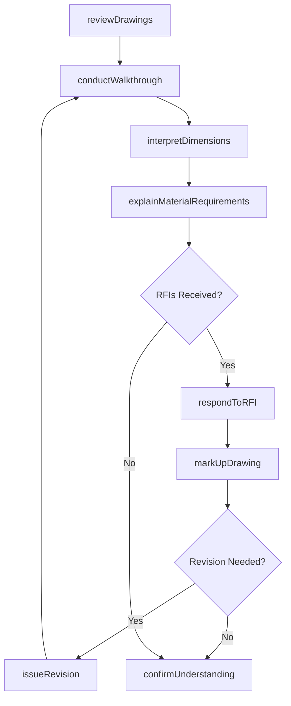
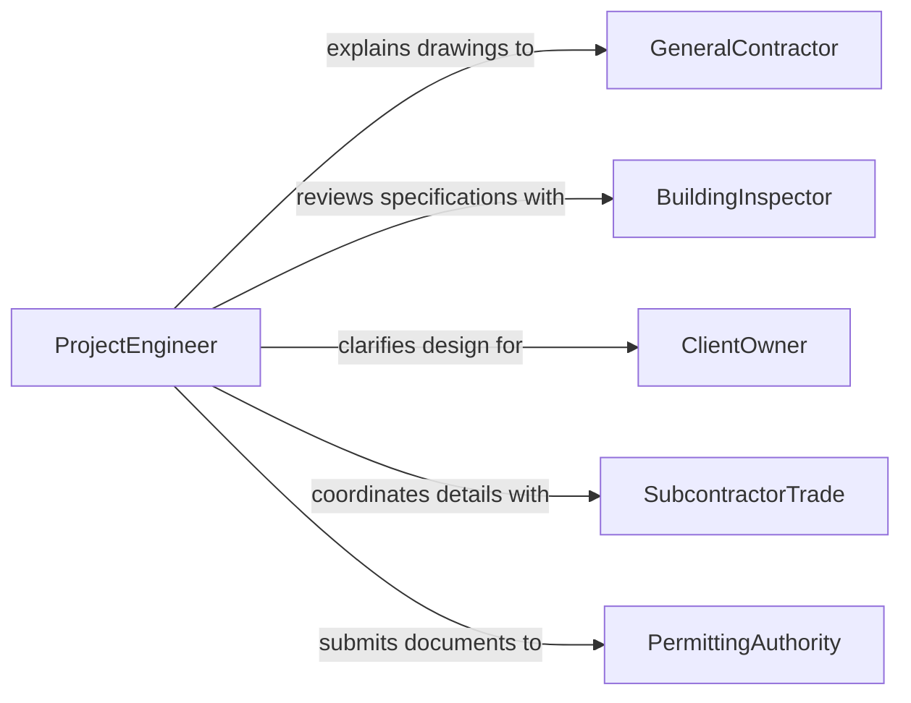

# Explain Engineering Drawings, Specifications, or Technical Information

> Business-as-Code definition for explaining engineering drawings and technical specifications. Models the interpretation and communication of complex technical documents to stakeholders who need to understand design intent, dimensional requirements, and construction details.

## Overview

Explaining engineering drawings, specifications, and other technical information involves interpreting blueprints, CAD models, bill of materials, tolerance callouts, and construction documents for audiences that include contractors, clients, inspectors, and cross-functional teams. This definition covers drawing review sessions, specification walkthroughs, RFI responses, and technical clarification meetings, enabling engineering and construction teams to ensure all parties share a common understanding of design requirements and build intent.

## Actors

| Actor | Description |
|-------|-------------|
| GeneralContractor | Executes construction based on the explained specifications |
| BuildingInspector | Verifies that construction matches the documented specifications |
| ClientOwner | The project owner who needs to understand design decisions |
| SubcontractorTrade | Specialty trades that implement specific specification sections |
| PermittingAuthority | Reviews technical documents as part of the approval process |

## Roles

| Role | Description |
|------|-------------|
| ProjectEngineer | Interprets and explains technical drawings to stakeholders |
| DesignArchitect | Clarifies design intent and aesthetic specifications |
| SpecificationWriter | Authors the technical documents being explained |
| FieldSupervisor | Translates drawing details into construction activities |

## Entities

| Entity | Description |
|--------|-------------|
| EngineeringDrawing | A technical illustration showing dimensions, materials, and assembly |
| Specification | A written document defining materials, methods, and standards |
| RequestForInformation | A formal question about drawing or specification details |
| DrawingMarkup | Annotations added to clarify or modify an existing drawing |
| BillOfMaterials | A list of components and quantities required for construction |
| TechnicalClarification | A documented response to a question about technical details |
| DrawingRevision | An updated version of an engineering drawing |

## Actions

| Action | Description |
|--------|-------------|
| reviewDrawings | Examine engineering drawings to prepare for explanation |
| conductWalkthrough | Walk stakeholders through drawing sets and specifications |
| interpretDimensions | Clarify measurements, tolerances, and spatial relationships |
| explainMaterialRequirements | Describe specified materials, grades, and substitution rules |
| respondToRFI | Provide formal answers to requests for information |
| markUpDrawing | Annotate drawings to highlight or clarify specific details |
| issueRevision | Release an updated drawing based on clarification discussions |
| confirmUnderstanding | Verify that stakeholders correctly interpret the technical information |

## Events

| Event | Description |
|-------|-------------|
| drawingsReviewed | Engineering drawings have been examined for explanation readiness |
| walkthroughConducted | Stakeholders have been walked through the drawing set |
| dimensionsInterpreted | Measurements and tolerances have been clarified |
| materialsExplained | Material specifications have been communicated |
| rfiResponded | A request for information has been formally answered |
| drawingMarkedUp | Annotations have been added to clarify details |
| revisionIssued | An updated drawing has been released |
| understandingConfirmed | Stakeholder comprehension has been verified |

## Searches

| Search | Description |
|--------|-------------|
| findDrawings | List engineering drawings by project, discipline, or revision |
| getOpenRFIs | Retrieve unanswered requests for information |
| findBySpecSection | Locate specifications by CSI division or section number |
| getRevisionHistory | Retrieve the revision history for a specific drawing |
| findClarifications | List technical clarifications by project or date |

## Workflow



## Actor Relationships



## Usage

### Calling Actions

```typescript
import { explainEngineeringDrawingsSpecificationsTechnical } from '@headlessly/explain-engineering-drawings-specifications-technical'

const drawings = explainEngineeringDrawingsSpecificationsTechnical()

// Review and walk through structural drawings
const review = await drawings.reviewDrawings({
  project: 'Harbor Bridge Rehabilitation',
  drawingSet: 'S-100 through S-145',
  discipline: 'structural'
})

await drawings.conductWalkthrough({
  reviewId: review.id,
  attendees: ['general-contractor', 'steel-fabricator', 'inspection-team'],
  focusAreas: ['connection-details', 'bearing-assemblies', 'load-paths']
})

// Respond to contractor RFI
await drawings.respondToRFI({
  rfiNumber: 'RFI-2026-047',
  question: 'Confirm weld specification at connection S-112/Detail 3',
  response: 'AWS D1.5 full penetration groove weld, see revised detail',
  attachments: ['S-112-Rev-B']
})
```

### Event-Driven Automation

```typescript
// Notify field team when RFI is answered
drawings.rfiResponded(async ({ rfiNumber, response }) => {
  await notify({
    to: 'field-supervision',
    message: `${rfiNumber} answered - review response before proceeding`
  })
})

// Track revision issuance
drawings.revisionIssued(async ({ drawingNumber, revision }) => {
  await notify({
    to: 'document-control',
    message: `Drawing ${drawingNumber} Rev ${revision} issued - update plan room`
  })
})
```
