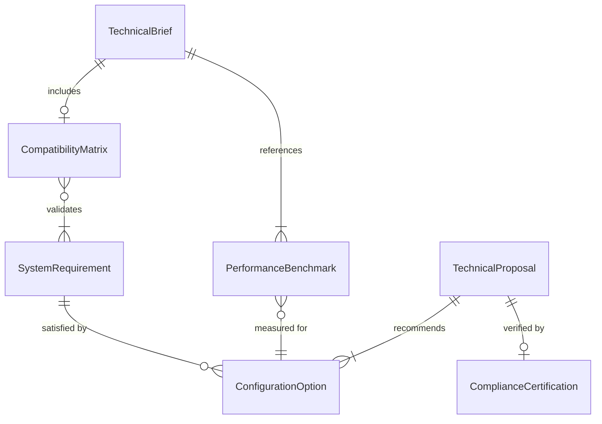
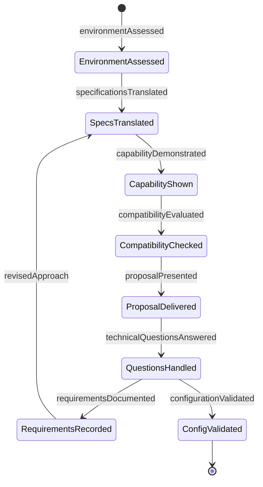
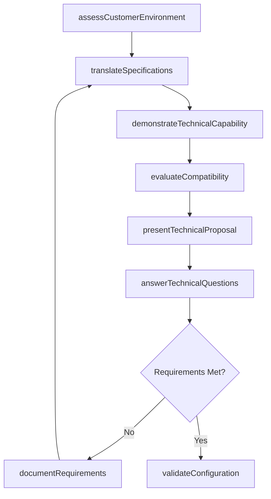
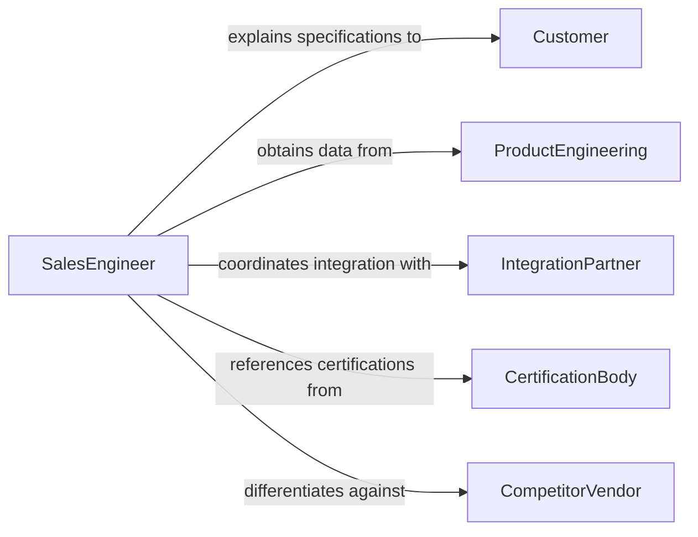

# Explain Technical Product or Service Information to Customers

> Business-as-Code definition for explaining technical product and service information to customers. Models the translation of complex technical specifications, performance data, and system requirements into language that customers can understand and use for purchasing and implementation decisions.

## Overview

Explaining technical product or service information to customers involves translating engineering specifications, performance benchmarks, compatibility requirements, and system architectures into accessible language for non-technical audiences. This definition covers pre-sale technical consultations, implementation planning sessions, integration discussions, and post-sale technical briefings, enabling technical sales and support teams to bridge the gap between product engineering and customer understanding.

## Actors

| Actor | Description |
|-------|-------------|
| Customer | The buyer or prospect requiring technical understanding of a product |
| ProductEngineering | Provides detailed technical specifications and performance data |
| IntegrationPartner | Assists with connecting the product to the customer's existing systems |
| CertificationBody | Validates product compliance with industry standards |
| CompetitorVendor | Offers alternative products the customer may be evaluating |

## Roles

| Role | Description |
|------|-------------|
| SalesEngineer | Translates technical specifications for customer audiences |
| TechnicalConsultant | Provides deep-dive analysis of product capabilities and fit |
| SolutionsArchitect | Designs system configurations that meet customer requirements |
| ProductManager | Provides roadmap and feature context for technical discussions |

## Entities

| Entity | Description |
|--------|-------------|
| TechnicalBrief | A summary of product specifications tailored for a specific customer |
| CompatibilityMatrix | A document showing product integration with existing systems |
| PerformanceBenchmark | Measured performance data under defined test conditions |
| SystemRequirement | Hardware, software, or infrastructure prerequisites for the product |
| TechnicalProposal | A formal document recommending a product configuration |
| ConfigurationOption | A specific product setup or customization possibility |
| ComplianceCertification | Documentation of product adherence to industry standards |

## Actions

| Action | Description |
|--------|-------------|
| assessCustomerEnvironment | Evaluate the customer's existing systems and technical needs |
| translateSpecifications | Convert engineering data into customer-accessible language |
| demonstrateTechnicalCapability | Show product performance through live or recorded demonstrations |
| evaluateCompatibility | Determine how the product integrates with existing infrastructure |
| presentTechnicalProposal | Deliver a tailored recommendation with configuration details |
| answerTechnicalQuestions | Respond to customer inquiries about product specifications |
| documentRequirements | Record the customer's technical requirements and constraints |
| validateConfiguration | Confirm that the proposed setup meets the customer's needs |

## Events

| Event | Description |
|-------|-------------|
| environmentAssessed | The customer's existing systems have been evaluated |
| specificationsTranslated | Technical data has been converted for customer understanding |
| capabilityDemonstrated | Product performance has been shown through demonstration |
| compatibilityEvaluated | Integration with existing infrastructure has been assessed |
| proposalPresented | A tailored technical recommendation has been delivered |
| technicalQuestionsAnswered | Customer specification inquiries have been addressed |
| requirementsDocumented | Customer technical needs and constraints have been recorded |
| configurationValidated | The proposed setup has been confirmed as meeting requirements |

## Searches

| Search | Description |
|--------|-------------|
| findProposals | List technical proposals by customer, product, or status |
| getCompatibility | Retrieve compatibility data by product or system |
| findOpenQuestions | Locate unanswered customer technical questions |
| getBenchmarks | Retrieve performance benchmarks by product or test condition |
| searchByRequirement | Find proposals matching specific technical requirements |

## Entity Relationships



## State Diagram



## Workflow



## Actor Relationships



## Usage

### Calling Actions

```typescript
import { explainTechnicalProductServiceInformation } from '@headlessly/explain-technical-product-service-information'

const technical = explainTechnicalProductServiceInformation()

// Assess customer environment and translate specs
const assessment = await technical.assessCustomerEnvironment({
  customer: 'Pacific Logistics Corp',
  existingSystems: ['SAP ERP', 'Oracle WMS', 'Cisco network infrastructure'],
  requirements: ['real-time-tracking', 'API-integration', '99.9%-uptime']
})

await technical.translateSpecifications({
  assessmentId: assessment.id,
  product: 'FleetTrack IoT Platform',
  audience: 'operations-leadership',
  technicalLevel: 'intermediate'
})

// Present proposal
await technical.presentTechnicalProposal({
  assessmentId: assessment.id,
  configuration: {
    tier: 'enterprise',
    devices: 500,
    integrations: ['SAP-connector', 'WMS-API'],
    sla: '99.95%'
  }
})
```

### Event-Driven Automation

```typescript
// Generate compatibility report after environment assessment
technical.environmentAssessed(async ({ assessmentId, customer }) => {
  await technical.evaluateCompatibility({ assessmentId })
})

// Notify sales when proposal is presented
technical.proposalPresented(async ({ assessmentId, customer, configuration }) => {
  await notify({
    to: 'sales-team',
    message: `Technical proposal delivered to ${customer} - ${configuration.tier} tier`
  })
})
```
