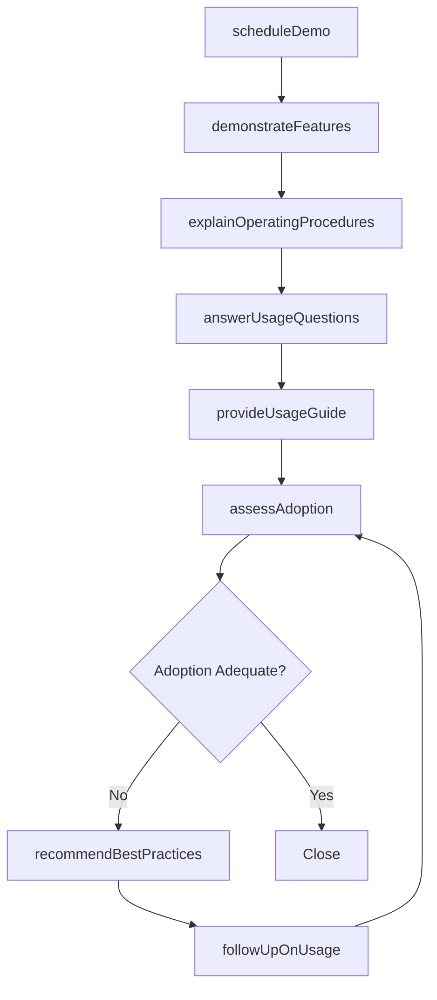
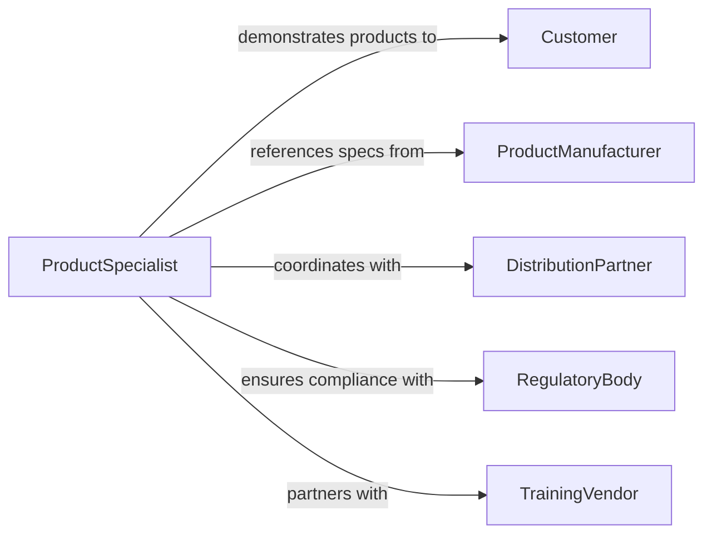

# Explain Use of Products or Services

> Business-as-Code definition for explaining product and service usage. Models the process of communicating operational instructions, best practices, and usage guidance to customers, end users, and stakeholders.

## Overview

Explaining the use of products or services involves demonstrating functionality, describing operational procedures, answering usage questions, and providing guidance on best practices and troubleshooting. This definition covers product demonstrations, onboarding walkthroughs, usage consultations, and follow-up support sessions, enabling organizations to ensure customers and users fully understand and derive value from the products and services they have purchased.

## Actors

| Actor | Description |
|-------|-------------|
| Customer | The purchaser or end user seeking to understand product usage |
| ProductManufacturer | Provides technical specifications and usage documentation |
| DistributionPartner | Resells or delivers the product and may provide usage guidance |
| RegulatoryBody | Sets safety or usage compliance requirements for certain products |
| TrainingVendor | Delivers certified training programs for complex products |

## Roles

| Role | Description |
|------|-------------|
| ProductSpecialist | Demonstrates product capabilities and explains usage |
| SalesEngineer | Provides pre-sale technical guidance and usage context |
| CustomerSuccessManager | Ensures customers adopt and use products effectively |
| TechnicalWriter | Creates usage guides and instructional documentation |

## Entities

| Entity | Description |
|--------|-------------|
| ProductDemo | A structured walkthrough of product features and usage |
| UsageGuide | Written or visual instructions for operating a product |
| FAQ | Frequently asked questions about product usage |
| UsageSession | A scheduled interaction to explain product functionality |
| FeatureHighlight | A focused explanation of a specific product capability |
| TroubleshootingGuide | Instructions for resolving common usage issues |
| AdoptionMetric | A measure of how effectively a customer is using the product |

## Actions

| Action | Description |
|--------|-------------|
| scheduleDemo | Arrange a product demonstration session with the customer |
| demonstrateFeatures | Walk through product capabilities and use cases |
| explainOperatingProcedures | Describe step-by-step usage instructions |
| answerUsageQuestions | Respond to customer inquiries about product functionality |
| provideUsageGuide | Deliver written or visual usage documentation |
| assessAdoption | Evaluate how effectively the customer is using the product |
| recommendBestPractices | Suggest optimal usage patterns and configurations |
| followUpOnUsage | Check in with the customer to address ongoing usage needs |

## Events

| Event | Description |
|-------|-------------|
| demoScheduled | A product demonstration has been arranged |
| featuresDemo | Product capabilities have been walked through |
| proceduresExplained | Step-by-step usage instructions have been communicated |
| questionsAnswered | Customer usage inquiries have been addressed |
| usageGuideProvided | Documentation has been delivered to the customer |
| adoptionAssessed | Customer usage effectiveness has been evaluated |
| bestPracticesRecommended | Optimal usage patterns have been suggested |
| followUpCompleted | A usage follow-up session has been conducted |

## Searches

| Search | Description |
|--------|-------------|
| findDemos | List product demonstrations by customer, product, or date |
| getUsageGuides | Retrieve usage documentation by product or version |
| findLowAdoption | Locate customers with below-target product adoption |
| getUsageSessions | List usage explanation sessions by customer or status |
| searchFAQs | Find frequently asked questions by product or topic |

## Workflow



## Actor Relationships



## Usage

### Calling Actions

```typescript
import { explainUseProductsServices } from '@headlessly/explain-use-products-services'

const usage = explainUseProductsServices()

// Schedule and deliver a product demo
const demo = await usage.scheduleDemo({
  customer: 'Meridian Manufacturing',
  product: 'CNC Precision Controller v4',
  format: 'on-site',
  date: '2026-02-20'
})

await usage.demonstrateFeatures({
  demoId: demo.id,
  features: ['auto-calibration', 'multi-axis-control', 'remote-monitoring'],
  audience: ['machine-operators', 'floor-supervisor']
})

await usage.explainOperatingProcedures({
  demoId: demo.id,
  procedures: ['initial-setup', 'daily-startup', 'emergency-shutdown']
})

// Assess and follow up
const adoption = await usage.assessAdoption({
  customer: 'Meridian Manufacturing',
  product: 'CNC Precision Controller v4',
  metrics: ['feature-utilization', 'error-rate', 'uptime']
})
```

### Event-Driven Automation

```typescript
// Send usage guide after demo
usage.featuresDemo(async ({ demoId, product }) => {
  await usage.provideUsageGuide({ demoId, product, format: 'pdf' })
})

// Alert CSM on low adoption
usage.adoptionAssessed(async ({ customer, adoptionScore }) => {
  if (adoptionScore < 60) {
    await notify({
      to: 'customer-success',
      message: `Low adoption (${adoptionScore}%) for ${customer} - follow-up needed`
    })
  }
})
```
