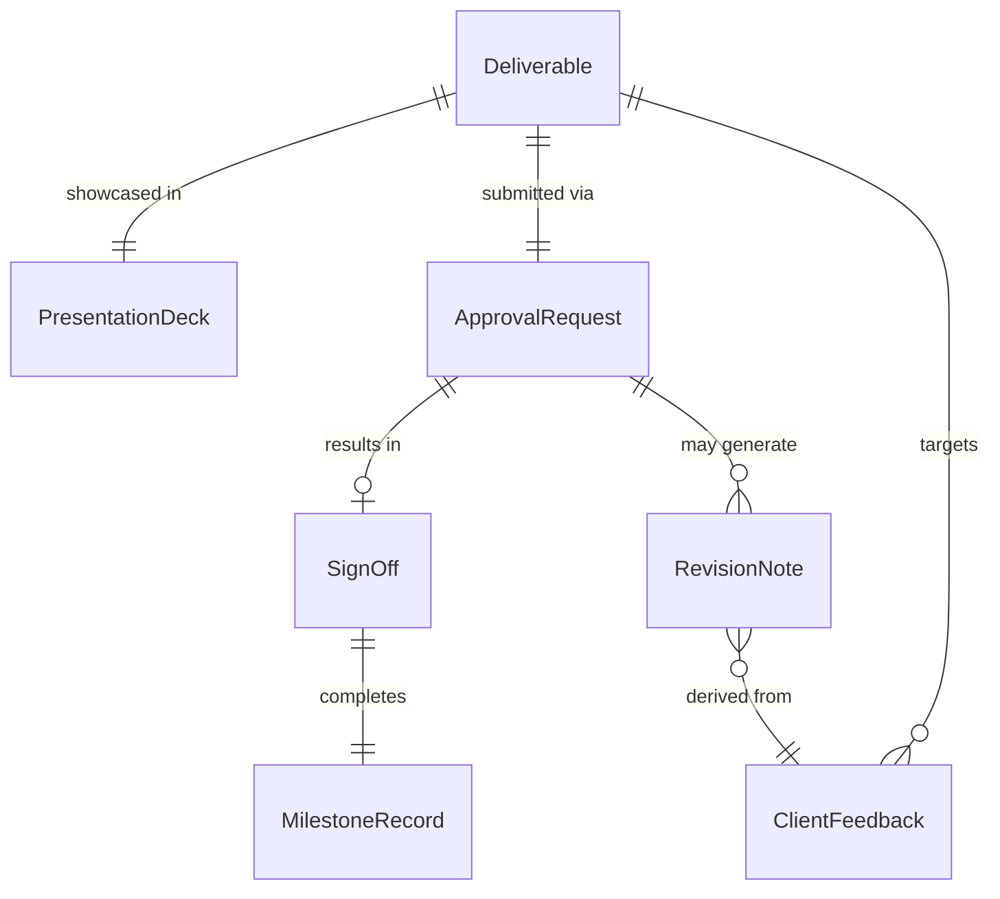
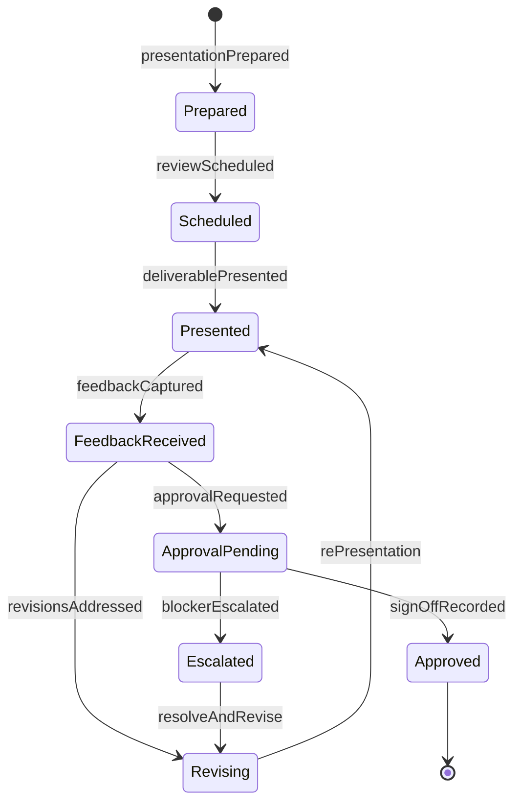
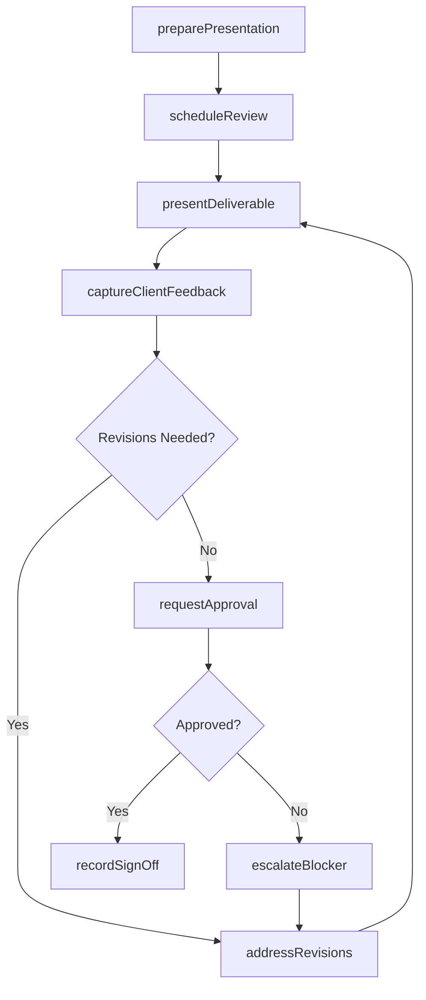
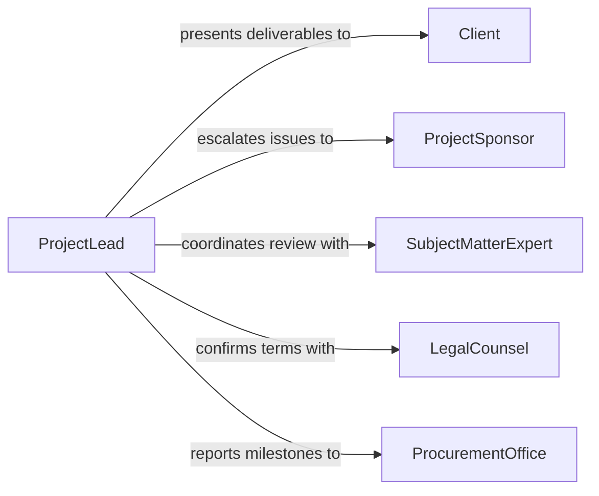

# Present Work to Clients for Approval

> Business-as-Code definition for presenting work to clients for approval. Models the preparation, delivery, and feedback cycle of client-facing presentations where deliverables are reviewed, discussed, and formally approved or returned for revision.

## Overview

Presenting work to clients for approval involves preparing deliverable summaries, scheduling review sessions, walking clients through design concepts or project milestones, capturing feedback, and securing formal sign-off. This definition covers creative presentations, architectural reviews, engineering submittals, and project milestone approvals, enabling teams to manage the approval pipeline from initial presentation through final acceptance.

## Actors

| Actor | Description |
|-------|-------------|
| Client | The individual or organization that reviews and approves deliverables |
| ProjectSponsor | The executive or budget holder who authorizes final acceptance |
| LegalCounsel | Reviews contractual implications of approval decisions |
| SubjectMatterExpert | Provides specialized evaluation of technical deliverables |
| ProcurementOffice | Manages vendor relationships and contract milestones |

## Roles

| Role | Description |
|------|-------------|
| ProjectLead | Coordinates the presentation and manages the approval process |
| Presenter | Delivers the work product walkthrough to the client |
| AccountManager | Maintains the client relationship and facilitates communication |
| QualityReviewer | Ensures deliverables meet internal standards before client presentation |

## Entities

| Entity | Description |
|--------|-------------|
| Deliverable | A completed work product submitted for client review |
| PresentationDeck | Visual materials used to walk clients through deliverables |
| ApprovalRequest | A formal request for client sign-off on a deliverable |
| ClientFeedback | Comments, revisions, or concerns raised during the review |
| SignOff | A formal record of client approval for a deliverable |
| RevisionNote | Specific changes requested by the client before approval |
| MilestoneRecord | Documentation linking the approval to a project milestone |

## Actions

| Action | Description |
|--------|-------------|
| preparePresentation | Assemble deliverables and supporting materials for client review |
| scheduleReview | Coordinate a meeting time with client stakeholders |
| presentDeliverable | Walk the client through the work product and rationale |
| captureClientFeedback | Document questions, comments, and requested changes |
| addressRevisions | Implement changes based on client feedback |
| requestApproval | Formally ask the client to sign off on the deliverable |
| recordSignOff | Document the client's formal approval |
| escalateBlocker | Raise unresolved disagreements to project sponsors |

## Events

| Event | Description |
|-------|-------------|
| presentationPrepared | Deliverable materials have been assembled for client review |
| reviewScheduled | A client review meeting has been confirmed |
| deliverablePresented | The work product has been walked through with the client |
| feedbackCaptured | Client comments and revision requests have been documented |
| revisionsAddressed | Requested changes have been implemented |
| approvalRequested | A formal sign-off request has been submitted |
| signOffRecorded | The client has formally approved the deliverable |
| blockerEscalated | An unresolved issue has been raised to project sponsors |

## Searches

| Search | Description |
|--------|-------------|
| findDeliverables | List deliverables by project, status, or client |
| getPendingApprovals | Retrieve deliverables awaiting client sign-off |
| getFeedbackHistory | Retrieve all feedback for a specific deliverable |
| getSignOffs | List approved deliverables by date, client, or project |
| findOverdueReviews | Locate review requests that have exceeded their response window |

## Entity Relationships



## State Diagram



## Workflow



## Actor Relationships



## Usage

### Calling Actions

```typescript
import { presentWorkClientsApproval } from '@headlessly/present-work-clients-approval'

const approvals = presentWorkClientsApproval()

// Prepare and schedule a client presentation
const presentation = await approvals.preparePresentation({
  project: 'Corporate Headquarters Redesign',
  deliverable: 'Phase 2 Interior Renderings',
  materials: ['floor-plans', '3d-renderings', 'material-samples'],
  audience: ['client-design-committee', 'facilities-director']
})

await approvals.scheduleReview({
  presentationId: presentation.id,
  proposedDates: ['2026-02-15', '2026-02-17'],
  format: 'in-person',
  location: 'client-headquarters'
})

// Present and capture feedback
await approvals.presentDeliverable({ presentationId: presentation.id })
await approvals.captureClientFeedback({
  presentationId: presentation.id,
  feedback: [
    { area: 'lobby-layout', comment: 'Expand seating area by 20%', priority: 'high' },
    { area: 'lighting', comment: 'Consider warmer tones for reception', priority: 'medium' }
  ]
})

// Request and record approval
await approvals.requestApproval({ presentationId: presentation.id })
await approvals.recordSignOff({ presentationId: presentation.id, approver: 'facilities-director' })
```

### Event-Driven Automation

```typescript
// Notify team when feedback is captured
approvals.feedbackCaptured(async ({ presentationId, feedbackCount }) => {
  await notify({
    to: 'project-team',
    message: `${feedbackCount} feedback items received - revisions needed`
  })
})

// Trigger milestone update on sign-off
approvals.signOffRecorded(async ({ presentationId, deliverable, approver }) => {
  await notify({
    to: 'project-management',
    message: `"${deliverable}" approved by ${approver} - milestone complete`
  })
})
```
