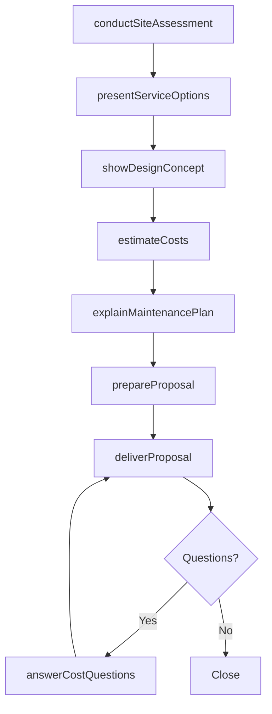
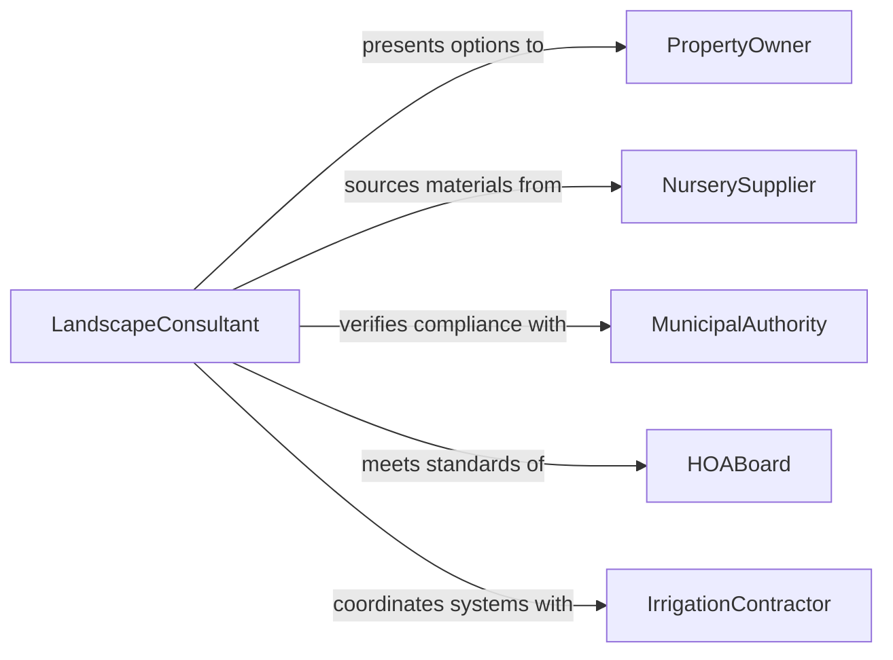

# Provide Information About Landscaping Services or Costs

> Business-as-Code definition for providing landscaping service and cost information. Models the consultation process where landscape professionals communicate service options, design concepts, material costs, and maintenance plans to property owners and managers.

## Overview

Providing information about landscaping services or costs involves conducting site assessments, presenting design options, estimating material and labor costs, explaining maintenance schedules, and delivering formal proposals to property owners, developers, and facility managers. This definition covers residential and commercial landscaping consultations, hardscape proposals, irrigation planning, and seasonal maintenance agreements, enabling landscape businesses to manage the client communication pipeline from initial inquiry through contract execution.

## Actors

| Actor | Description |
|-------|-------------|
| PropertyOwner | The individual or entity requesting landscaping information |
| NurserySupplier | Provides plant material pricing and availability |
| MunicipalAuthority | Enforces zoning, water use, and landscaping ordinances |
| HOABoard | Sets aesthetic and landscaping standards for community properties |
| IrrigationContractor | Provides specialized irrigation system design and installation |

## Roles

| Role | Description |
|------|-------------|
| LandscapeConsultant | Conducts site assessments and presents service options |
| Estimator | Calculates material, labor, and equipment costs |
| DesignSpecialist | Creates landscape design concepts and renderings |
| AccountCoordinator | Manages client communication and proposal delivery |

## Entities

| Entity | Description |
|--------|-------------|
| SiteAssessment | A documented evaluation of the property's current conditions |
| LandscapeProposal | A formal document outlining proposed services and costs |
| CostEstimate | A detailed breakdown of materials, labor, and equipment expenses |
| DesignConcept | A visual rendering of the proposed landscape |
| PlantSchedule | A list of specified plant materials with quantities and sizes |
| MaintenancePlan | A recurring service agreement for ongoing landscape care |
| ServiceCatalog | A listing of available landscaping services and pricing tiers |

## Actions

| Action | Description |
|--------|-------------|
| conductSiteAssessment | Evaluate the property to determine landscape opportunities |
| presentServiceOptions | Describe available landscaping services and their benefits |
| estimateCosts | Calculate detailed pricing for proposed landscaping work |
| showDesignConcept | Present visual renderings of the proposed landscape |
| explainMaintenancePlan | Describe ongoing care requirements and service schedules |
| prepareProposal | Assemble a formal proposal with scope, timeline, and pricing |
| deliverProposal | Present the completed proposal to the property owner |
| answerCostQuestions | Respond to client inquiries about pricing and payment options |

## Events

| Event | Description |
|-------|-------------|
| siteAssessed | The property evaluation has been completed |
| serviceOptionsPresented | Available landscaping services have been described |
| costsEstimated | Detailed pricing has been calculated |
| designConceptShown | Visual renderings have been presented to the client |
| maintenancePlanExplained | Ongoing care requirements have been communicated |
| proposalPrepared | A formal proposal has been assembled |
| proposalDelivered | The proposal has been presented to the property owner |
| costQuestionsAnswered | Client pricing inquiries have been addressed |

## Searches

| Search | Description |
|--------|-------------|
| findAssessments | List site assessments by property, date, or consultant |
| getProposals | Retrieve proposals by client, status, or service type |
| findByServiceType | Locate proposals by landscaping service category |
| getCostEstimates | Retrieve cost estimates by project or material type |
| getMaintenancePlans | List active maintenance agreements by client or property |

## Workflow



## Actor Relationships



## Usage

### Calling Actions

```typescript
import { provideInformationAboutLandscapingServices } from '@headlessly/provide-information-about-landscaping-services'

const landscaping = provideInformationAboutLandscapingServices()

// Conduct site assessment
const assessment = await landscaping.conductSiteAssessment({
  property: '1420 Elm Street',
  propertyType: 'residential',
  lotSize: 12000,
  existingFeatures: ['mature-oaks', 'concrete-patio', 'sprinkler-system'],
  concerns: ['drought-tolerance', 'curb-appeal', 'low-maintenance']
})

// Present options and estimate
await landscaping.presentServiceOptions({
  assessmentId: assessment.id,
  services: ['xeriscape-conversion', 'patio-extension', 'irrigation-upgrade']
})

const estimate = await landscaping.estimateCosts({
  assessmentId: assessment.id,
  scope: 'xeriscape-conversion',
  materials: ['decomposed-granite', 'native-perennials', 'drip-irrigation'],
  laborHours: 80
})

await landscaping.deliverProposal({
  assessmentId: assessment.id,
  estimateId: estimate.id,
  timeline: '3 weeks',
  paymentTerms: '50% deposit, 50% on completion'
})
```

### Event-Driven Automation

```typescript
// Auto-generate proposal when costs are estimated
landscaping.costsEstimated(async ({ assessmentId, estimateId }) => {
  await landscaping.prepareProposal({ assessmentId, estimateId })
})

// Notify account coordinator when proposal is delivered
landscaping.proposalDelivered(async ({ assessmentId, client }) => {
  await notify({
    to: 'account-coordinator',
    message: `Proposal delivered to ${client} - follow up in 3 business days`
  })
})
```
