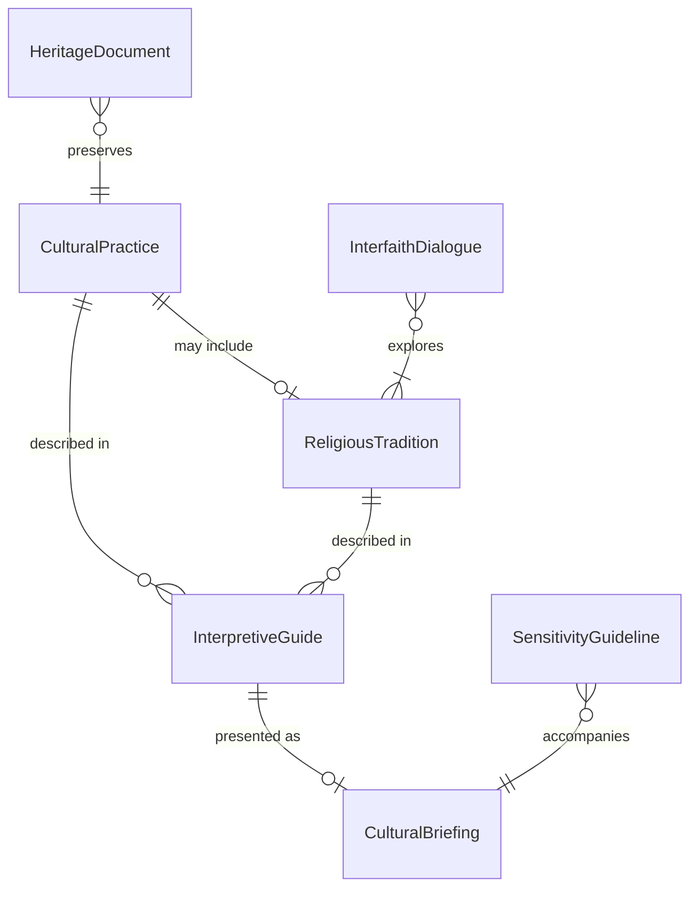
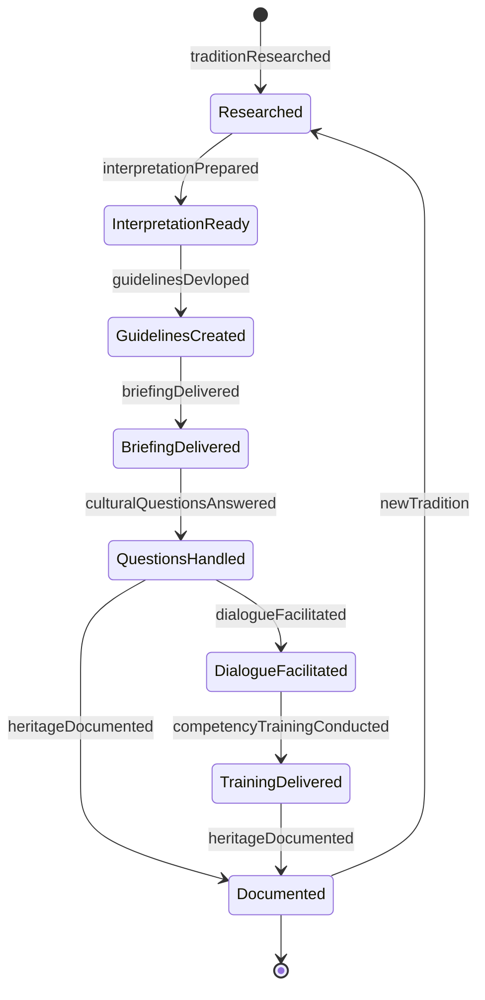
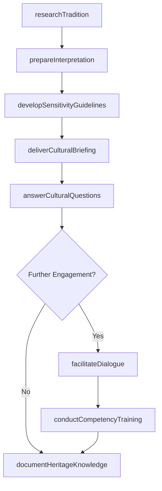
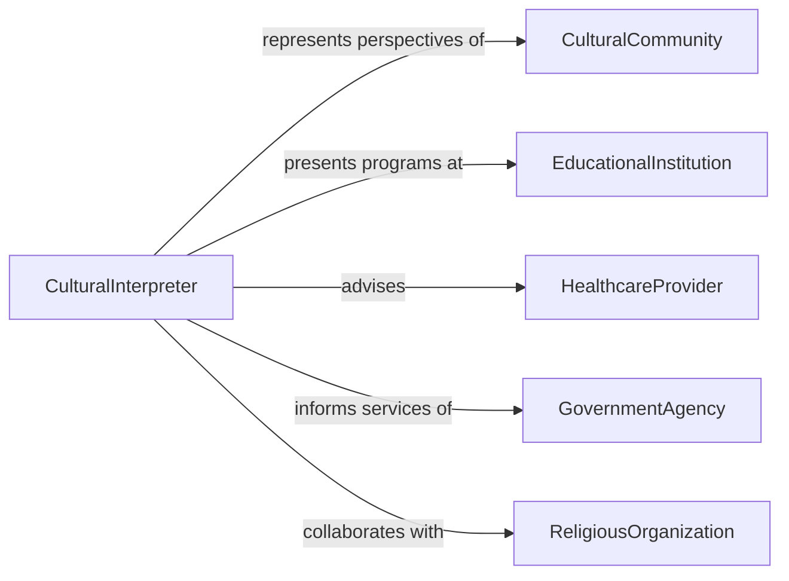

# Interpret Cultural or Religious Information for Others

> Business-as-Code definition for interpreting cultural and religious information. Models the process of explaining cultural practices, religious traditions, historical contexts, and cross-cultural norms to audiences seeking understanding for educational, professional, or community engagement purposes.

## Overview

Interpreting cultural or religious information for others involves researching traditions, practices, and belief systems, contextualizing them for diverse audiences, facilitating cross-cultural understanding, and providing guidance on culturally sensitive interactions. This definition covers museum interpretation, interfaith dialogue facilitation, cultural competency training, and heritage preservation communication, enabling cultural institutions, healthcare providers, social services, and multinational organizations to foster understanding and respect across cultural and religious boundaries.

## Actors

| Actor | Description |
|-------|-------------|
| CulturalCommunity | The group whose traditions and practices are being interpreted |
| EducationalInstitution | Schools, museums, or universities hosting cultural programs |
| HealthcareProvider | Requires cultural understanding for patient-centered care |
| GovernmentAgency | Implements culturally responsive public services |
| ReligiousOrganization | Provides authoritative perspectives on religious practices |

## Roles

| Role | Description |
|------|-------------|
| CulturalInterpreter | Explains cultural practices and norms to outside audiences |
| InterfaithLiaison | Facilitates dialogue and understanding between religious communities |
| CulturalCompetencyTrainer | Delivers training on cross-cultural awareness and sensitivity |
| HeritageSpecialist | Researches and presents cultural heritage information |

## Entities

| Entity | Description |
|--------|-------------|
| CulturalPractice | A tradition, custom, or behavior associated with a specific culture |
| ReligiousTradition | A belief system, ritual, or observance within a faith community |
| InterpretiveGuide | A resource explaining cultural or religious context for audiences |
| CulturalBriefing | A presentation on cultural norms and expectations |
| SensitivityGuideline | Recommendations for respectful cross-cultural interaction |
| InterfaithDialogue | A structured conversation between representatives of different faiths |
| HeritageDocument | A record preserving cultural or religious knowledge |

## Actions

| Action | Description |
|--------|-------------|
| researchTradition | Investigate the history, practices, and significance of a cultural or religious tradition |
| prepareInterpretation | Develop materials that explain cultural or religious information |
| deliverCulturalBriefing | Present cultural context to an audience seeking understanding |
| facilitateDialogue | Guide a structured conversation between cultural or religious groups |
| developSensitivityGuidelines | Create recommendations for respectful cross-cultural engagement |
| conductCompetencyTraining | Deliver cultural awareness training to professionals or teams |
| answerCulturalQuestions | Respond to inquiries about cultural or religious practices |
| documentHeritageKnowledge | Record cultural or religious information for preservation |

## Events

| Event | Description |
|-------|-------------|
| traditionResearched | A cultural or religious tradition has been investigated |
| interpretationPrepared | Materials explaining cultural information have been developed |
| briefingDelivered | Cultural context has been presented to the audience |
| dialogueFacilitated | A cross-cultural or interfaith conversation has been guided |
| guidelinesDevloped | Sensitivity recommendations have been created |
| competencyTrainingConducted | Cultural awareness training has been delivered |
| culturalQuestionsAnswered | Inquiries about practices have been addressed |
| heritageDocumented | Cultural or religious knowledge has been recorded |

## Searches

| Search | Description |
|--------|-------------|
| findTraditions | List cultural or religious traditions by region, faith, or topic |
| getGuidelines | Retrieve sensitivity guidelines by culture or context |
| findBriefings | Locate cultural briefings by audience or date |
| getDialogueRecords | Retrieve records of interfaith or cross-cultural dialogues |
| searchByRegion | Find cultural information by geographic region or community |

## Entity Relationships



## State Diagram



## Workflow



## Actor Relationships



## Usage

### Calling Actions

```typescript
import { interpretCulturalReligiousInformationOthers } from '@headlessly/interpret-cultural-religious-information-others'

const cultural = interpretCulturalReligiousInformationOthers()

// Research and prepare a cultural interpretation
const research = await cultural.researchTradition({
  tradition: 'Lunar New Year Observances',
  cultures: ['chinese', 'vietnamese', 'korean'],
  aspects: ['historical-origins', 'family-practices', 'food-traditions', 'business-customs']
})

const interpretation = await cultural.prepareInterpretation({
  researchId: research.id,
  audience: 'corporate-hr-teams',
  format: 'training-presentation',
  focusAreas: ['workplace-accommodation', 'inclusive-celebrations', 'scheduling-awareness']
})

// Deliver training and facilitate dialogue
await cultural.conductCompetencyTraining({
  interpretationId: interpretation.id,
  audience: 'people-managers',
  format: 'workshop',
  duration: '90 minutes'
})

await cultural.facilitateDialogue({
  topic: 'Religious Observance Accommodations in the Workplace',
  participants: ['hr-leadership', 'employee-resource-groups', 'interfaith-council'],
  format: 'roundtable'
})
```

### Event-Driven Automation

```typescript
// Auto-generate sensitivity guidelines when interpretation is prepared
cultural.interpretationPrepared(async ({ interpretationId }) => {
  await cultural.developSensitivityGuidelines({ interpretationId })
})

// Notify heritage team when knowledge is documented
cultural.heritageDocumented(async ({ tradition, documentId }) => {
  await notify({
    to: 'heritage-preservation',
    message: `Heritage record created for "${tradition}" - review and archive`
  })
})
```
