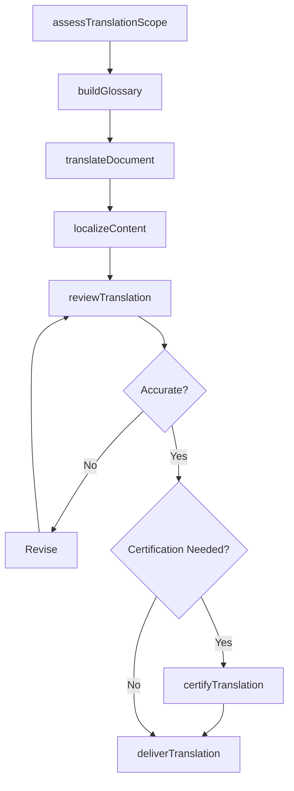
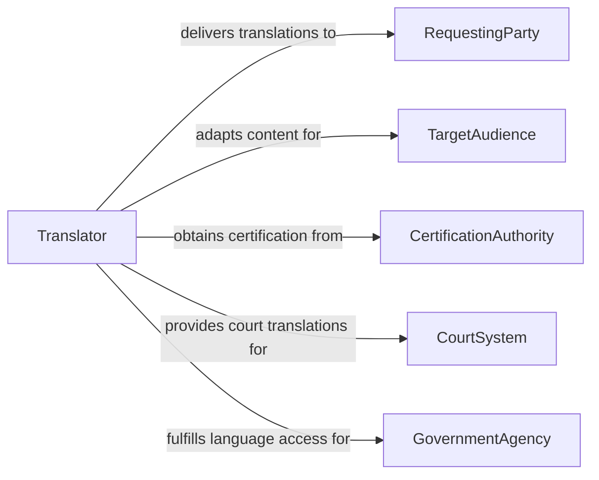

# Translate Information for Others

> Business-as-Code definition for translating information for others. Models the language translation and interpretation process that enables communication across linguistic boundaries in business, legal, medical, and public service contexts.

## Overview

Translating information for others involves converting written documents, spoken communications, and multimedia content from one language to another while preserving meaning, tone, and context. This definition covers document translation, simultaneous and consecutive interpretation, localization of business materials, and certified translation for legal proceedings, enabling organizations to communicate effectively with multilingual audiences and comply with language access requirements.

## Actors

| Actor | Description |
|-------|-------------|
| RequestingParty | The individual or organization that needs information translated |
| TargetAudience | The recipients who will consume the translated content |
| CertificationAuthority | Validates the accuracy and completeness of certified translations |
| CourtSystem | Requires certified translation for legal proceedings |
| GovernmentAgency | Mandates language access for public services |

## Roles

| Role | Description |
|------|-------------|
| Translator | Converts written content from one language to another |
| Interpreter | Provides real-time spoken translation between languages |
| LocalizationSpecialist | Adapts content for cultural and regional appropriateness |
| QualityReviewer | Reviews translations for accuracy, completeness, and tone |

## Entities

| Entity | Description |
|--------|-------------|
| SourceDocument | The original content to be translated |
| TranslatedDocument | The completed translation in the target language |
| GlossaryEntry | A standardized term translation for consistency across documents |
| TranslationMemory | A database of previously translated segments for reuse |
| CertificationStatement | A sworn attestation of translation accuracy |
| InterpretationSession | A real-time spoken translation event |
| LocalizationKit | A collection of translated and adapted materials for a specific locale |

## Actions

| Action | Description |
|--------|-------------|
| assessTranslationScope | Evaluate the source material and determine translation requirements |
| translateDocument | Convert written content from the source to the target language |
| interpretCommunication | Provide real-time spoken translation between parties |
| localizeContent | Adapt translated material for cultural and regional context |
| reviewTranslation | Verify accuracy, completeness, and tone of the translation |
| certifyTranslation | Issue a sworn statement attesting to translation accuracy |
| buildGlossary | Create standardized term translations for consistency |
| deliverTranslation | Provide the completed translation to the requesting party |

## Events

| Event | Description |
|-------|-------------|
| scopeAssessed | Translation requirements have been evaluated |
| documentTranslated | Written content has been converted to the target language |
| communicationInterpreted | Real-time spoken translation has been provided |
| contentLocalized | Translated material has been adapted for cultural context |
| translationReviewed | The translation has been verified for accuracy |
| translationCertified | A sworn accuracy attestation has been issued |
| glossaryBuilt | Standardized term translations have been created |
| translationDelivered | The completed translation has been provided to the client |

## Searches

| Search | Description |
|--------|-------------|
| findTranslations | List translations by language pair, status, or client |
| getGlossary | Retrieve standardized terms by language or domain |
| findCertified | Locate certified translations by document type or date |
| getTranslationMemory | Retrieve previously translated segments by source text |
| findByLanguagePair | List translations for a specific source-to-target language combination |

## Workflow



## Actor Relationships



## Usage

### Calling Actions

```typescript
import { translateInformationOthers } from '@headlessly/translate-information-others'

const translation = translateInformationOthers()

// Assess scope and translate a legal document
const scope = await translation.assessTranslationScope({
  sourceLanguage: 'en',
  targetLanguage: 'es',
  documentType: 'employment-contract',
  wordCount: 4500,
  certificationRequired: true
})

await translation.buildGlossary({
  scopeId: scope.id,
  domain: 'legal-employment',
  languagePair: 'en-es'
})

const translated = await translation.translateDocument({
  scopeId: scope.id,
  sourceDocument: 'employment-agreement-2026.pdf',
  preserveFormatting: true
})

await translation.reviewTranslation({ translationId: translated.id })
await translation.certifyTranslation({
  translationId: translated.id,
  certifier: 'ata-certified-translator-1247'
})
```

### Event-Driven Automation

```typescript
// Auto-review when translation is complete
translation.documentTranslated(async ({ translationId }) => {
  await translation.reviewTranslation({ translationId })
})

// Notify requesting party when translation is delivered
translation.translationDelivered(async ({ translationId, client, languagePair }) => {
  await notify({
    to: client,
    message: `Your ${languagePair} translation is ready for download`
  })
})
```
