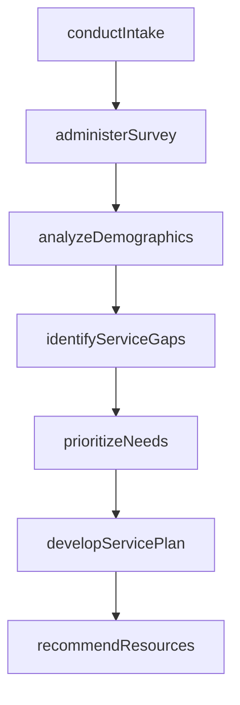
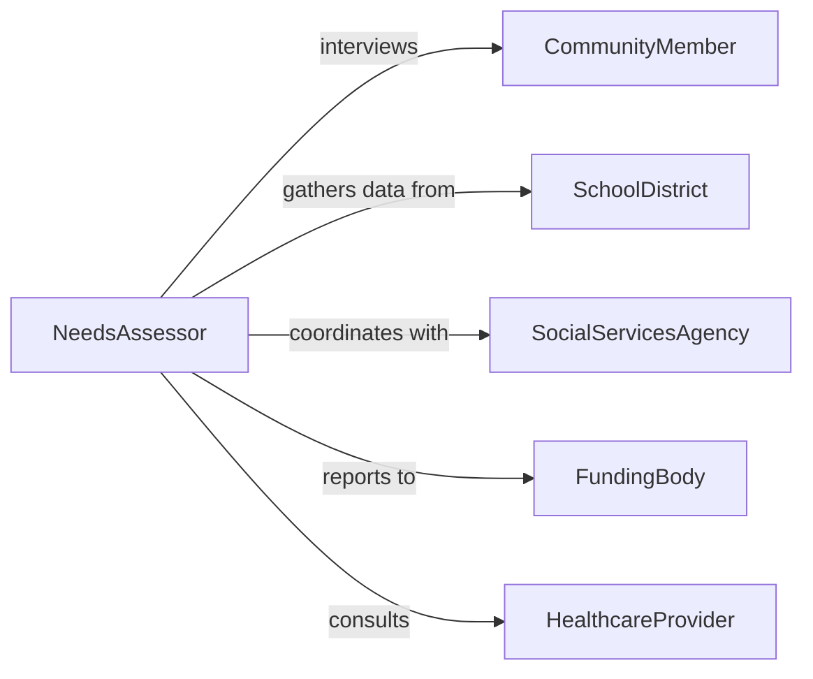

# Assess Individual Community Needs Educational

> Business-as-Code definition for assessing individual or community needs for educational or social services. Models the intake, evaluation, gap analysis, and service matching process.

## Overview

Assessing individual or community needs for educational or social services involves gathering demographic, socioeconomic, and educational data to identify gaps in available services and determine appropriate interventions. This definition covers intake interviews, community surveys, needs scoring, service gap analysis, and the generation of service plans that connect individuals and communities with educational programs, social assistance, counseling, and support resources.

## Actors

| Actor | Description |
|-------|-------------|
| SchoolDistrict | Local education authority providing academic programs and student data |
| SocialServicesAgency | Government or nonprofit agency delivering social support programs |
| CommunityMember | Individual or family participating in the needs assessment process |
| FundingBody | Grant-making or government entity financing educational and social programs |
| HealthcareProvider | Clinic or hospital providing health-related data relevant to service needs |

## Roles

| Role | Description |
|------|-------------|
| NeedsAssessor | Professional who conducts interviews, surveys, and data collection |
| ProgramPlanner | Designs service interventions based on identified needs |
| CommunityLiaison | Connects with community members and organizations to gather input |
| DataAnalyst | Analyzes assessment data to identify trends and prioritize needs |

## Entities

| Entity | Description |
|--------|-------------|
| NeedsAssessment | A structured evaluation of individual or community service gaps |
| ServiceGap | An identified deficiency in available educational or social services |
| DemographicProfile | Population characteristics such as age, income, education, and language |
| ServicePlan | A tailored set of recommended services and resources for the assessed population |
| Survey | A data collection instrument used to gather community or individual input |
| ResourceInventory | A catalog of available educational and social services in the area |

## Actions

| Action | Description |
|--------|-------------|
| conductIntake | Gather initial information from individuals or community representatives |
| administerSurvey | Distribute and collect structured questionnaires to assess needs |
| analyzeDemographics | Evaluate population data to understand service demand patterns |
| identifyServiceGaps | Compare assessed needs against available resources to find deficiencies |
| developServicePlan | Create a tailored plan matching identified needs with available services |
| prioritizeNeeds | Rank identified needs by urgency, impact, and feasibility of intervention |
| recommendResources | Connect individuals or communities with specific programs and services |

## Events

| Event | Description |
|-------|-------------|
| intakeCompleted | Initial information gathering from the individual or community is done |
| surveyAdministered | A needs assessment survey has been distributed and collected |
| demographicsAnalyzed | Population data analysis has been completed |
| serviceGapsIdentified | Deficiencies in available services have been documented |
| servicePlanDeveloped | A tailored service plan has been created for the assessed population |
| needsPrioritized | Identified needs have been ranked by urgency and impact |
| resourcesRecommended | Specific programs and services have been matched to assessed needs |

## Searches

| Search | Description |
|--------|-------------|
| findAssessments | List needs assessments by community, date, population type, or status |
| getServiceGaps | Retrieve identified service gaps by category, severity, or location |
| getResourceInventory | Find available educational and social services by type and geography |
| getServicePlans | Retrieve service plans by individual, community, or program area |

## Workflow



## Actor Relationships



## Usage

### Calling Actions

```typescript
import { assessIndividualCommunityNeedsEducational } from '@headlessly/assess-individual-community-needs-educational'

const needs = assessIndividualCommunityNeedsEducational()

// Conduct intake for a community needs assessment
const intake = await needs.conductIntake({
  community: 'Eastside Neighborhood',
  population: 'Families with school-age children',
  contactPerson: 'Maria Gonzalez, Community Center Director',
  initialConcerns: ['after-school tutoring', 'ESL classes', 'youth mentoring']
})

// Administer a needs survey
await needs.administerSurvey({
  intakeId: intake.id,
  surveyType: 'community-education',
  distributionMethod: 'door-to-door and online',
  targetResponses: 200,
  languages: ['English', 'Spanish']
})

// Identify service gaps and develop a plan
const gaps = await needs.identifyServiceGaps({
  intakeId: intake.id,
  assessedNeeds: ['ESL instruction', 'after-school care', 'parent education workshops'],
  existingServices: ['one ESL class at community college, waitlisted']
})

await needs.developServicePlan({
  intakeId: intake.id,
  gaps: gaps.id,
  plan: [
    { need: 'ESL instruction', action: 'Partner with library for evening ESL classes', timeline: 'Q2 2026' },
    { need: 'After-school care', action: 'Expand community center hours with volunteer tutors', timeline: 'Q3 2026' }
  ]
})
```

### Event-Driven Automation

```typescript
// Notify funding bodies when critical service gaps are identified
needs.serviceGapsIdentified(async ({ intakeId, gaps }) => {
  const critical = gaps.filter(g => g.severity === 'critical')
  if (critical.length > 0) {
    await notify({
      to: 'funding-coordinator',
      message: `${critical.length} critical service gaps identified in assessment #${intakeId}. Grant applications recommended.`
    })
  }
})

// Auto-generate referral packets when resources are recommended
needs.resourcesRecommended(async ({ intakeId, resources }) => {
  for (const resource of resources) {
    await generateReferralPacket({ intakeId, program: resource.name, contact: resource.contactInfo })
  }
})
```
