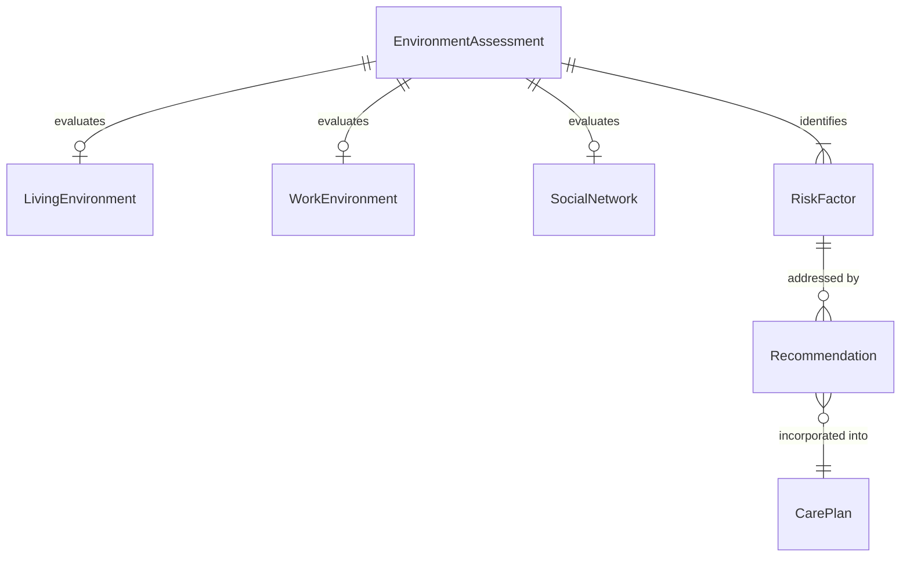
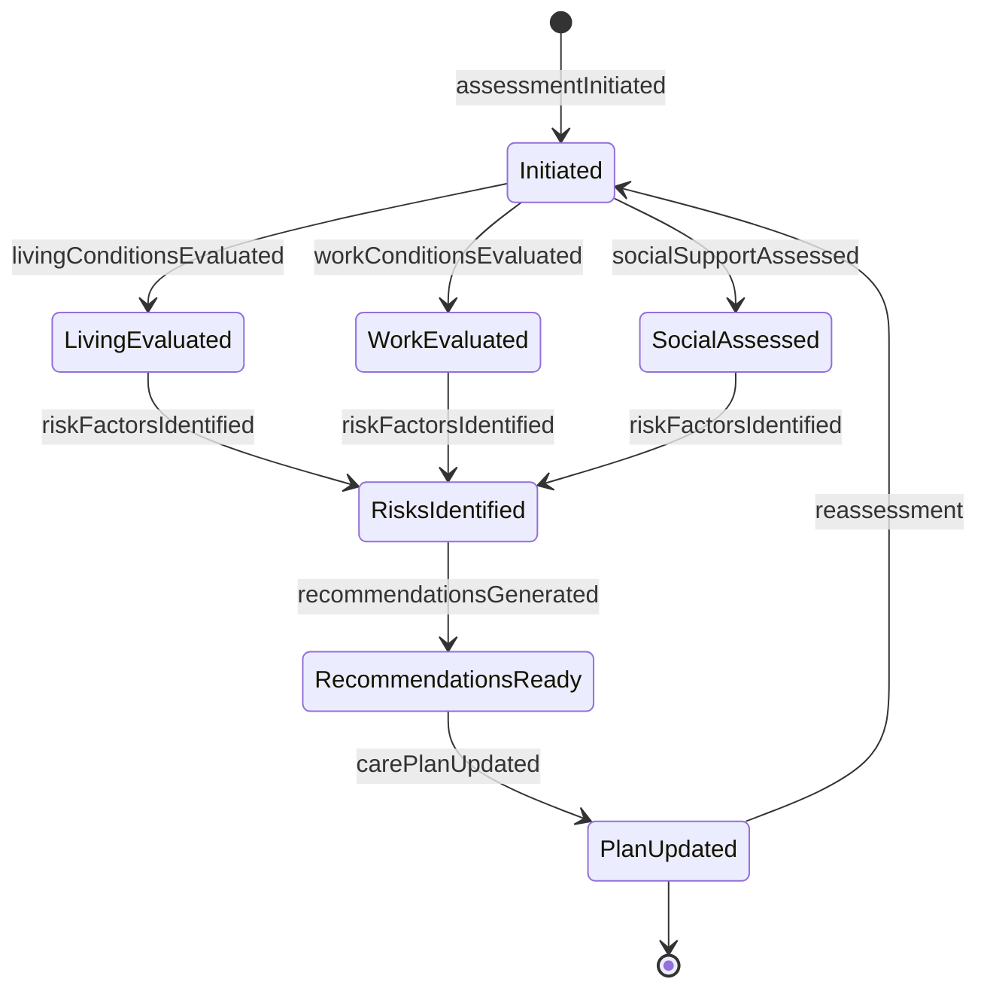
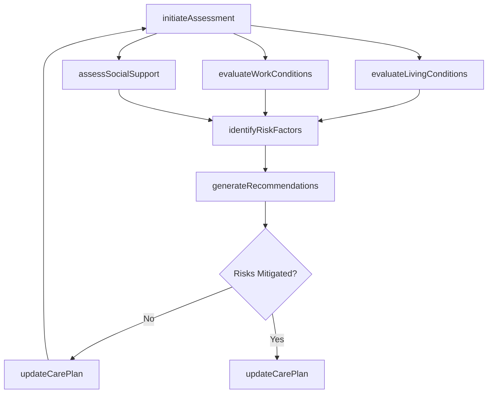
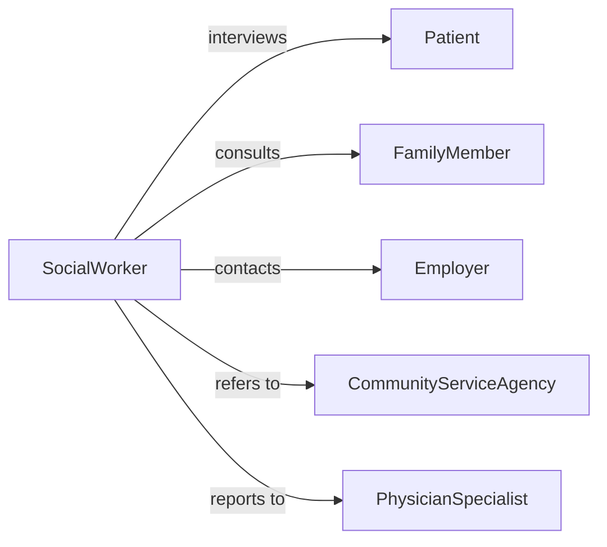

# Assess Patient Work Living Social

> Business-as-Code definition for assessing patient work, living, or social environments. Models the evaluation of environmental factors affecting patient health, recovery, and wellbeing.

## Overview

Assessing patient work, living, or social environments involves evaluating the physical, occupational, and social conditions in which patients live and function to determine their impact on health outcomes, treatment adherence, and recovery potential. This definition covers home safety evaluations, workplace ergonomic assessments, social support network analysis, and environmental risk identification to inform care planning and service referrals.

## Actors

| Actor | Description |
|-------|-------------|
| Patient | Individual whose environments are being assessed |
| FamilyMember | Household member providing context about living conditions and support |
| Employer | Workplace entity providing occupational environment information |
| CommunityServiceAgency | Organization offering housing, transportation, or social support resources |
| InsuranceProvider | Payer that may authorize environmental modifications or services |

## Roles

| Role | Description |
|------|-------------|
| SocialWorker | Conducts comprehensive assessments of living and social environments |
| OccupationalTherapist | Evaluates work and home environments for functional safety and accessibility |
| CaseManager | Coordinates assessment findings with care planning and service referrals |
| PhysicianSpecialist | Orders environmental assessments and incorporates findings into treatment plans |

## Entities

| Entity | Description |
|--------|-------------|
| EnvironmentAssessment | A structured evaluation of a patient's work, living, or social conditions |
| LivingEnvironment | The patient's home setting including physical layout, safety, and accessibility |
| WorkEnvironment | The patient's occupational setting including ergonomics and hazard exposure |
| SocialNetwork | The patient's support system of family, friends, and community connections |
| RiskFactor | An environmental condition that may negatively impact patient health |
| Recommendation | A suggested modification or service to address identified environmental risks |
| CarePlan | The patient's treatment and service plan incorporating assessment findings |

## Actions

| Action | Description |
|--------|-------------|
| initiateAssessment | Begin a structured evaluation of the patient's environments |
| evaluateLivingConditions | Assess the patient's home for safety, accessibility, and adequacy |
| evaluateWorkConditions | Assess the patient's workplace for ergonomic risks and accommodations |
| assessSocialSupport | Evaluate the patient's social network and community connections |
| identifyRiskFactors | Document environmental conditions that threaten patient health or recovery |
| generateRecommendations | Propose modifications, services, or referrals based on findings |
| updateCarePlan | Incorporate assessment findings and recommendations into the care plan |

## Events

| Event | Description |
|-------|-------------|
| assessmentInitiated | An environmental assessment has been started for a patient |
| livingConditionsEvaluated | The patient's home environment has been assessed |
| workConditionsEvaluated | The patient's workplace environment has been assessed |
| socialSupportAssessed | The patient's social network has been evaluated |
| riskFactorsIdentified | Environmental risks have been documented |
| recommendationsGenerated | Modifications or referrals have been proposed |
| carePlanUpdated | The care plan has been updated with assessment findings |

## Searches

| Search | Description |
|--------|-------------|
| findAssessments | List environmental assessments by patient, type, date, or status |
| getRiskFactors | Retrieve identified risk factors by patient, environment type, or severity |
| getRecommendations | Find recommendations by patient, status, or category |
| getPatientHistory | Retrieve past environmental assessments and outcomes for a patient |

## Entity Relationships



## State Diagram



## Workflow



## Actor Relationships



## Usage

### Calling Actions

```typescript
import { assessPatientWorkLivingSocial } from '@headlessly/assess-patient-work-living-social'

const envAssess = assessPatientWorkLivingSocial()

// Initiate an assessment for a patient recovering from hip replacement
const assessment = await envAssess.initiateAssessment({
  patientId: 'PT-88421',
  reason: 'Post-surgical discharge planning - hip replacement',
  assessmentTypes: ['living', 'social']
})

// Evaluate living conditions
await envAssess.evaluateLivingConditions({
  assessmentId: assessment.id,
  findings: {
    stairAccess: true,
    bathroomGrabBars: false,
    trippingHazards: ['loose rugs in hallway', 'cluttered bedroom floor'],
    wheelchairAccessible: false
  }
})

// Identify risk factors and generate recommendations
await envAssess.identifyRiskFactors({
  assessmentId: assessment.id,
  risks: [
    { factor: 'No bathroom grab bars', severity: 'high', area: 'fall prevention' },
    { factor: 'Stairs to bedroom', severity: 'medium', area: 'mobility' }
  ]
})

await envAssess.generateRecommendations({
  assessmentId: assessment.id,
  recommendations: [
    { action: 'Install grab bars in bathroom', priority: 'high' },
    { action: 'Arrange temporary bedroom on ground floor', priority: 'high' },
    { action: 'Remove loose rugs', priority: 'medium' }
  ]
})
```

### Event-Driven Automation

```typescript
// Alert case manager when high-severity risks are identified
envAssess.riskFactorsIdentified(async ({ assessmentId, risks }) => {
  const highRisks = risks.filter(r => r.severity === 'high')
  if (highRisks.length > 0) {
    await notify({
      to: 'case-manager',
      message: `${highRisks.length} high-severity environmental risks identified for assessment #${assessmentId}`
    })
  }
})

// Auto-generate referrals when recommendations include community services
envAssess.recommendationsGenerated(async ({ assessmentId, recommendations }) => {
  const serviceReferrals = recommendations.filter(r => r.requiresExternalService)
  for (const referral of serviceReferrals) {
    await createReferral({ assessmentId, service: referral.action })
  }
})
```
