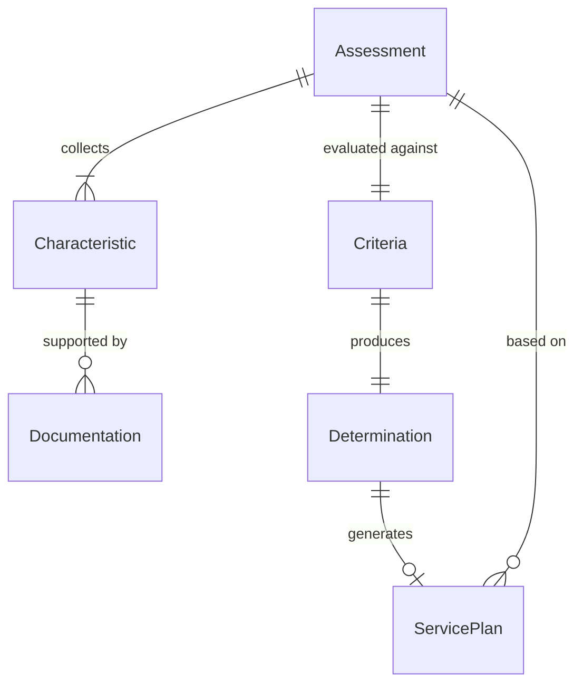
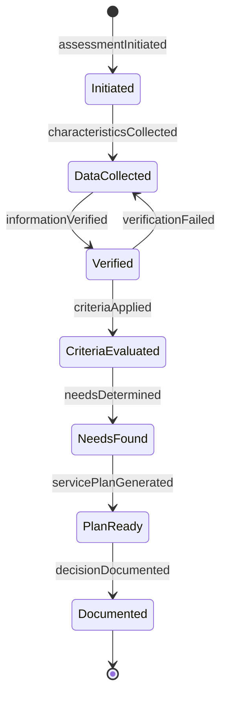
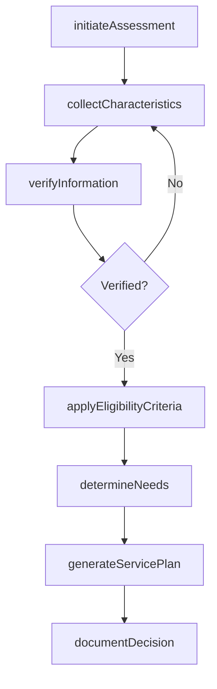
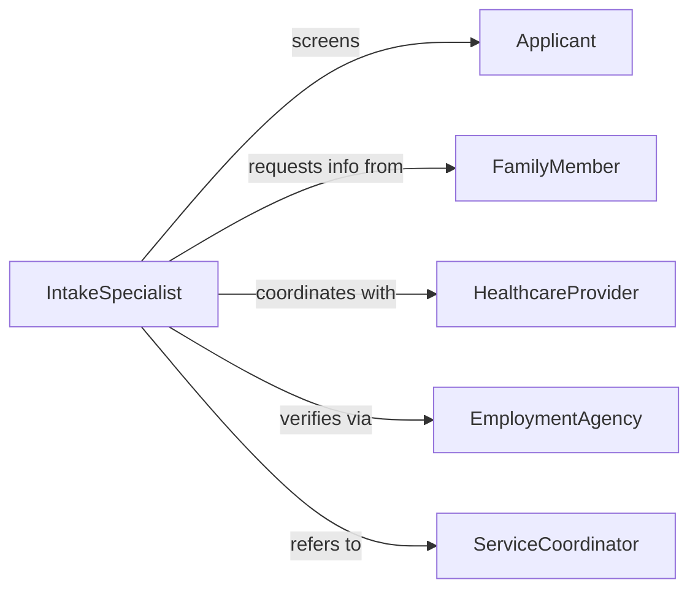

# Evaluate Characteristics Individuals Determine Needs

> Business-as-Code definition for evaluating individual characteristics to determine service needs and program eligibility. Models comprehensive assessment processes used in social services, healthcare, and benefits administration.

## Overview

Individual needs evaluation involves collecting demographic, medical, financial, and social information to determine appropriate services and program eligibility. This definition provides actions for intake, assessment, eligibility determination, and referrals across case management workflows.

## Actors

| Actor | Description |
|-------|-------------|
| Applicant | Individual seeking services or benefits |
| FamilyMember | Provides support information for the applicant |
| HealthcareProvider | Submits medical documentation for assessment |
| EmploymentAgency | Provides work history and income verification |
| HousingAuthority | Validates housing status and needs |
| GovernmentAgency | Reviews eligibility for public programs |

## Roles

| Role | Description |
|------|-------------|
| IntakeSpecialist | Conducts initial screening and data collection |
| CaseManager | Coordinates comprehensive needs assessment |
| EligibilityWorker | Determines program qualification status |
| ServiceCoordinator | Connects individuals to appropriate resources |

## Entities

| Entity | Description |
|--------|-------------|
| Assessment | Comprehensive evaluation of individual needs |
| Criteria | Eligibility rules for specific programs |
| Characteristic | Measurable attribute used in evaluation |
| Determination | Official decision on eligibility or service level |
| ServicePlan | Recommended actions based on assessed needs |
| Documentation | Supporting evidence for assessments |

## Actions

| Action | Description |
|--------|-------------|
| initiateAssessment | Start a new needs evaluation process |
| collectCharacteristics | Gather demographic and situational data |
| verifyInformation | Confirm accuracy of submitted data |
| applyEligibilityCriteria | Match individual characteristics to program rules |
| determineNeeds | Identify required services and support levels |
| generateServicePlan | Create recommendations based on assessment |
| documentDecision | Record eligibility determination and rationale |

## Events

| Event | Description |
|-------|-------------|
| assessmentInitiated | New needs evaluation has been started |
| characteristicsCollected | Individual data has been gathered |
| informationVerified | Supporting documentation has been confirmed |
| criteriaApplied | Eligibility rules have been evaluated |
| needsDetermined | Service requirements have been identified |
| servicePlanGenerated | Recommendations have been created |
| decisionDocumented | Final determination has been recorded |

## Searches

| Search | Description |
|--------|-------------|
| findAssessments | Retrieve evaluations by individual or status |
| getEligibilityResults | List determinations by program or date |
| getPendingVerifications | Find assessments awaiting documentation |
| getServicePlans | Retrieve recommendations by individual |

## Entity Relationships



## State Diagram



## Workflow



## Actor Relationships



## Usage

### Calling Actions

```typescript
import { evaluateCharacteristicsIndividualsDetermineNeeds } from '@headlessly/evaluate-characteristics-individuals-determine-needs'

const evaluator = evaluateCharacteristicsIndividualsDetermineNeeds()

// Begin new assessment
const assessment = await evaluator.initiateAssessment({
  applicantId: 'APP-2847',
  programType: 'housing-assistance',
  requestDate: '2026-02-05'
})

// Collect individual characteristics
await evaluator.collectCharacteristics({
  assessmentId: assessment.id,
  characteristics: {
    householdSize: 3,
    monthlyIncome: 2400,
    employmentStatus: 'employed',
    disabilityStatus: 'none',
    housingStatus: 'rent-burdened'
  }
})

// Determine eligibility and needs
const determination = await evaluator.applyEligibilityCriteria({
  assessmentId: assessment.id,
  program: 'section-8-voucher'
})
```

### Event-Driven Automation

```typescript
// Auto-request verification when needed
evaluator.characteristicsCollected(async ({ assessmentId, characteristics }) => {
  if (characteristics.monthlyIncome > 1000) {
    await evaluator.verifyInformation({
      assessmentId,
      verificationType: 'income',
      provider: 'employment-agency'
    })
  }
})

// Generate service plan after determination
evaluator.needsDetermined(async ({ assessmentId, needs }) => {
  await evaluator.generateServicePlan({
    assessmentId,
    services: needs.map(need => ({
      type: need.category,
      urgency: need.priority
    }))
  })
})
```
