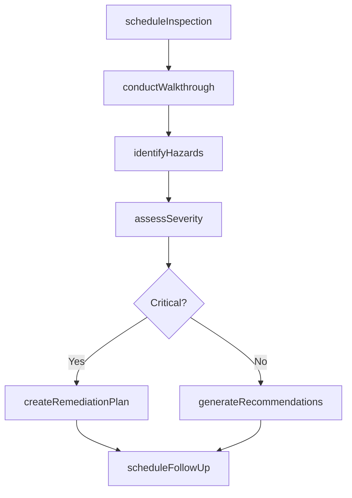
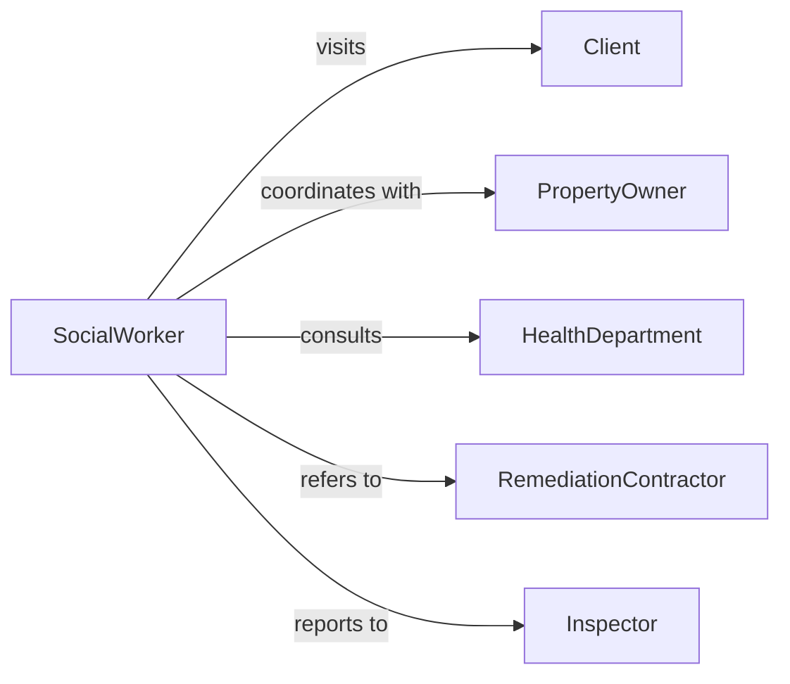

# Evaluate Potential Problems Home Work

> Business-as-Code definition for identifying environmental hazards and safety risks in residential and workplace settings. Models systematic assessment processes used in social work, occupational health, and safety compliance.

## Overview

Environmental problem evaluation involves inspecting living and working conditions to identify health hazards, safety risks, accessibility barriers, and compliance violations. This definition provides actions for conducting site assessments, documenting findings, and recommending corrective measures.

## Actors

| Actor | Description |
|-------|-------------|
| Client | Individual whose environment is being assessed |
| PropertyOwner | Responsible for maintaining safe conditions |
| Employer | Manages workplace safety and compliance |
| Inspector | Conducts official safety or code inspections |
| HealthDepartment | Investigates environmental health concerns |
| RemediationContractor | Performs corrective repairs or modifications |

## Roles

| Role | Description |
|------|-------------|
| SocialWorker | Evaluates home environments for client safety |
| OccupationalHealthSpecialist | Assesses workplace hazards and ergonomics |
| SafetyInspector | Identifies code violations and risks |
| CaseManager | Coordinates environmental intervention services |

## Entities

| Entity | Description |
|--------|-------------|
| EnvironmentalAssessment | Comprehensive evaluation of living or work space |
| Hazard | Identified risk to health, safety, or wellbeing |
| Observation | Documented finding from site inspection |
| Recommendation | Suggested corrective action or intervention |
| RemediationPlan | Structured approach to address identified problems |
| FollowUp | Scheduled re-inspection or status check |

## Actions

| Action | Description |
|--------|-------------|
| scheduleInspection | Arrange site visit for environmental evaluation |
| conductWalkthrough | Perform systematic inspection of premises |
| identifyHazards | Document safety risks and problem conditions |
| assessSeverity | Determine urgency and impact of each finding |
| generateRecommendations | Create corrective action suggestions |
| createRemediationPlan | Develop structured intervention approach |
| scheduleFollowUp | Arrange verification of corrective actions |

## Events

| Event | Description |
|-------|-------------|
| inspectionScheduled | Site visit has been arranged |
| walkthroughConducted | Inspection has been completed |
| hazardsIdentified | Problems have been documented |
| severityAssessed | Risk levels have been determined |
| recommendationsGenerated | Corrective actions have been suggested |
| remediationPlanCreated | Intervention plan has been developed |
| followUpScheduled | Re-inspection date has been set |

## Searches

| Search | Description |
|--------|-------------|
| findAssessments | Retrieve evaluations by location or date |
| getHazardsByType | List identified risks by category or severity |
| getPendingRemediations | Find open corrective action items |
| getOverdueFollowUps | Retrieve missed re-inspection appointments |

## Workflow



## Actor Relationships



## Usage

### Calling Actions

```typescript
import { evaluatePotentialProblemsHomeWork } from '@headlessly/evaluate-potential-problems-home-work'

const evaluator = evaluatePotentialProblemsHomeWork()

// Schedule home safety inspection
const inspection = await evaluator.scheduleInspection({
  clientId: 'CLI-8392',
  locationType: 'residence',
  address: '742 Oak Street, Unit 3B',
  visitDate: '2026-02-10',
  reason: 'elderly-client-fall-risk'
})

// Document hazards during walkthrough
await evaluator.identifyHazards({
  inspectionId: inspection.id,
  hazards: [
    { type: 'trip-hazard', location: 'bathroom', description: 'loose floor tile' },
    { type: 'electrical', location: 'kitchen', description: 'exposed wiring' },
    { type: 'structural', location: 'stairs', description: 'broken handrail' }
  ]
})

// Assess severity and create plan
const severityResults = await evaluator.assessSeverity({
  inspectionId: inspection.id
})
```

### Event-Driven Automation

```typescript
// Auto-escalate critical hazards
evaluator.severityAssessed(async ({ inspectionId, hazards }) => {
  const criticalHazards = hazards.filter(h => h.severity === 'critical')
  if (criticalHazards.length > 0) {
    await evaluator.createRemediationPlan({
      inspectionId,
      urgency: 'immediate',
      targetDate: addDays(new Date(), 7)
    })
  }
})

// Notify client of recommendations
evaluator.recommendationsGenerated(async ({ inspectionId, recommendations }) => {
  const client = await getClient(inspectionId)
  await sendNotification({
    to: client.email,
    subject: 'Home Safety Recommendations',
    body: formatRecommendations(recommendations)
  })
})
```
