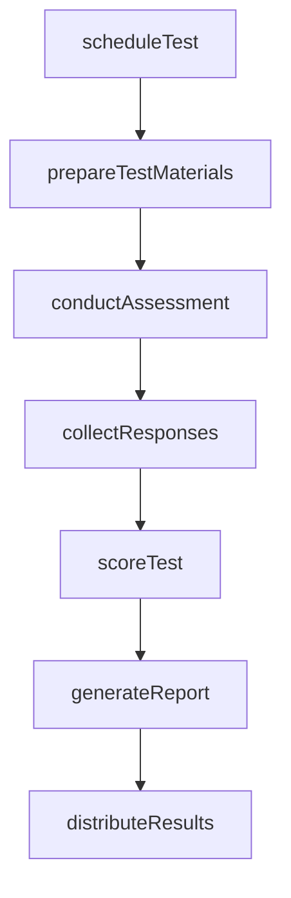
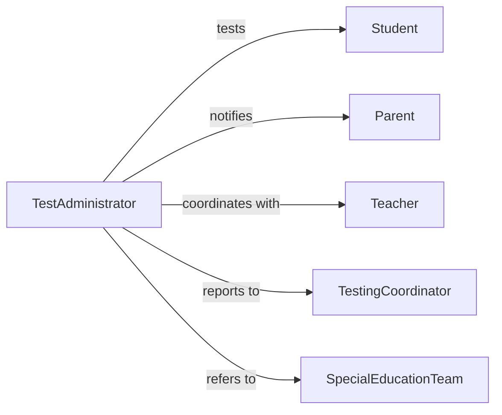

# Administer Tests Assess Educational Needs

> Business-as-Code definition for conducting standardized testing to evaluate student learning needs and academic progress. Models test administration processes used in K-12 education, special education evaluation, and instructional planning.

## Overview

Educational testing administration involves selecting appropriate assessments, preparing testing environments, conducting standardized evaluations, and analyzing results to inform instructional decisions. This definition provides actions for the complete testing lifecycle from scheduling through results reporting.

## Actors

| Actor | Description |
|-------|-------------|
| Student | Individual being assessed for educational needs |
| Parent | Reviews assessment results and provides consent |
| Teacher | Implements testing and uses results for instruction |
| TestingCoordinator | Manages district-wide assessment programs |
| SpecialEducationTeam | Uses results for IEP development |
| TestPublisher | Provides standardized assessment instruments |

## Roles

| Role | Description |
|------|-------------|
| TestAdministrator | Conducts standardized assessments |
| AssessmentCoordinator | Schedules and manages testing logistics |
| Proctor | Supervises testing sessions for integrity |
| Evaluator | Analyzes and interprets test results |

## Entities

| Entity | Description |
|--------|-------------|
| TestingSession | Scheduled administration of one or more assessments |
| Assessment | Standardized instrument for measuring student learning |
| TestResponse | Student answers to assessment items |
| Score | Quantitative result from a completed test |
| Accommodation | Modification for students with special needs |
| Report | Summary of test results and interpretations |

## Actions

| Action | Description |
|--------|-------------|
| scheduleTest | Arrange testing session for students |
| prepareTestMaterials | Assemble instruments and supplies |
| conductAssessment | Administer test according to protocol |
| collectResponses | Gather completed test materials |
| scoreTest | Calculate results using scoring guide |
| generateReport | Create summary of assessment findings |
| distributeResults | Share scores with appropriate stakeholders |

## Events

| Event | Description |
|-------|-------------|
| testScheduled | Testing session has been arranged |
| materialsPrepared | Test instruments are ready for administration |
| assessmentConducted | Test has been administered to students |
| responsesCollected | Completed materials have been gathered |
| testScored | Results have been calculated |
| reportGenerated | Assessment summary has been created |
| resultsDistributed | Scores have been shared with stakeholders |

## Searches

| Search | Description |
|--------|-------------|
| findTestingSessions | Retrieve scheduled assessments by date or grade |
| getStudentScores | List test results by student or subject |
| getPendingScoring | Find completed tests awaiting scoring |
| getReportsByDistrict | Retrieve assessment summaries by location |

## Workflow



## Actor Relationships



## Usage

### Calling Actions

```typescript
import { administerTestsAssessEducationalNeeds } from '@headlessly/administer-tests-assess-educational-needs'

const testing = administerTestsAssessEducationalNeeds()

// Schedule diagnostic reading assessment
const session = await testing.scheduleTest({
  assessmentName: 'Diagnostic Reading Assessment',
  grade: 3,
  students: ['STU-2847', 'STU-2848', 'STU-2849'],
  date: '2026-02-15',
  duration: 45,
  accommodations: [
    { studentId: 'STU-2848', type: 'extended-time', multiplier: 1.5 }
  ]
})

// Conduct the assessment
await testing.conductAssessment({
  sessionId: session.id,
  startTime: '2026-02-15T09:00:00Z',
  protocol: 'standard'
})

// Score and generate report
const scores = await testing.scoreTest({
  sessionId: session.id
})

const report = await testing.generateReport({
  sessionId: session.id,
  includeRecommendations: true
})
```

### Event-Driven Automation

```typescript
// Auto-notify parents when results are ready
testing.reportGenerated(async ({ sessionId, students, report }) => {
  for (const studentId of students) {
    const parent = await getParentContact(studentId)
    await sendNotification({
      to: parent.email,
      subject: 'Assessment Results Available',
      attachments: [report.url]
    })
  }
})

// Flag students needing intervention
testing.testScored(async ({ sessionId, scores }) => {
  const lowScores = scores.filter(s => s.percentile < 25)
  if (lowScores.length > 0) {
    await createInterventionReferral({
      sessionId,
      students: lowScores.map(s => s.studentId),
      reason: 'below-benchmark-performance'
    })
  }
})
```
