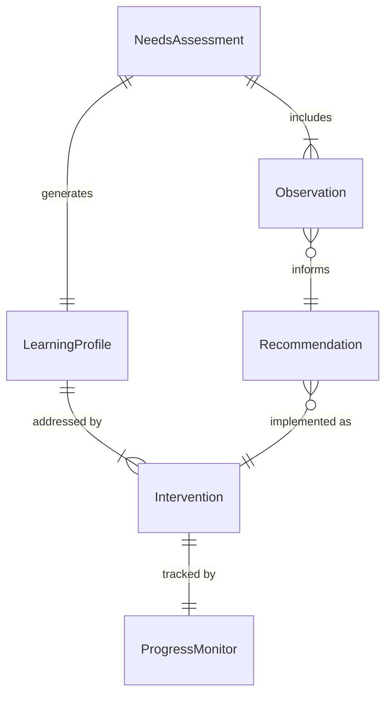
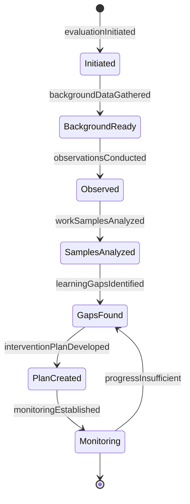
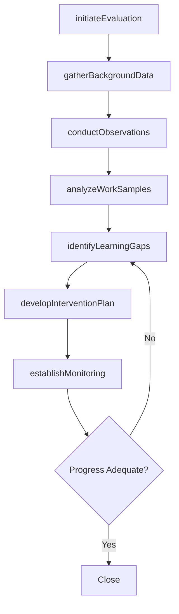
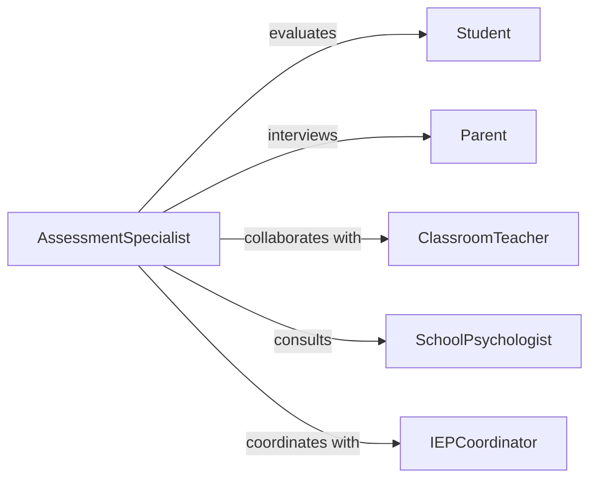

# Assess Educational Needs Students

> Business-as-Code definition for evaluating student learning requirements, strengths, and intervention needs. Models comprehensive assessment processes used in instructional planning, special education, and academic support programs.

## Overview

Student needs assessment involves gathering data on academic performance, learning styles, behavioral patterns, and environmental factors to determine appropriate instructional strategies and support services. This definition provides actions for conducting multi-faceted evaluations that inform individualized education plans and classroom differentiation.

## Actors

| Actor | Description |
|-------|-------------|
| Student | Individual whose educational needs are being assessed |
| Parent | Provides developmental history and home context |
| ClassroomTeacher | Contributes observation data and work samples |
| SchoolCounselor | Addresses social-emotional learning needs |
| SpecialEducationTeacher | Evaluates for learning disabilities or accommodations |
| SchoolPsychologist | Conducts cognitive and behavioral assessments |

## Roles

| Role | Description |
|------|-------------|
| AssessmentSpecialist | Coordinates comprehensive evaluation process |
| InterventionCoordinator | Develops support plans based on findings |
| DataAnalyst | Interprets multiple data sources for patterns |
| IEPCoordinator | Translates assessments into formal education plans |

## Entities

| Entity | Description |
|--------|-------------|
| NeedsAssessment | Comprehensive evaluation of student requirements |
| LearningProfile | Summary of strengths, challenges, and preferences |
| Observation | Documented evidence from classroom or testing |
| Intervention | Targeted support strategy for identified needs |
| ProgressMonitor | Ongoing measurement of response to instruction |
| Recommendation | Suggested instructional or service modification |

## Actions

| Action | Description |
|--------|-------------|
| initiateEvaluation | Begin comprehensive needs assessment process |
| gatherBackgroundData | Collect developmental and academic history |
| conductObservations | Document student performance in various settings |
| analyzeWorkSamples | Review student outputs for skill patterns |
| identifyLearningGaps | Determine areas requiring targeted support |
| developInterventionPlan | Create structured support strategies |
| establishMonitoring | Set up progress tracking for interventions |

## Events

| Event | Description |
|-------|-------------|
| evaluationInitiated | Needs assessment process has begun |
| backgroundDataGathered | Historical information has been collected |
| observationsConducted | Student performance has been documented |
| workSamplesAnalyzed | Student outputs have been reviewed |
| learningGapsIdentified | Support needs have been determined |
| interventionPlanDeveloped | Support strategies have been created |
| monitoringEstablished | Progress tracking has been implemented |

## Searches

| Search | Description |
|--------|-------------|
| findAssessments | Retrieve evaluations by student or date |
| getInterventionPlans | List support strategies by need type |
| getProgressMonitors | Find active tracking measures by student |
| getRecommendations | Retrieve suggested supports by teacher or grade |

## Entity Relationships



## State Diagram



## Workflow



## Actor Relationships



## Usage

### Calling Actions

```typescript
import { assessEducationalNeedsStudents } from '@headlessly/assess-educational-needs-students'

const assessor = assessEducationalNeedsStudents()

// Start comprehensive evaluation
const assessment = await assessor.initiateEvaluation({
  studentId: 'STU-9274',
  grade: 5,
  referralReason: 'below-grade-level-reading',
  requestedBy: 'teacher',
  consentDate: '2026-01-28'
})

// Gather background information
await assessor.gatherBackgroundData({
  assessmentId: assessment.id,
  sources: ['parent-interview', 'cumulative-file', 'previous-assessments'],
  areasOfConcern: ['reading-comprehension', 'written-expression']
})

// Identify gaps and develop plan
const gaps = await assessor.identifyLearningGaps({
  assessmentId: assessment.id
})

const plan = await assessor.developInterventionPlan({
  assessmentId: assessment.id,
  gaps,
  tier: 2,
  frequency: 'daily'
})
```

### Event-Driven Automation

```typescript
// Auto-schedule observations after background data collection
assessor.backgroundDataGathered(async ({ assessmentId, areasOfConcern }) => {
  await assessor.conductObservations({
    assessmentId,
    settings: ['general-education-classroom', 'small-group-instruction'],
    focusAreas: areasOfConcern,
    duration: 30
  })
})

// Notify IEP team when significant gaps identified
assessor.learningGapsIdentified(async ({ assessmentId, gaps }) => {
  const significantGaps = gaps.filter(g => g.severity >= 'moderate')
  if (significantGaps.length >= 2) {
    await notifyIEPTeam({
      assessmentId,
      recommendation: 'comprehensive-evaluation',
      gaps: significantGaps
    })
  }
})
```
