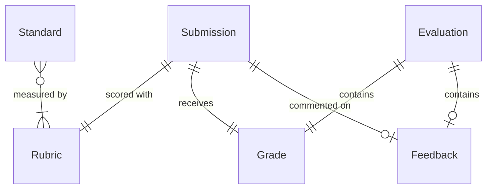
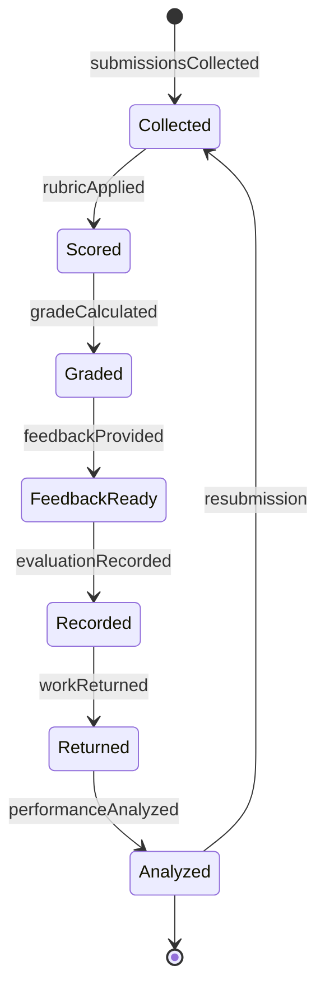
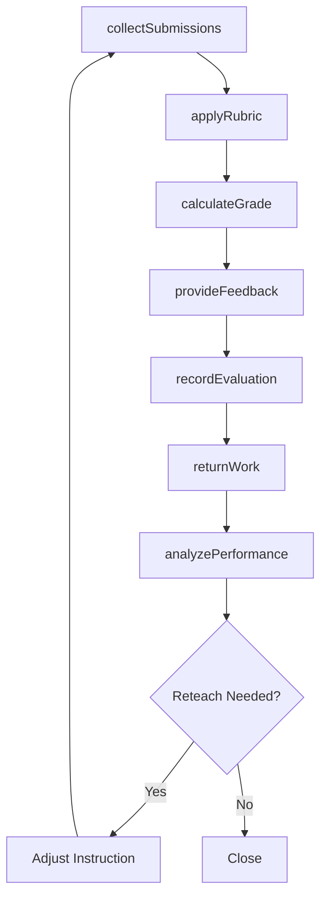
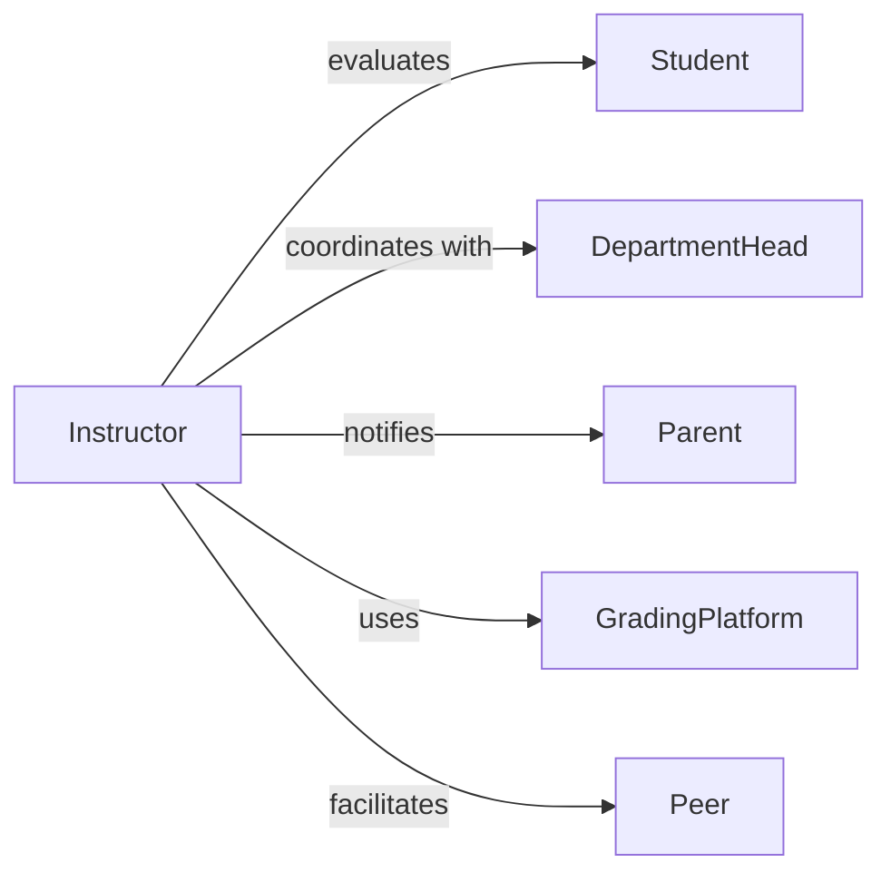

# Evaluate Student Work

> Business-as-Code definition for assessing student assignments, projects, and performance tasks. Models grading and feedback processes used in K-12 and higher education to measure learning outcomes and guide instruction.

## Overview

Student work evaluation involves reviewing assignments against learning standards, applying consistent grading criteria, providing actionable feedback, and documenting achievement levels. This definition provides actions for the complete assessment cycle from submission through grade posting and feedback delivery.

## Actors

| Actor | Description |
|-------|-------------|
| Student | Submits work for evaluation and receives feedback |
| Teacher | Assesses work quality and provides instructional feedback |
| DepartmentHead | Reviews grading consistency across sections |
| Parent | Monitors student progress through grades and comments |
| Peer | Provides collaborative feedback in peer review activities |
| GradingPlatform | Manages submissions and grade recording |

## Roles

| Role | Description |
|------|-------------|
| Instructor | Evaluates work and assigns grades |
| Grader | Scores assignments using provided rubrics |
| FeedbackProvider | Offers constructive comments for improvement |
| ModerationLeader | Ensures consistency across multiple evaluators |

## Entities

| Entity | Description |
|--------|-------------|
| Submission | Student work product submitted for evaluation |
| Rubric | Structured criteria for assessing work quality |
| Grade | Numerical or letter score assigned to work |
| Feedback | Written comments on strengths and improvements |
| Evaluation | Complete assessment including grade and comments |
| Standard | Learning objective measured by the assignment |

## Actions

| Action | Description |
|--------|-------------|
| collectSubmissions | Gather student work for evaluation |
| applyRubric | Score work using established criteria |
| calculateGrade | Determine final score from rubric results |
| provideFeedback | Write constructive comments for students |
| recordEvaluation | Document grades and feedback in gradebook |
| returnWork | Deliver evaluated work to students |
| analyzePerformance | Identify patterns across student submissions |

## Events

| Event | Description |
|-------|-------------|
| submissionsCollected | Student work has been gathered for grading |
| rubricApplied | Scoring criteria have been used to evaluate work |
| gradeCalculated | Final score has been determined |
| feedbackProvided | Comments have been written for student |
| evaluationRecorded | Grade has been entered in gradebook |
| workReturned | Evaluated assignment has been delivered to student |
| performanceAnalyzed | Patterns have been identified across submissions |

## Searches

| Search | Description |
|--------|-------------|
| findSubmissions | Retrieve student work by assignment or date |
| getGradesByStudent | List all scores for an individual student |
| getPendingEvaluations | Find ungraded submissions awaiting review |
| getPerformanceByStandard | Analyze achievement on specific learning objectives |

## Entity Relationships



## State Diagram



## Workflow



## Actor Relationships



## Usage

### Calling Actions

```typescript
import { evaluateStudentWork } from '@headlessly/evaluate-student-work'

const evaluator = evaluateStudentWork()

// Collect essay submissions
const submissions = await evaluator.collectSubmissions({
  assignmentId: 'ESSAY-301',
  class: 'ENG-101-03',
  dueDate: '2026-02-05T23:59:00Z',
  totalStudents: 24
})

// Apply rubric to evaluate quality
await evaluator.applyRubric({
  submissionId: 'SUB-8472',
  rubricId: 'ESSAY-RUBRIC-v2',
  scores: {
    thesis: 4,
    evidence: 3,
    organization: 4,
    conventions: 3
  }
})

// Calculate final grade and provide feedback
const grade = await evaluator.calculateGrade({
  submissionId: 'SUB-8472'
})

await evaluator.provideFeedback({
  submissionId: 'SUB-8472',
  feedback: 'Strong thesis statement and clear organization. Consider using more varied evidence sources to strengthen your argument.'
})
```

### Event-Driven Automation

```typescript
// Auto-return work when feedback is complete
evaluator.feedbackProvided(async ({ submissionId }) => {
  await evaluator.recordEvaluation({ submissionId })
  await evaluator.returnWork({ submissionId })
})

// Notify students of low grades
evaluator.gradeCalculated(async ({ submissionId, grade, student }) => {
  if (grade.percentage < 70) {
    await sendNotification({
      to: student.email,
      subject: 'Assignment Available for Review',
      message: 'Your graded assignment is ready. Please review the feedback and consider office hours for support.'
    })
  }
})

// Flag class-wide performance issues
evaluator.performanceAnalyzed(async ({ assignmentId, results }) => {
  if (results.averageScore < 75 && results.failureRate > 0.3) {
    await notifyInstructor({
      assignmentId,
      recommendation: 'consider-reteaching',
      data: results
    })
  }
})
```
