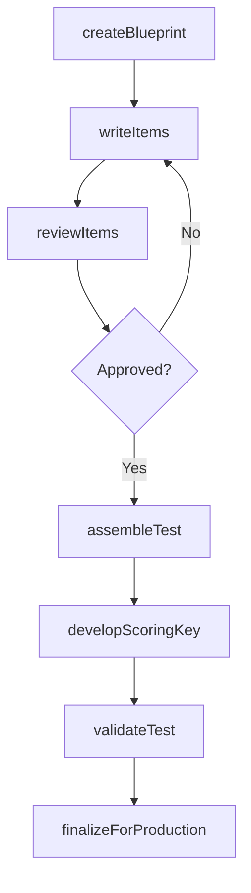
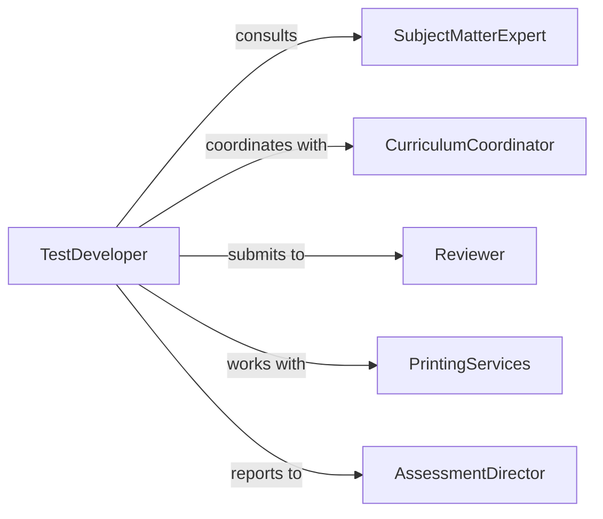

# Prepare Tests

> Business-as-Code definition for developing valid and reliable assessments for student learning measurement. Models test creation processes used in classroom assessment, standardized testing, and certification programs.

## Overview

Test preparation involves designing assessment instruments aligned to learning objectives, selecting appropriate item types, ensuring content validity, and establishing scoring procedures. This definition provides actions for creating high-quality tests from initial blueprint through final validation and printing.

## Actors

| Actor | Description |
|-------|-------------|
| Teacher | Creates classroom assessments aligned to curriculum |
| CurriculumCoordinator | Reviews tests for alignment to standards |
| AssessmentDirector | Oversees district testing programs |
| TestingVendor | Provides item banks and test assembly tools |
| SubjectMatterExpert | Validates content accuracy and relevance |
| PrintingServices | Produces physical test materials |

## Roles

| Role | Description |
|------|-------------|
| TestDeveloper | Designs assessment structure and items |
| ItemWriter | Creates individual test questions |
| Reviewer | Evaluates items for quality and bias |
| Editor | Ensures clarity and consistency across items |

## Entities

| Entity | Description |
|--------|-------------|
| TestBlueprint | Specification of content coverage and item distribution |
| TestItem | Individual question or task on assessment |
| Distractor | Incorrect answer option for multiple-choice items |
| ScoringKey | Correct answers and point values for items |
| Specification | Detailed criteria for test construction |
| TestForm | Complete assembled version of assessment |

## Actions

| Action | Description |
|--------|-------------|
| createBlueprint | Define test structure and content coverage |
| writeItems | Develop individual questions aligned to objectives |
| reviewItems | Evaluate questions for quality and fairness |
| assembleTest | Combine items into complete assessment form |
| developScoringKey | Create answer key with point values |
| validateTest | Ensure assessment meets quality standards |
| finalizeForProduction | Prepare test for printing or digital delivery |

## Events

| Event | Description |
|-------|-------------|
| blueprintCreated | Test specification has been defined |
| itemsWritten | Questions have been developed |
| itemsReviewed | Questions have been evaluated for quality |
| testAssembled | Complete assessment has been compiled |
| scoringKeyDeveloped | Answer key has been created |
| testValidated | Assessment has passed quality review |
| testFinalized | Assessment is ready for administration |

## Searches

| Search | Description |
|--------|-------------|
| findBlueprints | Retrieve test specifications by subject or grade |
| getItemsByStandard | List questions aligned to specific objectives |
| getPendingReviews | Find items awaiting quality evaluation |
| getTestForms | Retrieve assembled assessments by version |

## Workflow



## Actor Relationships



## Usage

### Calling Actions

```typescript
import { prepareTests } from '@headlessly/prepare-tests'

const testPrep = prepareTests()

// Create test blueprint
const blueprint = await testPrep.createBlueprint({
  subject: 'Algebra 1',
  grade: 9,
  standards: ['A-REI.1', 'A-REI.3', 'A-CED.1'],
  itemCount: 25,
  timeLimit: 50,
  itemTypes: { multipleChoice: 20, shortAnswer: 5 }
})

// Write and review items
await testPrep.writeItems({
  blueprintId: blueprint.id,
  standard: 'A-REI.1',
  itemType: 'multiple-choice',
  items: [
    {
      stem: 'Solve for x: 2x + 5 = 13',
      options: ['x = 4', 'x = 9', 'x = 18', 'x = 6'],
      correctAnswer: 'x = 4',
      difficulty: 'medium'
    }
  ]
})

// Assemble and finalize
const testForm = await testPrep.assembleTest({
  blueprintId: blueprint.id,
  formId: 'ALG1-FINAL-A'
})

await testPrep.developScoringKey({
  formId: testForm.id
})
```

### Event-Driven Automation

```typescript
// Auto-submit for review after items written
testPrep.itemsWritten(async ({ blueprintId, items }) => {
  await testPrep.reviewItems({
    blueprintId,
    itemIds: items.map(i => i.id),
    reviewType: 'content-accuracy'
  })
})

// Notify coordinator when test validated
testPrep.testValidated(async ({ formId, blueprint }) => {
  const coordinator = await getCurriculumCoordinator(blueprint.subject)
  await sendNotification({
    to: coordinator.email,
    subject: `Test ${formId} Ready for Production`,
    message: 'The assessment has passed validation and is ready to finalize.'
  })
})

// Auto-create scoring key after assembly
testPrep.testAssembled(async ({ formId }) => {
  await testPrep.developScoringKey({
    formId,
    includeRubrics: true
  })
})
```
