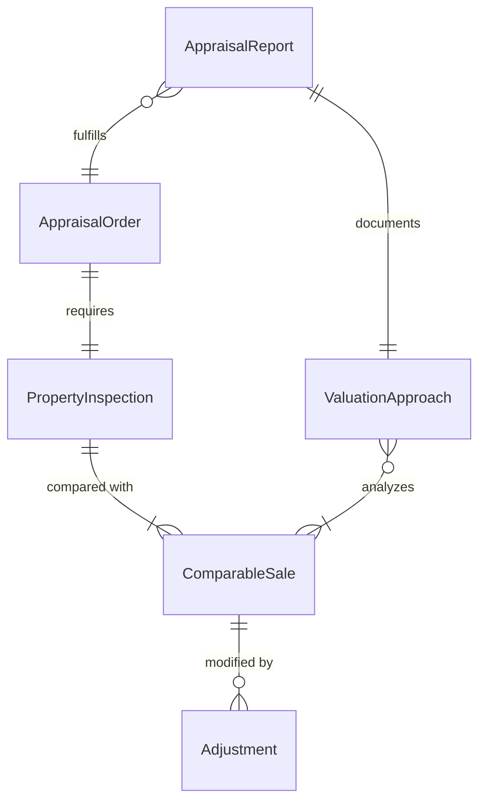
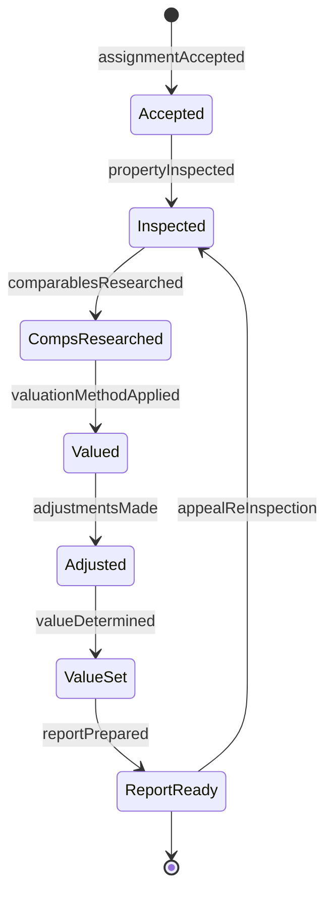
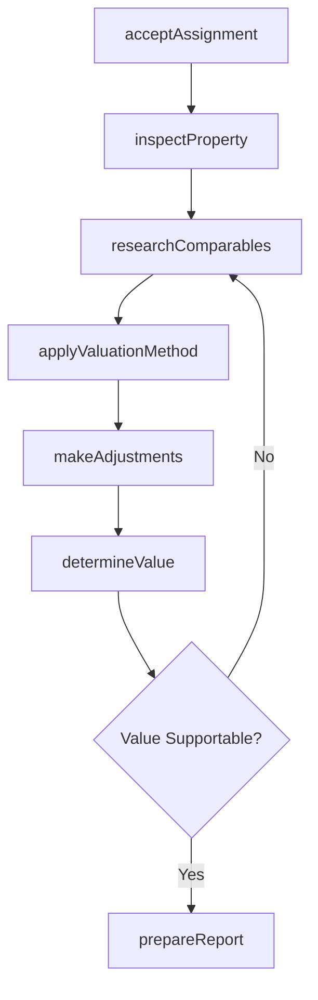
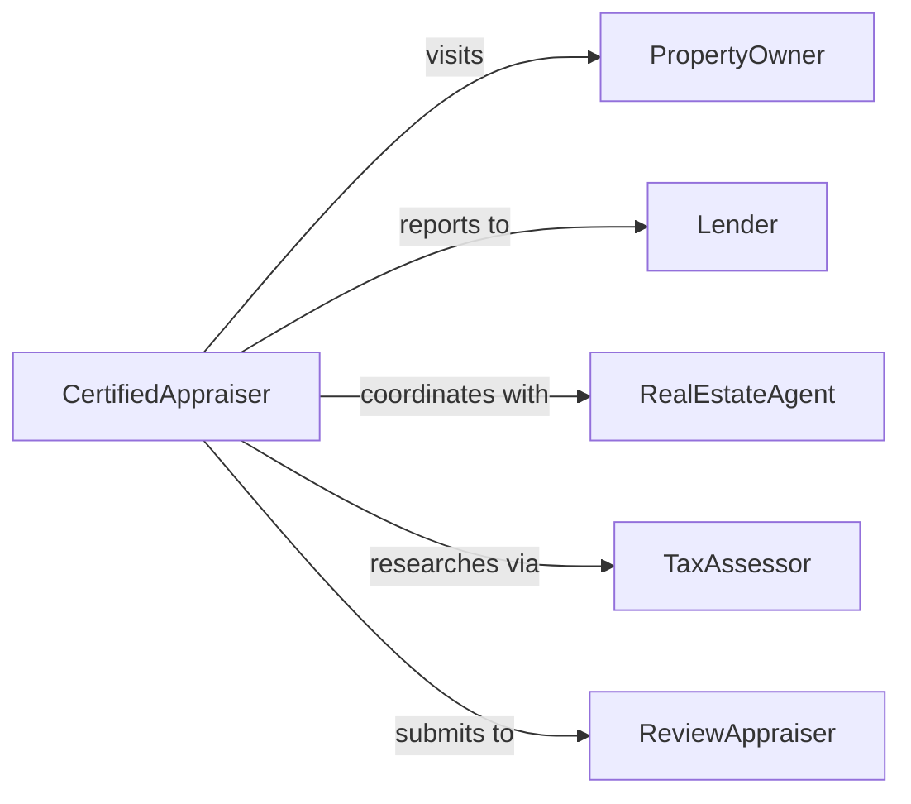

# Appraise Property Values

> Business-as-Code definition for determining fair market value of real estate and personal property. Models professional appraisal processes used in real estate transactions, tax assessment, and insurance underwriting.

## Overview

Property appraisal involves inspecting real estate or personal property, analyzing comparable sales, applying valuation methodologies, and producing documented value opinions. This definition provides actions for conducting appraisals from assignment acceptance through final report delivery and review.

## Actors

| Actor | Description |
|-------|-------------|
| PropertyOwner | Possesses real estate or assets being valued |
| Lender | Requires appraisal for mortgage underwriting |
| RealEstateAgent | Facilitates property transactions using appraisals |
| TaxAssessor | Uses valuations for property tax calculations |
| InsuranceCompany | Determines coverage amounts based on valuations |
| Buyer | Reviews appraisal before finalizing purchase |

## Roles

| Role | Description |
|------|-------------|
| CertifiedAppraiser | Licensed professional conducting property valuations |
| ReviewAppraiser | Validates quality and accuracy of appraisal reports |
| AppraisalCoordinator | Manages assignment workflow and scheduling |
| FieldInspector | Conducts on-site property inspections |

## Entities

| Entity | Description |
|--------|-------------|
| AppraisalOrder | Request for property valuation services |
| PropertyInspection | On-site evaluation of subject property |
| ComparableSale | Recently sold similar property used for analysis |
| ValuationApproach | Methodology applied to estimate value |
| AppraisalReport | Formal document stating value opinion |
| Adjustment | Modification to comparable sale price for differences |

## Actions

| Action | Description |
|--------|-------------|
| acceptAssignment | Agree to conduct appraisal for client |
| inspectProperty | Conduct on-site evaluation of subject property |
| researchComparables | Identify and analyze similar recent sales |
| applyValuationMethod | Calculate value using appropriate approach |
| makeAdjustments | Modify comparable prices for property differences |
| determineValue | Establish final value opinion |
| prepareReport | Create formal appraisal documentation |

## Events

| Event | Description |
|-------|-------------|
| assignmentAccepted | Appraisal order has been confirmed |
| propertyInspected | On-site evaluation has been completed |
| comparablesResearched | Similar sales have been identified |
| valuationMethodApplied | Value calculation has been performed |
| adjustmentsMade | Comparable prices have been modified |
| valueDetermined | Final value opinion has been established |
| reportPrepared | Appraisal documentation is complete |

## Searches

| Search | Description |
|--------|-------------|
| findAppraisalOrders | Retrieve assignments by status or due date |
| getComparableSales | List recent sales by location and property type |
| getPendingInspections | Find scheduled property visits |
| getReportsByAppraiser | Retrieve completed appraisals by professional |

## Entity Relationships



## State Diagram



## Workflow



## Actor Relationships



## Usage

### Calling Actions

```typescript
import { appraisePropertyValues } from '@headlessly/appraise-property-values'

const appraisal = appraisePropertyValues()

// Accept new appraisal assignment
const order = await appraisal.acceptAssignment({
  propertyAddress: '742 Maple Drive, Springfield',
  propertyType: 'single-family-residential',
  requestedBy: 'First National Bank',
  loanAmount: 425000,
  dueDate: '2026-02-15'
})

// Conduct property inspection
const inspection = await appraisal.inspectProperty({
  orderId: order.id,
  inspectionDate: '2026-02-08',
  observations: {
    squareFeet: 2400,
    bedrooms: 4,
    bathrooms: 2.5,
    condition: 'good',
    upgrades: ['kitchen-remodel-2024', 'new-roof-2023']
  }
})

// Research and apply valuation
const comparables = await appraisal.researchComparables({
  orderId: order.id,
  radius: 1.0,
  timeframe: 'last-6-months',
  minCount: 3
})

const value = await appraisal.determineValue({
  orderId: order.id,
  approach: 'sales-comparison'
})
```

### Event-Driven Automation

```typescript
// Auto-schedule inspection after assignment
appraisal.assignmentAccepted(async ({ orderId, propertyAddress }) => {
  await appraisal.inspectProperty({
    orderId,
    scheduledDate: addBusinessDays(new Date(), 3),
    notifyOwner: true
  })
})

// Alert on value discrepancies
appraisal.valueDetermined(async ({ orderId, value, loanAmount }) => {
  const loanToValue = (loanAmount / value.amount) * 100
  if (loanToValue > 80) {
    await notifyUnderwriter({
      orderId,
      alert: 'high-ltv',
      loanToValue,
      recommendation: 'review-required'
    })
  }
})

// Auto-submit for review
appraisal.reportPrepared(async ({ orderId, appraiserId }) => {
  await submitForReview({
    orderId,
    reviewType: 'quality-control',
    assignTo: 'review-queue'
  })
})
```
