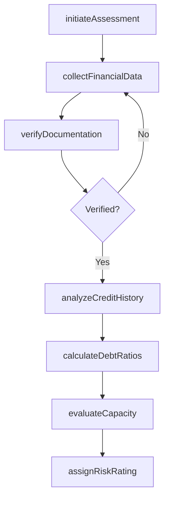
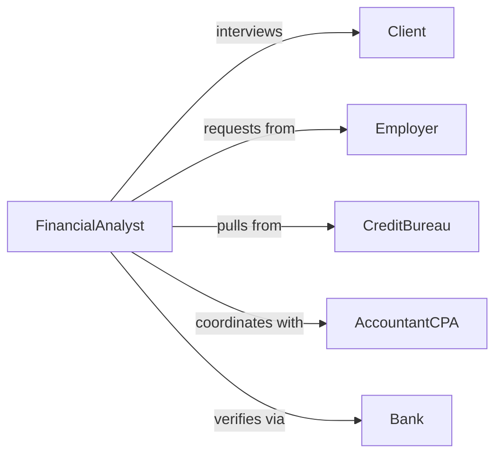

# Assess Financial Status Clients

> Business-as-Code definition for evaluating client financial condition, creditworthiness, and capacity. Models comprehensive financial assessment processes used in lending, financial planning, and credit underwriting.

## Overview

Client financial assessment involves analyzing income, assets, liabilities, credit history, and cash flow to determine financial health and lending capacity. This definition provides actions for conducting thorough financial evaluations from initial data gathering through risk rating and recommendation development.

## Actors

| Actor | Description |
|-------|-------------|
| Client | Individual or business seeking financial services |
| Employer | Verifies income and employment information |
| CreditBureau | Provides credit history and scoring data |
| AccountantCPA | Supplies verified financial statements |
| Bank | Provides account balance and transaction history |
| Appraiser | Values collateral assets for secured lending |

## Roles

| Role | Description |
|------|-------------|
| FinancialAnalyst | Evaluates client financial condition |
| CreditUnderwriter | Determines lending risk and approval |
| WealthAdvisor | Assesses financial status for planning services |
| LoanOfficer | Collects financial data and manages process |

## Entities

| Entity | Description |
|--------|-------------|
| FinancialProfile | Comprehensive summary of client financial status |
| IncomeStatement | Documentation of earnings and sources |
| BalanceSheet | Snapshot of assets and liabilities |
| CreditReport | History of borrowing and payment behavior |
| CashFlowAnalysis | Evaluation of money inflows and outflows |
| RiskRating | Assessment of financial stability and creditworthiness |

## Actions

| Action | Description |
|--------|-------------|
| initiateAssessment | Begin client financial evaluation process |
| collectFinancialData | Gather income, asset, and liability information |
| verifyDocumentation | Confirm accuracy of submitted financial data |
| analyzeCreditHistory | Review credit reports and payment patterns |
| calculateDebtRatios | Determine debt-to-income and other metrics |
| evaluateCapacity | Assess ability to repay obligations |
| assignRiskRating | Determine overall financial risk level |

## Events

| Event | Description |
|-------|-------------|
| assessmentInitiated | Financial evaluation has begun |
| financialDataCollected | Client information has been gathered |
| documentationVerified | Financial data has been confirmed accurate |
| creditHistoryAnalyzed | Credit reports have been reviewed |
| debtRatiosCalculated | Financial metrics have been determined |
| capacityEvaluated | Repayment ability has been assessed |
| riskRatingAssigned | Overall risk level has been determined |

## Searches

| Search | Description |
|--------|-------------|
| findAssessments | Retrieve evaluations by client or status |
| getHighRiskClients | List clients with elevated risk ratings |
| getPendingVerifications | Find assessments awaiting documentation |
| getCapacityBySegment | Analyze lending capacity by client type |

## Workflow



## Actor Relationships



## Usage

### Calling Actions

```typescript
import { assessFinancialStatusClients } from '@headlessly/assess-financial-status-clients'

const assessor = assessFinancialStatusClients()

// Begin financial assessment
const assessment = await assessor.initiateAssessment({
  clientId: 'CLI-7392',
  assessmentType: 'mortgage-application',
  loanAmount: 450000,
  purpose: 'home-purchase'
})

// Collect and verify financial data
await assessor.collectFinancialData({
  assessmentId: assessment.id,
  income: {
    salary: 95000,
    bonus: 12000,
    otherIncome: 8000
  },
  assets: {
    checking: 25000,
    savings: 75000,
    retirement: 180000
  },
  liabilities: {
    autoLoan: 18000,
    creditCards: 5000,
    studentLoans: 32000
  }
})

// Calculate ratios and evaluate capacity
const ratios = await assessor.calculateDebtRatios({
  assessmentId: assessment.id
})

const capacity = await assessor.evaluateCapacity({
  assessmentId: assessment.id,
  proposedPayment: 2800
})
```

### Event-Driven Automation

```typescript
// Auto-pull credit report after data collection
assessor.financialDataCollected(async ({ assessmentId, clientId }) => {
  await assessor.analyzeCreditHistory({
    assessmentId,
    bureaus: ['Experian', 'Equifax', 'TransUnion'],
    clientConsent: true
  })
})

// Flag high debt-to-income ratios
assessor.debtRatiosCalculated(async ({ assessmentId, ratios }) => {
  if (ratios.debtToIncome > 43) {
    await notifyUnderwriter({
      assessmentId,
      alert: 'high-dti',
      ratio: ratios.debtToIncome,
      recommendation: 'additional-review-required'
    })
  }
})

// Auto-assign risk rating after capacity evaluation
assessor.capacityEvaluated(async ({ assessmentId, capacity }) => {
  const riskFactors = {
    creditScore: capacity.creditScore,
    debtToIncome: capacity.debtToIncome,
    reserves: capacity.monthsReserves
  }
  await assessor.assignRiskRating({
    assessmentId,
    factors: riskFactors
  })
})
```
