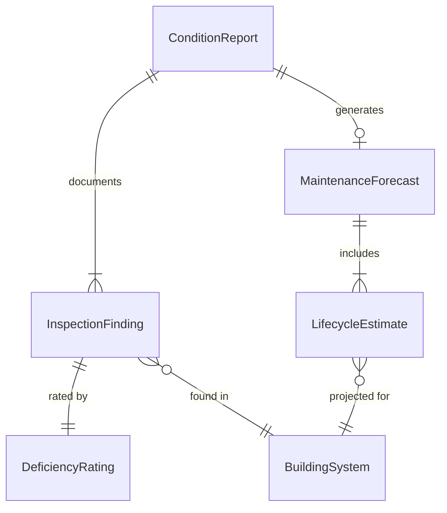
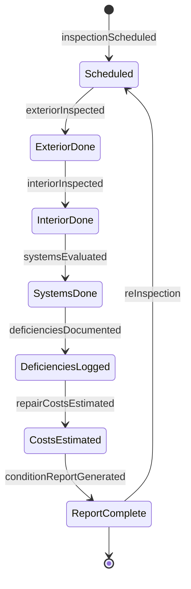
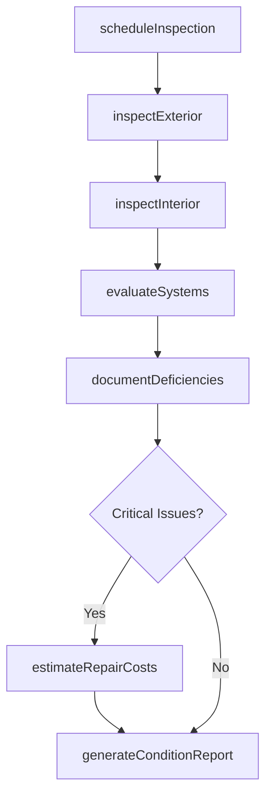
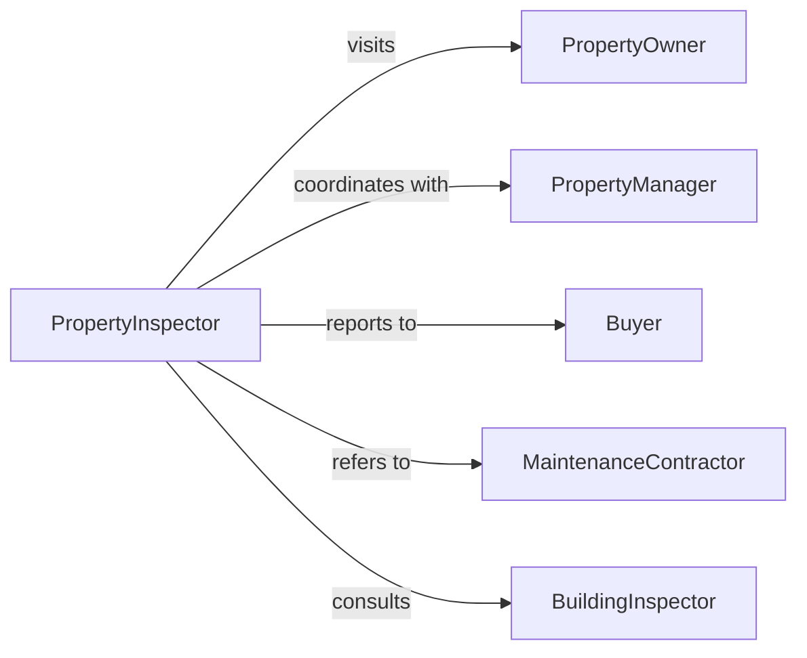

# Evaluate Condition Properties

> Business-as-Code definition for assessing the physical state and maintenance needs of real estate and facilities. Models property inspection processes used in facilities management, real estate transactions, and maintenance planning.

## Overview

Property condition evaluation involves systematic inspection of building systems, structural elements, finishes, and equipment to identify defects, estimate remaining useful life, and prioritize repairs. This definition provides actions for conducting comprehensive condition assessments from scheduling through report delivery and maintenance recommendations.

## Actors

| Actor | Description |
|-------|-------------|
| PropertyOwner | Responsible for maintaining building condition |
| PropertyManager | Oversees day-to-day facility operations |
| Buyer | Reviews condition before purchase decision |
| InsuranceCompany | Assesses risk based on property condition |
| MaintenanceContractor | Performs repairs identified in inspection |
| BuildingInspector | Enforces code compliance and safety standards |

## Roles

| Role | Description |
|------|-------------|
| PropertyInspector | Conducts systematic condition evaluations |
| FacilitiesManager | Manages property maintenance and capital planning |
| ConditionAssessment Specialist | Evaluates building systems and components |
| MaintenancePlanner | Develops repair schedules from inspection findings |

## Entities

| Entity | Description |
|--------|-------------|
| ConditionReport | Comprehensive documentation of property state |
| InspectionFinding | Documented deficiency or maintenance need |
| BuildingSystem | Major component like HVAC, electrical, or plumbing |
| DeficiencyRating | Severity classification for identified issues |
| MaintenanceForecast | Projected repair and replacement schedule |
| LifecycleEstimate | Remaining useful life of building components |

## Actions

| Action | Description |
|--------|-------------|
| scheduleInspection | Arrange comprehensive property evaluation |
| inspectExterior | Evaluate roof, walls, foundation, and grounds |
| inspectInterior | Assess finishes, fixtures, and living spaces |
| evaluateSystems | Review HVAC, electrical, plumbing, and mechanical |
| documentDeficiencies | Record condition issues and maintenance needs |
| estimateRepairCosts | Calculate financial impact of identified issues |
| generateConditionReport | Create comprehensive property assessment document |

## Events

| Event | Description |
|-------|-------------|
| inspectionScheduled | Property evaluation has been arranged |
| exteriorInspected | Outside components have been evaluated |
| interiorInspected | Inside spaces have been assessed |
| systemsEvaluated | Building systems have been reviewed |
| deficienciesDocumented | Issues have been recorded |
| repairCostsEstimated | Financial impact has been calculated |
| conditionReportGenerated | Assessment documentation is complete |

## Searches

| Search | Description |
|--------|-------------|
| findInspections | Retrieve evaluations by property or date |
| getDeficienciesBySeverity | List issues by urgency or cost |
| getSystemConditions | Find component status by building system |
| getForecastedMaintenance | Retrieve projected repair schedules |

## Entity Relationships



## State Diagram



## Workflow



## Actor Relationships



## Usage

### Calling Actions

```typescript
import { evaluateConditionProperties } from '@headlessly/evaluate-condition-properties'

const evaluator = evaluateConditionProperties()

// Schedule comprehensive inspection
const inspection = await evaluator.scheduleInspection({
  propertyId: 'PROP-4729',
  propertyType: 'commercial-office',
  squareFeet: 45000,
  inspectionDate: '2026-02-12',
  scope: 'full-assessment'
})

// Conduct system evaluations
await evaluator.inspectExterior({
  inspectionId: inspection.id,
  components: ['roof', 'facade', 'parking-lot', 'landscaping']
})

await evaluator.evaluateSystems({
  inspectionId: inspection.id,
  systems: [
    { type: 'hvac', age: 12, condition: 'fair' },
    { type: 'electrical', age: 18, condition: 'good' },
    { type: 'plumbing', age: 18, condition: 'poor' }
  ]
})

// Document findings and estimate costs
const deficiencies = await evaluator.documentDeficiencies({
  inspectionId: inspection.id
})

const costs = await evaluator.estimateRepairCosts({
  inspectionId: inspection.id,
  deficiencies
})
```

### Event-Driven Automation

```typescript
// Auto-flag critical deficiencies
evaluator.deficienciesDocumented(async ({ inspectionId, deficiencies }) => {
  const critical = deficiencies.filter(d => d.severity === 'immediate')
  if (critical.length > 0) {
    await notifyPropertyManager({
      inspectionId,
      alert: 'critical-issues-found',
      items: critical,
      recommendation: 'immediate-action-required'
    })
  }
})

// Generate maintenance forecast after cost estimation
evaluator.repairCostsEstimated(async ({ inspectionId, costs }) => {
  const forecast = costs.filter(c => c.timeframe === 'next-5-years')
  await createMaintenanceForecast({
    inspectionId,
    projectedCosts: forecast,
    prioritization: 'cost-and-urgency'
  })
})

// Notify stakeholders when report ready
evaluator.conditionReportGenerated(async ({ inspectionId, reportUrl }) => {
  const property = await getProperty(inspectionId)
  await sendNotification({
    to: [property.owner, property.manager],
    subject: 'Property Condition Report Available',
    attachments: [reportUrl]
  })
})
```
