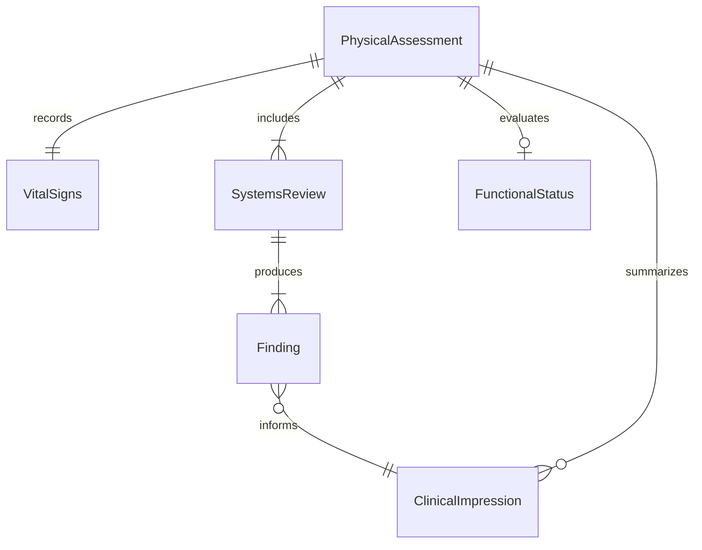
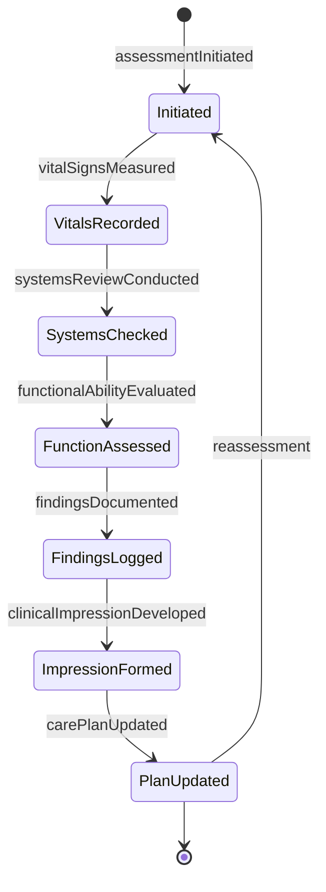
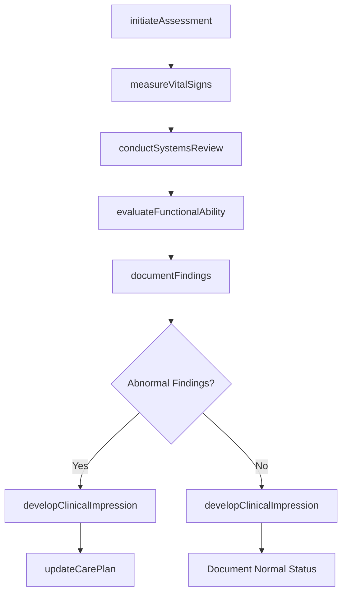
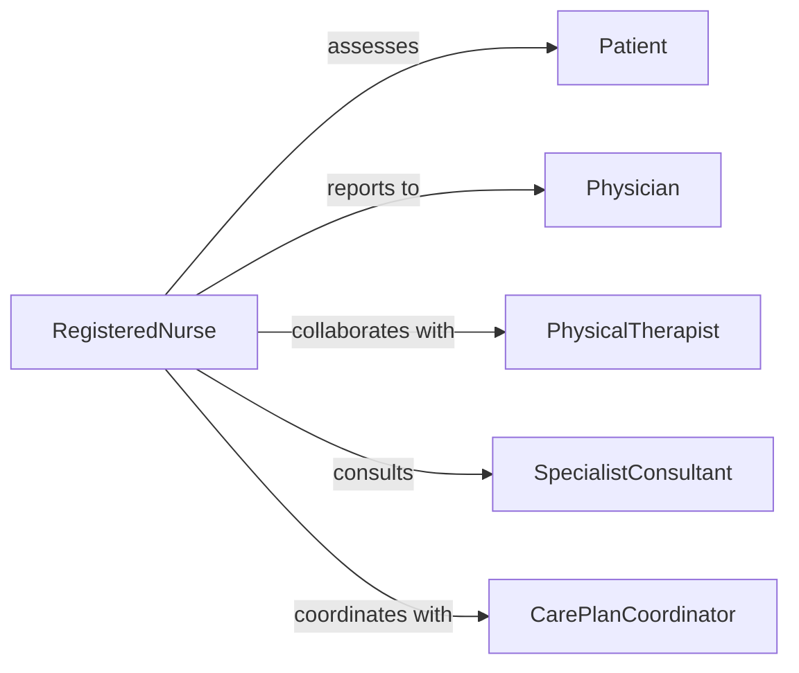

# Assess Physical Conditions Patients Aid

> Business-as-Code definition for evaluating patient physical status to support diagnosis and treatment planning. Models clinical assessment processes used in nursing, physical therapy, and primary care settings.

## Overview

Patient physical assessment involves systematic examination of body systems, vital signs, functional abilities, and symptom presentation to identify health conditions and inform care decisions. This definition provides actions for conducting comprehensive physical evaluations from initial screening through documentation and care planning.

## Actors

| Actor | Description |
|-------|-------------|
| Patient | Individual receiving physical assessment |
| Physician | Orders assessments and interprets findings |
| SpecialistConsultant | Provides expert evaluation for complex cases |
| FamilyMember | Provides patient history and observations |
| Laboratory | Performs diagnostic tests ordered from assessment |
| PharmacistRPH | Reviews medication effects on physical condition |

## Roles

| Role | Description |
|------|-------------|
| RegisteredNurse | Conducts initial and ongoing physical assessments |
| PhysicalTherapist | Evaluates musculoskeletal and functional status |
| ClinicalAssessor | Performs comprehensive patient examinations |
| CarePlanCoordinator | Translates assessment findings into care interventions |

## Entities

| Entity | Description |
|--------|-------------|
| PhysicalAssessment | Comprehensive evaluation of patient physical status |
| VitalSigns | Measurable indicators like blood pressure and pulse |
| SystemsReview | Evaluation of each body system for abnormalities |
| FunctionalStatus | Assessment of ability to perform daily activities |
| Finding | Documented observation from physical examination |
| ClinicalImpression | Professional judgment about patient condition |

## Actions

| Action | Description |
|--------|-------------|
| initiateAssessment | Begin systematic patient physical evaluation |
| measureVitalSigns | Record temperature, pulse, respiration, blood pressure |
| conductSystemsReview | Examine cardiovascular, respiratory, and other systems |
| evaluateFunctionalAbility | Assess mobility, strength, and daily living skills |
| documentFindings | Record observations and abnormalities |
| developClinicalImpression | Formulate professional judgment about condition |
| updateCarePlan | Modify treatment based on assessment results |

## Events

| Event | Description |
|-------|-------------|
| assessmentInitiated | Physical evaluation has begun |
| vitalSignsMeasured | Basic health indicators have been recorded |
| systemsReviewConducted | Body systems have been examined |
| functionalAbilityEvaluated | Patient capabilities have been assessed |
| findingsDocumented | Observations have been recorded in chart |
| clinicalImpressionDeveloped | Professional judgment has been formulated |
| carePlanUpdated | Treatment plan has been modified |

## Searches

| Search | Description |
|--------|-------------|
| findAssessments | Retrieve evaluations by patient or date |
| getAbnormalFindings | List patients with critical observations |
| getVitalTrends | Analyze vital sign patterns over time |
| getPendingReassessments | Find patients due for follow-up evaluation |

## Entity Relationships



## State Diagram



## Workflow



## Actor Relationships



## Usage

### Calling Actions

```typescript
import { assessPhysicalConditionsPatientsAid } from '@headlessly/assess-physical-conditions-patients-aid'

const assessor = assessPhysicalConditionsPatientsAid()

// Begin patient assessment
const assessment = await assessor.initiateAssessment({
  patientId: 'PT-8392',
  encounterType: 'admission',
  assessmentType: 'comprehensive',
  dateTime: '2026-02-05T14:30:00Z'
})

// Measure and record vital signs
await assessor.measureVitalSigns({
  assessmentId: assessment.id,
  vitals: {
    temperature: 98.6,
    pulse: 78,
    respiration: 16,
    bloodPressureSystolic: 128,
    bloodPressureDiastolic: 82,
    oxygenSaturation: 97
  }
})

// Conduct systems examination
await assessor.conductSystemsReview({
  assessmentId: assessment.id,
  systems: {
    cardiovascular: { rhythm: 'regular', murmurs: false },
    respiratory: { soundsBilateral: true, crackles: false },
    neurological: { alertOriented: true, strength: 'normal' }
  }
})

// Document findings and develop impression
const findings = await assessor.documentFindings({
  assessmentId: assessment.id
})
```

### Event-Driven Automation

```typescript
// Auto-alert on abnormal vital signs
assessor.vitalSignsMeasured(async ({ assessmentId, vitals }) => {
  if (vitals.bloodPressureSystolic > 140 || vitals.oxygenSaturation < 92) {
    await notifyProvider({
      assessmentId,
      alert: 'abnormal-vitals',
      urgency: 'immediate',
      values: vitals
    })
  }
})

// Trigger specialist consult for abnormal findings
assessor.findingsDocumented(async ({ assessmentId, findings }) => {
  const critical = findings.filter(f => f.severity === 'abnormal')
  if (critical.some(f => f.system === 'cardiovascular')) {
    await requestConsult({
      assessmentId,
      specialty: 'cardiology',
      reason: 'abnormal-cardiovascular-findings'
    })
  }
})

// Auto-update care plan after assessment
assessor.clinicalImpressionDeveloped(async ({ assessmentId, impression }) => {
  await assessor.updateCarePlan({
    assessmentId,
    interventions: impression.recommendedInterventions,
    priority: impression.acuityLevel
  })
})
```
