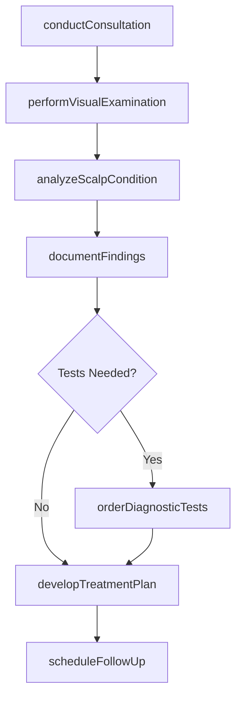
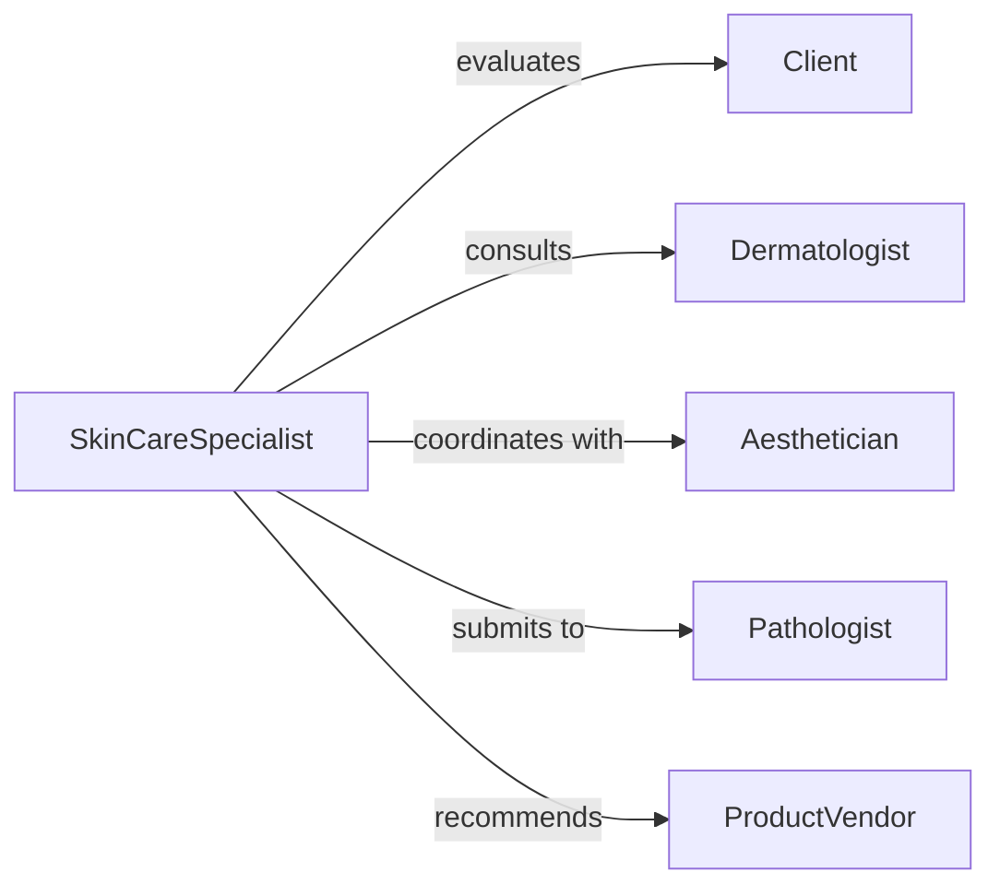

# Assess Skin Hair Conditions

> Business-as-Code definition for evaluating integumentary system health and cosmetic concerns. Models assessment processes used in dermatology, cosmetology, and aesthetic medicine for diagnosis and treatment planning.

## Overview

Skin and hair assessment involves visual examination, palpation, diagnostic testing, and patient history review to identify conditions ranging from medical disorders to cosmetic concerns. This definition provides actions for conducting thorough evaluations from consultation through treatment recommendations and follow-up planning.

## Actors

| Actor | Description |
|-------|-------------|
| Client | Individual seeking skin or hair evaluation |
| Dermatologist | Diagnoses and treats medical skin conditions |
| Cosmetologist | Addresses cosmetic hair and scalp concerns |
| Aesthetician | Provides facial and skin care treatments |
| Pathologist | Analyzes tissue samples from biopsies |
| ProductVendor | Supplies treatment products and solutions |

## Roles

| Role | Description |
|------|-------------|
| SkinCareSpecialist | Evaluates and treats integumentary conditions |
| TrichologistHairSpecialist | Focuses on hair and scalp health |
| ClinicalAssessor | Conducts diagnostic examinations |
| TreatmentConsultant | Recommends therapeutic and cosmetic interventions |

## Entities

| Entity | Description |
|--------|-------------|
| IntegumentaryAssessment | Comprehensive evaluation of skin and hair |
| SkinCondition | Identified abnormality or cosmetic concern |
| ScalpAnalysis | Evaluation of hair follicles and scalp health |
| DiagnosticTest | Laboratory or imaging study for confirmation |
| TreatmentProtocol | Recommended therapeutic or cosmetic regimen |
| ProgressPhoto | Visual documentation for comparison over time |

## Actions

| Action | Description |
|--------|-------------|
| conductConsultation | Interview client about concerns and history |
| performVisualExamination | Inspect skin or hair for abnormalities |
| analyzeScalpCondition | Evaluate follicle health and hair density |
| documentFindings | Record observations and measurements |
| orderDiagnosticTests | Request laboratory or imaging studies |
| developTreatmentPlan | Create therapeutic or cosmetic intervention strategy |
| scheduleFollowUp | Arrange reassessment appointment |

## Events

| Event | Description |
|-------|-------------|
| consultationConducted | Client interview has been completed |
| visualExaminationPerformed | Skin or hair has been inspected |
| scalpConditionAnalyzed | Follicle and scalp health has been evaluated |
| findingsDocumented | Observations have been recorded |
| diagnosticTestsOrdered | Studies have been requested |
| treatmentPlanDeveloped | Intervention strategy has been created |
| followUpScheduled | Reassessment has been arranged |

## Searches

| Search | Description |
|--------|-------------|
| findAssessments | Retrieve evaluations by client or date |
| getConditionsByType | List diagnoses by skin or hair category |
| getPendingTests | Find assessments awaiting diagnostic results |
| getTreatmentResponses | Analyze outcomes by protocol type |

## Workflow



## Actor Relationships



## Usage

### Calling Actions

```typescript
import { assessSkinHairConditions } from '@headlessly/assess-skin-hair-conditions'

const assessor = assessSkinHairConditions()

// Begin consultation
const assessment = await assessor.conductConsultation({
  clientId: 'CLI-5829',
  chiefConcern: 'hair-thinning',
  duration: 6,
  durationUnit: 'months',
  previousTreatments: ['over-the-counter-minoxidil']
})

// Perform examination
await assessor.performVisualExamination({
  assessmentId: assessment.id,
  areas: ['scalp', 'hairline', 'crown'],
  observations: {
    hairDensity: 'reduced',
    scalpCondition: 'normal',
    inflammation: false
  }
})

// Analyze scalp with specialized tools
const scalpAnalysis = await assessor.analyzeScalpCondition({
  assessmentId: assessment.id,
  method: 'trichoscopy',
  findings: {
    follicleHealth: 'miniaturization-present',
    hairShaftDiameter: 'variable',
    telogenPercentage: 35
  }
})

// Develop treatment plan
const plan = await assessor.developTreatmentPlan({
  assessmentId: assessment.id,
  diagnosis: 'androgenetic-alopecia',
  interventions: ['prescription-finasteride', 'low-level-light-therapy']
})
```

### Event-Driven Automation

```typescript
// Auto-order tests for suspicious lesions
assessor.visualExaminationPerformed(async ({ assessmentId, observations }) => {
  if (observations.lesions?.some(l => l.characteristics.includes('irregular-border'))) {
    await assessor.orderDiagnosticTests({
      assessmentId,
      tests: ['dermatoscopy', 'biopsy-if-indicated'],
      urgency: 'priority'
    })
  }
})

// Capture progress photos at consultation
assessor.consultationConducted(async ({ assessmentId, chiefConcern }) => {
  if (['hair-loss', 'acne', 'pigmentation'].includes(chiefConcern)) {
    await captureProgressPhotos({
      assessmentId,
      views: ['frontal', 'lateral', 'crown'],
      lighting: 'standardized'
    })
  }
})

// Schedule follow-up based on treatment type
assessor.treatmentPlanDeveloped(async ({ assessmentId, interventions }) => {
  const followUpWeeks = interventions.some(i => i.includes('prescription')) ? 8 : 12
  await assessor.scheduleFollowUp({
    assessmentId,
    weeksFromNow: followUpWeeks,
    purpose: 'treatment-response-evaluation'
  })
})
```
